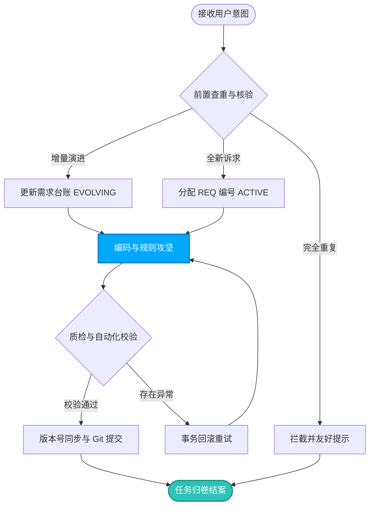
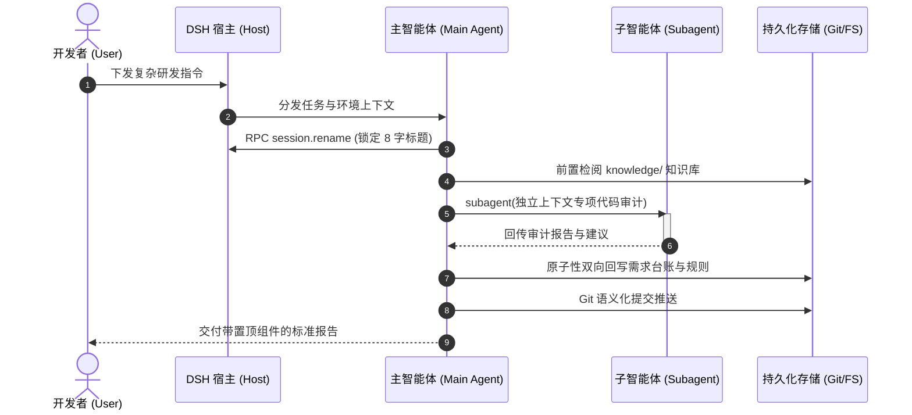
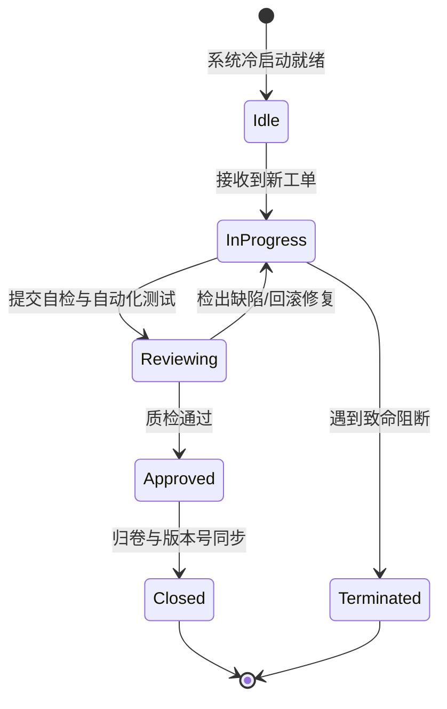

# 全场景流程图、信息图与教学图生成技术指南与标准模板库 (Diagram Generation Guide)

> ### 🏷️ **版本信息与实施追踪**
> - **当前文档版本**：`v4.18.0`
> - **对应实施版本**：`v4.18.0`
> - **版本治理规范**：遵循 [`rules/workflow/versioning_standard.md`](../rules/workflow/versioning_standard.md)
> - **最后更新日期**：2026-09-16
> - **版本状态**：`[Release 稳定生效]`

本文档是系统针对**流程图、架构信息图、交互时序图与教学图解**制定的通用技术选型指南与标准化生成规范。旨在帮助智能体在各种交互载体下，产出稳定、高保真、无兼容性问题的视觉化交付物。

---

## 🧭 一、图表技术栈全景与选型决策树

在不同的客户端与展示环境下，图表渲染的支撑能力存在差异。智能体必须依据场景精准选用合适的技术格式：

```text
                                  ┌── [终端 / 聊天界面直接输出] ──▶ 原生 ASCII / Unicode 框线图
                                  │   (零外部依赖、绝不乱码、排版精准对齐)
                                  │
                                  ├── [工程文档 / Git 仓库展示] ──▶ Mermaid.js 声明式图表
                                  │   (GitHub/GitLab 原生渲染，轻量维护)
[图表交付场景决策] ─────────────────┤
                                  ├── [高保真演示 / 视觉卡片信息图] ─▶ 原生 SVG 矢量图形
                                  │   (色彩渐变、自适应缩放、现代卡片风格)
                                  │
                                  └── [重型工业级拓扑 / 复杂类继承] ─▶ PlantUML / Graphviz (DOT)
                                      (自动物理力导向排版，适合海量节点)
```

---

## 📊 二、五大图表技术方案横向对比

| 方案名称 | 渲染门槛与环境依赖 | 渲染保真度 | 编辑与修改维护性 | 最佳适用场景 |
| :--- | :--- | :---: | :---: | :--- |
| **1. ASCII / Unicode 字符图** | **完全零依赖**（纯文本） | 中等 | 高（纯文本易改） | DSH 聊天会话即时汇报、终端日志、纯文本 README |
| **2. Mermaid.js** | 需要 Markdown 渲染器支持 | 高 | 极高（结构化 DSL）| 流程图、时序图、状态机流转、项目甘特图、思维导图 |
| **3. 原生 SVG** | 浏览器/现代渲染器原生支持 | **极高 (矢量精美)** | 中等（XML 节点较多） | 架构全景展示图、高亮数据卡片、产品功能全景大图 |
| **4. PlantUML** | 需要 Java / 外部渲染服务器 | 高 | 高（文本描述） | 大型 UML 类图、微服务组件部署拓扑图 |
| **5. Excalidraw** | 需要 Excalidraw 容器支持 | 独特手绘风 | 极高（结构化 JSON） | 头脑风暴、生动的手绘风格白板教学与草图设计 |

---

## 🛠️ 三、标准化常用图表生成模版库 (即拷即用)

### 模版 1：业务流转闭环流程图 (Mermaid Flowchart)
适用于研发闭环、审批流、任务生命周期的可视化表达：



---

### 模版 2：人机与多智能体交互时序图 (Mermaid Sequence)
适用于协议通信、RPC 调用与多智能体分工协同：



---

### 模版 3：业务状态机流转状态图 (Mermaid State)
适用于游戏角色状态、订单生命周期与连接协议状态：



---

### 模版 4：系统分层架构信息卡片 (原生 SVG 矢量模板)
适合嵌入 Web GUI 或文档中展示高保真卡片：

```xml
<svg width="600" height="240" viewBox="0 0 600 240" fill="none" xmlns="http://www.w3.org/2000/svg">
  <!-- 背景底板 -->
  <rect width="600" height="240" rx="12" fill="#1A1D24" stroke="#2B313E" stroke-width="2"/>
  
  <!-- 顶部状态指示栏 -->
  <rect x="24" y="20" width="10" height="10" rx="5" fill="#2EC4B6"/>
  <text x="44" y="30" fill="#DCE3EB" font-family="system-ui, sans-serif" font-size="14" font-weight="600">DSH 分层系统架构全景 (System Architecture)</text>
  
  <!-- 第一层卡片：展示层 -->
  <rect x="24" y="50" width="552" height="46" rx="8" fill="#252A36" stroke="#00A8FF" stroke-width="1.5"/>
  <text x="40" y="78" fill="#FFFFFF" font-family="sans-serif" font-size="14" font-weight="bold">呈现层 (Presentation):</text>
  <text x="210" y="78" fill="#A0AEC0" font-family="sans-serif" font-size="13">Web GUI · 侧边栏投影 · 视口吸附卡片</text>
  
  <!-- 第二层卡片：执行层 -->
  <rect x="24" y="106" width="552" height="46" rx="8" fill="#252A36" stroke="#FFB900" stroke-width="1.5"/>
  <text x="40" y="134" fill="#FFFFFF" font-family="sans-serif" font-size="14" font-weight="bold">宿主层 (Runtime Host):</text>
  <text x="210" y="134" fill="#A0AEC0" font-family="sans-serif" font-size="13">ApiProxy 路由网关 · 沙箱隔离 · JSONL 会话持久化</text>
  
  <!-- 第三层卡片：底座引擎 -->
  <rect x="24" y="162" width="552" height="46" rx="8" fill="#252A36" stroke="#2EC4B6" stroke-width="1.5"/>
  <text x="40" y="190" fill="#FFFFFF" font-family="sans-serif" font-size="14" font-weight="bold">引擎层 (Execution Core):</text>
  <text x="210" y="190" fill="#A0AEC0" font-family="sans-serif" font-size="13">文件系统读写 · Bash 终端 · 多智能体编排 (subagent / workflow)</text>
</svg>
```

---

## 🚫 四、AI 自动生成图表的四大避坑铁律

1. **绝对杜绝裸 HTML 注入**：
   - DSH 聊天引擎会将裸 HTML（如 `<div>`、`<details>` 等）自动转义为文本字符串，导致排版大乱；
   - 聊天界面内必须使用 GFM 原生引用块或 Markdown 表格/ASCII 图，禁止内嵌裸 HTML 布局。
2. **Mermaid 特殊字符转义**：
   - 节点文本中若包含英文圆括号 `()`、方括号 `[]` 或引号 `""`，必须用英文双引号包裹（如 `Node["执行函数 test()"]`），否则会导致 Mermaid 渲染器解析崩溃黑屏。
3. **SVG 必须具备 `viewBox` 与自适应尺寸**：
   - 编写 SVG 时，必须显式声明 `viewBox="0 0 W H"`，禁止仅指定绝对高宽，以保障在不同屏幕和暗色/亮色主题下的自适应缩放。
4. **ASCII 框线字符等宽对齐**：
   - 字符图必须使用等宽制表符（如 `┌ ─ ┐ │ └ ┘ ├ ┼ ┤`）并置于纯文本代码块（` ```text `）内，避免变宽字体造成画面歪斜。
