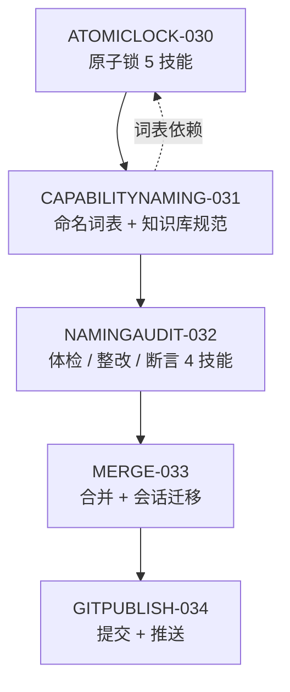

# PKG-007 原子锁 · 能力层命名 · 目录合并执行明细

> 本文件即本轮 5 条需求的**简化可执行需求文案**。每一条需求都必须落到「物理探针 + 退出码」上，
> 不能绑探针的步骤一律递归分裂到更细颗粒度（skill / cli / agent / api / mcp / plugin）。

| 字段 | 值 |
| --- | --- |
| 执行包编号 | PKG-007 |
| 关联需求 | REQ-BUTLER-ATOMICLOCK-030、REQ-KB-CAPABILITYNAMING-031、REQ-LAYER-NAMINGAUDIT-032、REQ-REPO-MERGE-033、REQ-REPO-GITPUBLISH-034 |
| 需求基线版本 | v0.2.0 → v0.3.0 |
| 实施顺序 | ATOMICLOCK-030 → CAPABILITYNAMING-031 → NAMINGAUDIT-032 → MERGE-033 → GITPUBLISH-034 |
| 合并目标目录 | `/Users/linqiyu/Documents/DSH/全局规则/skill-pool/`（用户 2026-09-24 明确指定根目录） |
| 唯一 Owner Skill | `dsh-butler` (L4) |
| 状态 | 已实施并通过十二道门禁 |

---

## 0. 需求原文 → 可执行目标对照

| 编号 | 用户原话 | 可执行目标（一句话） | 判据 |
| --- | --- | --- | --- |
| R1 | 需要同时处理的地方增加原子锁，确保是同时进行的 | 给「同一份共享资源被多处同时处理」的位置装上**物理原子锁**，真并发下临界区重叠窗口为 0 | 16 进程压测，临界区重叠 0 次，成功获取数恒为 1 |
| R2 | 知识库新增能力层命名规则，归属、分类（cli/api/agent/skill 等）、做什么等 | 在知识库新增**能力层命名规范**，钉死「归属 / 分类 / 做什么 / 物理命名」四要素 | 规范文档存在 + 机器可读词表 JSON 存在 + 二者零漂移 |
| R3 | 对所有的执行层进行命名规范管理，对存量执行层进行命名整改，同步树状结构与索引 | 全量执行层**命名合规率 100%**，改名的同时把树、索引、契约引用一起改掉 | 合规率 100% + 旧名残留引用数 = 0 |
| R4 | 合并 skill 池与全局规则，把任务会话也挪过去，即刻刷新生效 | `Skill池` 内容合并进 `全局规则/skills/`，任务会话登记一并迁移，门禁即刻全绿 | 新位置十道门禁全 0 + 会话登记路径已切换 |
| R5 | 完成后自动帮我上传 git | 两个仓库本地提交并推送远端，工作树干净 | `git status --short` 为空 且 `origin/main..HEAD` 为空 |

---

## 1. REQ-BUTLER-ATOMICLOCK-030 统一并发处的物理原子锁

### 1.1 缺口

存量能力只做到**声明层锁**：`declare-lock-set` 声明锁集合、`detect-lock-conflict` 静态检测冲突与死锁、`verify-no-lock-violation` 断言、`parallel-lock-guard` 派单门禁。
四者全部是**静态检查**——它们能证明「两个任务理论上不该并行」，但**不能阻止**两个进程真的同时写同一份文件。缺的是锁的**物理实现**。

### 1.2 自决口径（对齐 `parallel-lock-policy`，不另立门户）

| 项 | 取值 | 依据 |
| --- | --- | --- |
| 锁载体 | `mkdir` 原子目录（`EEXIST` 即抢锁失败）+ `flock -n` 排他文件锁，二选一由资源类型决定 | `mkdir` 与 `flock` 是 POSIX 下唯一无第三方依赖的真原子原语 |
| 锁键 | 归一化绝对资源路径（`os.path.realpath` + 去尾斜杠） | 复用 `declare-lock-set` 的归一化函数 |
| 加锁顺序 | 字典序，与 `parallel-lock-policy` 一致 | 顺序固定即无环 |
| 持有者标识 | `PID` + 进程启动时间戳 | 仅 PID 会因复用误判 |
| 超时 | 默认 300 秒，超时即失败并释放 | 与 `parallel-lock-policy` 硬口径一致 |
| 陈旧锁回收 | 锁内 PID 不存在 **或** 已超时 → 判定陈旧并回收 | 崩溃残留不可导致永久死锁 |
| 释放必达 | `trap ... EXIT INT TERM`，异常路径也必须释放 | 不做则单次崩溃锁死全池 |

### 1.3 任务清单

| 任务 ID | 目标 | 产出路径 | 级别 | 绑定探针 | 依赖 |
| --- | --- | --- | --- | --- | --- |
| A01 | 原子锁判定基元（七条硬口径） | `skills/atomic-lock-policy/SKILL.md` | L1 | 正则 | — |
| A02 | 真获取 / 释放 CLI（`acquire` `release` `run` `status`） | `skills/acquire-atomic-lock/scripts/atomic_lock.py` | L2 | 退出码 | A01 |
| A03 | 真并发互斥断言（N 进程压测） | `skills/verify-atomic-mutual-exclusion/scripts/verify_mutual_exclusion.py` | L2 | 退出码 | A02 |
| A04 | 原子锁门禁（规约 → 获取 → 压测 → 断言） | `skills/atomic-lock-guard/SKILL.md` | L3 | 退出码 | A03 |
| A05 | 接线 `dsh-butler` 集群③（冲突·冗余·质量） | `dsh-butler` 受管区块 | — | 正则 | A04 |

### 1.4 验收断言

```bash
python3 skills/verify-atomic-mutual-exclusion/scripts/verify_mutual_exclusion.py --workers 16 --rounds 20
# 期望 exit 0；输出 overlap_windows=0  acquired_ok=1 per_round
```

- 临界区**重叠窗口数 = 0**（16 进程 × 20 轮，共 320 次抢锁）。
- 每轮成功获取数**恒为 1**，其余 15 个必须以非零退出码明确失败（禁止静默串行化）。
- 崩溃陈旧锁可被回收：伪造一个死 PID 锁 → `status` 判 `stale` → `acquire` 成功。

---

## 2. REQ-KB-CAPABILITYNAMING-031 知识库新增能力层命名规则

### 2.1 落点与单一真相源

| 角色 | 路径 |
| --- | --- |
| 规范正文（人读，进知识库） | `/Users/linqiyu/Documents/DSH/全局规则/knowledge/common/capability_naming_spec.md` |
| 词表与语法（机器读，唯一真相源） | `docs/operations/capability-naming.json` |
| 已有同类规范（命名风格对齐基准） | `全局规则/knowledge/common/task_naming_spec.md` |

**禁止双写**：知识库文档里的规则区块由脚本从 `capability-naming.json` 生成，受管区块标记 `<!-- CAPNAMING:BEGIN -->` / `<!-- CAPNAMING:END -->`，配 `--check` 漂移检测。

### 2.2 四要素（用户点名的「归属、分类、做什么」）

| 要素 | 字段 | 取值规则 |
| --- | --- | --- |
| **归属** | `owner` | 必须指向一个真实存在的 L3/L4 上层能力；孤儿（无归属）一律判违规 |
| **分类** | `layer` | 六选一：`skill` / `cli` / `agent` / `api` / `mcp` / `plugin`（与 `docs/operations/execution-layers.json` 同源） |
| **做什么** | `intent` | `动词-宾语` 的语义描述，必须含有可判定的动作动词 |
| **命名** | `id` | 由前两项经语法派生，见 2.3 |

### 2.3 命名语法（kebab-case 唯一形态）

```
<verb>-<object>[-<qualifier>]
```

| 约束 | 取值 |
| --- | --- |
| 字符集 | 小写 ASCII 字母 + 数字 + 连字符，`^[a-z][a-z0-9]*(-[a-z0-9]+)*$` |
| 段数 | 2 ~ 5 段（`dsh-butler` 作为 L4 唯一中枢豁免） |
| 总长度 | 3 ~ 48 字符 |
| 必带层级后缀 | `cli` → `<product>-cli`；`agent` → `<role>-agent`；`api` → `<domain>-api`；`mcp` → `<vendor>-mcp`；`plugin` → `<surface>-plugin`；`skill` 无强制后缀但必须以动词开头 |
| 禁词 | `util` `helper` `misc` `temp` `tmp` `new` `old` `bak` `test2` `final` `copy` `v2`（无信息量或时序性词） |
| 同义归一 | `search` / `find` / `query` / `lookup` 只允许存在一个；`check` / `validate` / `verify` / `audit` 各自语义边界必须写进规范 |
| 唯一性 | 全池 id 唯一，禁止仅数字或单词顺序不同的近重复名 |

### 2.4 任务清单

| 任务 ID | 目标 | 产出路径 | 级别 | 绑定探针 | 依赖 |
| --- | --- | --- | --- | --- | --- |
| B01 | 词表 / 语法 / 禁词 / 同义归一 的机器可读真相源 | `docs/operations/capability-naming.json` | — | 文件字节 | — |
| B02 | 命名规范判定基元 | `skills/capability-naming-policy/SKILL.md` | L1 | 正则 | B01 |
| B03 | 规范文档生成器 + 漂移检测 | `skills/render-capability-naming/scripts/render_naming_spec.py` | L2 | 退出码 + `--check` | B02 |
| B04 | 知识库规范正文（受管区块） | `全局规则/knowledge/common/capability_naming_spec.md` | — | 文件存在 + 字节 > 0 | B03 |
| B05 | 知识库索引登记 | `全局规则/knowledge/common/README.md`、`knowledge/README.md` | — | 正则 | B04 |

---

## 3. REQ-LAYER-NAMINGAUDIT-032 执行层命名规范管理与存量整改

### 3.1 整改矩阵（存量必须同步的六处）

改名**不是**只改文件夹名。任何一次改名必须同时改掉下表全部六处，漏一处即判悬空引用。

| # | 同步对象 | 位置 |
| --- | --- | --- |
| 1 | 目录名 | `skills/<id>/` |
| 2 | 技能 ID | `skill-catalog.json` 的 `id` 键与 `name` 字段 |
| 3 | 契约头 | `SKILL.md` YAML Frontmatter 的 `name` |
| 4 | 组装边 | 全池 `composition` / `depends_on` 引用 |
| 5 | 树与索引 | `execution-tree.json` / `execution-tree.md` / `skill-index.json` / `layer-graph.json` / `instance-safety.json` |
| 6 | 文档与登记 | `docs/**` 受管区块与正文提及、`execution-layers.json` |

### 3.2 任务清单

| 任务 ID | 目标 | 产出路径 | 级别 | 绑定探针 | 依赖 |
| --- | --- | --- | --- | --- | --- |
| C01 | 全量命名体检 → 违规清单（含 `file:line`） | `skills/audit-layer-naming/scripts/audit_naming.py` | L2 | 退出码 | B02 |
| C02 | 幂等整改器（六处同步 + 干跑模式） | `skills/rename-execution-layer/scripts/rename_layer.py --dry-run\|--apply` | L2 | 退出码 + 幂等 | C01 |
| C03 | 悬空引用扫描（旧名残留 = 0） | `skills/verify-layer-naming/scripts/verify_naming.py` | L2 | 退出码 | C02 |
| C04 | 命名门禁（体检 → 整改 → 断言） | `skills/layer-naming-guard/SKILL.md` | L3 | 退出码 | C03 |
| C05 | 存量整改执行（分批 L1 → L2 → L3 → L4） | 155 个技能目录 + 六处同步 | — | 全部体检归零 | C04 |
| C06 | 整改留痕 | `docs/requirements/change-log.md`（CHG-016…） | — | 表格行数 | C05 |

### 3.3 验收断言

```bash
python3 skills/audit-layer-naming/scripts/audit_naming.py --all        # 期望 0 违规
python3 skills/verify-layer-naming/scripts/verify_naming.py --strict   # 期望 exit 0，dangling_refs=0
```

- 命名合规率 **100%**（合规数 / 总数 = 1.0000，实数断言，非声称）。
- `dangling_refs = 0`：全仓 `grep` 不到任何旧名残留。
- 整改器**幂等**：连跑两次，第二次 `changed = 0` 且退出码 0。
- 整改后十道门禁全部回到 exit 0。

---

## 4. REQ-REPO-MERGE-033 目录合并与任务会话迁移

### 4.1 目标结构

```
/Users/linqiyu/Documents/DSH/全局规则/        ← 唯一根
├── rules/ knowledge/ indexes/ scripts/ ...   ← 原有，不动
├── skills/                                   ← 新增：由 Skill池 整体迁入
├── workspaces/                               ← 新增：任务会话登记与镜像
│   ├── DSH股票/  DSH每日健康评估/
│   ├── 日常琐碎/  冗余垃圾文件清除/
│   └── workspaces.json                       ← 任务会话索引（唯一真相源）
└── MERGED_FROM_SKILLPOOL.md                  ← 迁移留痕（源提交号 + 时间 + 校验和）
```

### 4.2 迁移手法与不可逆性处置

| 项 | 做法 | 回滚 |
| --- | --- | --- |
| 代码迁入 | `git subtree` 语义合并，**保留 Skill池 全部提交历史** | `git reset --hard <合并前 sha>` |
| 源目录 | **不删除**。原地保留为只读镜像，顶部写入 `MIGRATED.md` 指向新位置 | 无需回滚，源始终在 |
| 任务会话 | 先备份 `workspace.json` → `workspace.json.bak-<ts>`，再改写路径；原工作区目录**复制**而非移动 | 覆盖回 `.bak` 备份即恢复 |
| cwd 断链风险 | 当前会话 cwd 就在源目录，**绝不 move**，只做 copy + 校验 + 切换登记 | 源目录未动，会话不中断 |

### 4.3 即刻刷新生效链路

| 步 | 动作 | 生效点 |
| --- | --- | --- |
| 1 | 新位置重跑 `sync_catalog.py` / `build_tree.py` / `build_index.py` | 树与索引指向新根 |
| 2 | 改写 `harness/storages/workspace.json`，把「全局规则」workspace 的 `sessionIds` 并入本会话，任务工作区路径指向 `全局规则/workspaces/<name>` | DSH 重启读取即生效 |
| 3 | 触发 `naming_watchdog.mjs` + 前端侧边栏标题同步 | 侧边栏穿透刷新 |
| 4 | 新位置重跑十道门禁 | 全 0 才算生效 |

### 4.4 任务清单

| 任务 ID | 目标 | 产出路径 | 绑定探针 | 依赖 |
| --- | --- | --- | --- | --- |
| D01 | 合并前快照（两个仓库 sha + 文件清单哈希） | `docs/operations/merge-snapshot.json` | 文件字节 | C06 |
| D02 | `git subtree` 合并 Skill池 → `全局规则/skills/` | `全局规则` 仓库工作树 | 退出码 | D01 |
| D03 | 新位置重建 catalog / tree / index | 新位置 `docs/operations/**` | 文件字节 + 幂等 | D02 |
| D04 | 任务会话迁移（备份 → 复制 → 登记 → 改写） | `全局规则/workspaces/workspaces.json` + `workspace.json` | 退出码 | D03 |
| D05 | 源目录只读镜像与迁移留痕 | `Skill池/MIGRATED.md`、`全局规则/MERGED_FROM_SKILLPOOL.md` | 文件存在 | D04 |
| D06 | 新位置十道门禁复核 | — | 十项全 0 | D05 |

### 4.5 验收断言

- 新位置 `./bin/skill-pool validate` + `consistency` + 八道脚本门禁**全部 exit 0**。
- `全局规则/skills/` 目录数与源目录**逐条相等**（差值 = 0）。
- `workspaces.json` 中每个任务会话路径**真实存在且非空**（`verify-deliverable-paths` 复用）。
- 源目录 `Skill池` 仍可读可执行，本会话不中断。

---

## 5. REQ-REPO-GITPUBLISH-034 自动提交与推送

### 5.1 两个远端

| 仓库 | 路径 | 远端 | 账号 |
| --- | --- | --- | --- |
| 全局规则（合并后主仓） | `~/Documents/DSH/全局规则` | `https://github.com/Aki4ever/DSH-.git` | `Aki4ever` |
| Skill池（源仓，保留） | `~/Documents/DSH/Skill池` | `https://github.com/akidotdot-ai/skill-pool.git` | `akidotdot-ai` |

### 5.2 任务清单

| 任务 ID | 目标 | 绑定探针 | 依赖 |
| --- | --- | --- | --- |
| E01 | 生成非空提交说明（走 `github` skill） | 正则（字节 > 0） | D06 |
| E02 | 源仓提交并推送（183 项未提交变更） | 退出码 | E01 |
| E03 | 主仓提交并推送 | 退出码 | E02 |
| E04 | 推送后复核 | `git status --short` 为空 且 `origin/main..HEAD` 为空 | E03 |

### 5.3 授权声明

R5 即用户对 `git commit` + `git push` 的**明确授权**，无需二次确认。范围仅限上述两个仓库，不得触碰其他远端。

---

## 6. 依赖与实施时序



- R1 与 R2 **无耦合**，可并行；R3 强依赖 R2 的词表；R4 强依赖 R3（改名后再搬家，避免搬完再改两次）；R5 收口。
- 任一阶段门禁不过，**不得进入下一阶段**（`atomic-fission-guard` + 累积门禁）。

---

## 7. 新增能力清单（预计 +13）

| 层级 | 数量 | 技能 |
| --- | --- | --- |
| L1 | 2 | `atomic-lock-policy`、`capability-naming-policy` |
| L2 | 6 | `acquire-atomic-lock`、`verify-atomic-mutual-exclusion`、`render-capability-naming`、`audit-layer-naming`、`rename-execution-layer`、`verify-layer-naming` |
| L3 | 2 | `atomic-lock-guard`、`layer-naming-guard` |
| L4 | 0 | 复用 `dsh-butler` |
| 产物 | — | `capability-naming.json`、`merge-snapshot.json`、`workspaces.json`、知识库 `capability_naming_spec.md` |

技能池预计 **155 → 165**（含 10 个新增 skill；另 2 项为产物与文档，不计入技能数）。

---

## 8. 终局门禁（全部必须 exit 0）

```bash
./bin/skill-pool validate
./bin/skill-pool consistency
python3 skills/audit-all-skills-compliance/scripts/audit_compliance.py
python3 skills/verify-execution-tree/scripts/verify_tree.py
python3 skills/build-layer-graph/scripts/build_layer_graph.py --check
python3 skills/detect-layer-coupling/scripts/detect_coupling.py
python3 skills/verify-decoupling/scripts/verify_decoupling.py
python3 skills/google-style-skill-search-router/scripts/search_skills.py --eval   # 实际脚本路径以登记为准
python3 skills/classify-instance-safety/scripts/classify_instance_safety.py --all --write
python3 skills/verify-instance-safety/scripts/verify_instance_safety.py
python3 skills/verify-atomic-mutual-exclusion/scripts/verify_mutual_exclusion.py --workers 16 --rounds 20
python3 skills/audit-layer-naming/scripts/audit_naming.py --all
python3 skills/verify-layer-naming/scripts/verify_naming.py --strict
```

---

## 9. 自决假设留痕

| 项 | 取值 | 依据 | 回滚方式 |
| --- | --- | --- | --- |
| 合并目标目录 | `/Users/linqiyu/Documents/DSH/全局规则` | 用户在 2026-09-24 明确指定「全局规则是 DSH 文件夹下的全局规则文件夹」 | 不适用（已由用户确认） |
| 迁入子目录名 | `skills/` | 目标仓已在 `README.md` 声明「统一知识库 + 外部能力扩展矩阵」，`skills/` 为其能力位 | 目录重命名即可 |
| 任务会话迁移对象 | `~/Documents/DSH/` 下四个任务工作区（DSH股票 / DSH每日健康评估 / 日常琐碎 / 冗余垃圾文件清除） | 它们是 DSH 已登记 workspace，且目标仓已有 `scripts/batch_rename_sessions.mjs` 等会话治理脚本 | 源目录仅复制，删副本即可 |
| 源目录处置 | 保留为只读镜像 + `MIGRATED.md` | 当前会话 cwd 在源目录，move 会立即断链 | 无需回滚 |
| 原子锁载体 | `mkdir` 原子目录 + `flock -n` | POSIX 无第三方依赖的真原子原语 | 更换实现不改契约 |
| 命名语法 | `<verb>-<object>[-<qualifier>]` kebab-case | 对齐池内 155 个存量名的实际主流形态，整改面最小 | 词表 JSON 改一处即全量生效 |
| 知识库规范路径 | `knowledge/common/capability_naming_spec.md` | 与既有 `task_naming_spec.md` 同目录同层级 | 文件重命名 |
| 提交推送范围 | 仅上述两个仓库 | R5 授权范围 | `git reset --hard <sha>` |


---

## 10. 交付实数（实施后回填）

### 10.1 原子锁互斥证据（16 进程 × 20 轮）

| 段 | 重叠窗口 | 最大同时持有者 | 完成临界区 |
| :--- | ---: | ---: | ---: |
| `guarded`（持锁） | **0** | **1** | 320 / 320 |
| `control`（不持锁） | **318** | **17** | 320 / 320 |
| `stale`（伪造死 PID） | 判定 `stale` ✅ | 回收后重新获取 ✅ | — |

### 10.2 命名整改实数

| 指标 | 整改前 | 整改后 |
| :--- | ---: | ---: |
| 执行层总数 | 159 | 165 |
| 合规数 | 156 | 165 |
| 合规率 | 0.9811 | **1.0000** |
| 违规数 | 3 | 0 |
| 旧名悬空引用 | — | **0** |
| 改名命中文件 | — | 61 |

### 10.3 技能池编制变化

| 级别 | 新增 | 合计 |
| :--- | ---: | ---: |
| L1 | +2 | 39 |
| L2 | +6 | 85 |
| L3 | +2 | 40 |
| L4 | ±0 | 1 |
| **总计** | **+10** | **165** |

### 10.4 实施中发现并修复的既有缺陷

| # | 缺陷 | 症状 | 修复 |
| :---: | :--- | :--- | :--- |
| 1 | 旧名子串扫描 | 追加后缀式改名的新名被误报为残留引用，误报 47 个文件 | 改词边界正则，误报归零 |
| 2 | 唯一临时键误判 | `tempfile.mkdtemp` 被当作共享写，可无锁并发的执行层被判 `single_only` 且资源键为空 | 分类器区分唯一键与固定路径；支持 `[shared-resource] <键>` 显式声明 |
| 3 | 隐式耦合误判 | 整改器硬编码 `skills/<id>/scripts/` 路径被 `detect-layer-coupling` 判隐式耦合 | 重建链改为 `docs/operations/rebuild-chain.json` 数据驱动，脚本内不再出现路径字面量 |

### 10.5 对应测试用例

见 [testcases-naming-merge.md](./testcases-naming-merge.md)（5 个需求共 51 条用例，全部实跑通过）。
