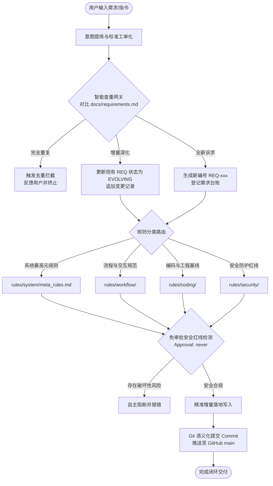
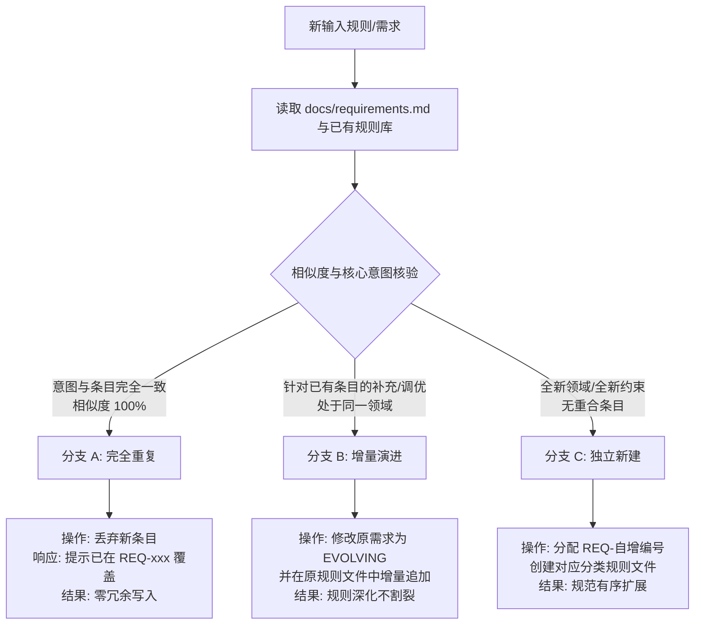
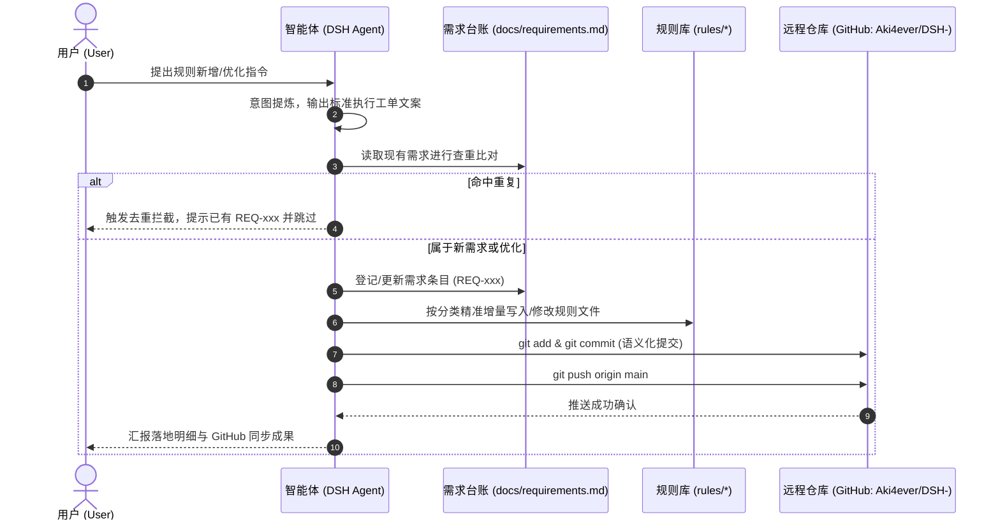

# 全局规则运作逻辑与可视化教学指南 (Global Rules Tutorial)

本文档面向所有协作者与智能体，系统化解析本项目**全局规则体系的核心运转逻辑**，并通过多维度可视化教学图进行直观展示。

---

## 🎯 一、全局规则运转的核心逻辑概括

本系统的全局规则运作遵循 **“一网关、二同步、三防线、五闭环”** 逻辑：

1. **一网关（去重网关）**：任何指令或规则进入前，先做字面与语义扫描，重复内容一律拦截过滤（幂等性保证）。
2. **二同步（双向同源）**：需求台账（`docs/requirements.md`）与具体规则实现（`rules/*`）严格同频演进，杜绝孤立规则。
3. **三防线（安全自律）**：在免审批策略（`Approval: never`）下，主动识别并拦截破坏性指令，严格按最小影响面精准编辑。
4. **五闭环（标准变更循环）**：输入提炼 ➔ 查重决策 ➔ 需求台账登记 ➔ 规则分层落地 ➔ Git 语义化同步。

---

## 📊 二、多维度可视化教学图解

### 教学图 1：端到端全链路执行闭环图 (End-to-End Pipeline)



---

### 教学图 2：智能查重与三向分支决策图 (De-duplication Logic)



---

### 教学图 3：规则金字塔与仲裁优先级 (Precedence Hierarchy)

当多条规则发生边界冲突或歧义时，严格依从金字塔自顶向下的仲裁权力：

```text
               ▲
              / \
             / 1 \   最高元规则 (rules/system/meta_rules.md)
            /─────\  [绝对律令: 需求双向同步、智能去重、全中文交互]
           /   2   \
          /─────────\ 安全防破坏红线 (rules/security/)
         /     3     \ [免审批运行环境安全底线、禁区目录拦截]
        /─────────────\
       /       4       \ 流程协同规范 (rules/workflow/)
      /─────────────────\ [变更工作流、组件命名、任务工单推进]
     /         5         \
    /─────────────────────\ 编码与技术规范 (rules/coding/)
   /           6           \ [Git 提交规范、跨平台换行 LF、代码样式]
  /─────────────────────────\
 /             7             \ 临时操作偏好 (Ad-hoc Preferences)
─────────────────────────────── [单次任务临时指令，不可覆盖上位规则]
```

---

### 教学图 4：人机协作交互时序图 (Collaboration Sequence)



---

## 💡 三、实战演练案例教学

### 场景 1：重复输入被智能过滤
* **用户输入**：“所有交互都要中文回答。”
* **系统研判**：扫描发现 `REQ-002` 与 `rules/system/meta_rules.md` 第三条已完全覆盖“全中文交互”。
* **处置逻辑**：**直接触发去重拦截**，不产生冗余文件，提示用户该需求已存在。

### 场景 2：规则优化与增量演进
* **用户输入**：“在需求文档中增加对弃用规则的打标要求。”
* **系统研判**：属于对已有 `REQ-004` 的补充优化。
* **处置逻辑**：将 `REQ-004` 标记为 `[EVOLVING]`，在对应条款追加补充，并同步更新提交。

### 场景 3：免审批下的安全自护
* **指令出现**：包含涉及工作区外或破坏性指令时。
* **系统研判**：当前审批为 `never`，一旦触碰高危将破坏系统且无确认机会。
* **处置逻辑**：系统依据第四条自律准则主动阻断越界动作，收敛至工作区安全执行。
