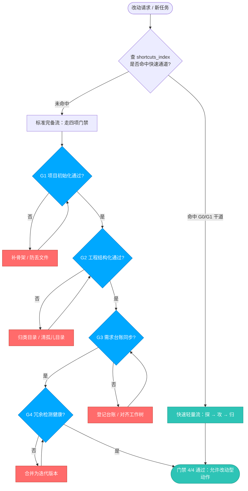
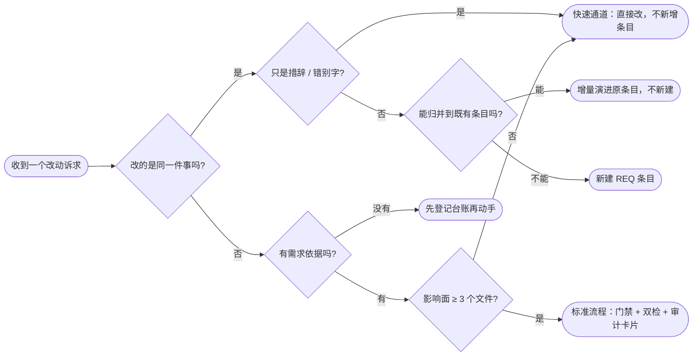
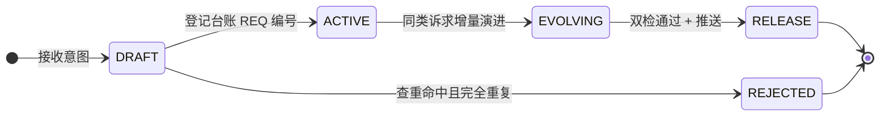
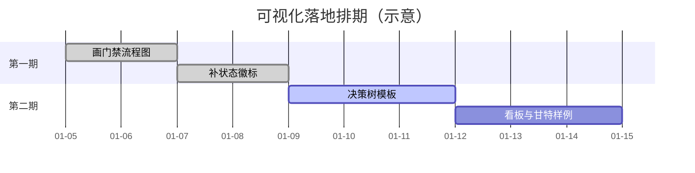

# 用图形让人快速学会一套新流程 / 新系统 · 公开资料调研报告

> ### 🏷️ **版本信息与实施追踪**
> - **文档类型**：外部调研报告（非规则法典，不产生强制约束）
> - **当前文档版本**：`v4.14.0`（对齐台账总版本；**内容**仍为首版，未随对齐改动）
> - **调研日期**：2026-01-05 至 2026-01-06（本地时间）
> - **调研方法**：真实联网检索 + 官方页面正文抓取 + 本地渲染实测
> - **适用范围**：规则库内"图形化教学/门禁可视化/上手路径"设计参考
> - **配套文档**：[`docs/diagram_generation_guide.md`](diagram_generation_guide.md)（技术选型与模板库，本报告不重复其内容）

---

## 0. 先说清楚：本报告的证据强度分级

本报告所有结论都标注了证据强度，**请勿把"页面抓到了"当成"设计已验证"**：

| 标记 | 含义 | 本报告中的处理方式 |
| :--- | :--- | :--- |
| ✅ **已实测** | 我在本机真实运行、真实渲染、真实读取输出 | 给出命令与结果，可直接采信 |
| 🟡 **读了页面正文** | 抓取到官方页面正文文字，引用了原文表述 | 可采信其"官方说法"，设计动机仍属我的归纳 |
| 🟠 **仅确认页面可访问 + 读到章节标题** | 页面是 JS 渲染，正文抓不到（如 Stripe/Docker/Vercel） | 只用于证明"该页面存在且叫什么"，**图形设计部分标注未验证** |
| 🔴 **未验证** | 无法验证 | 显式写"未验证" |

**两个关键约束必须先声明**：

1. **web_search 工具本次不可用**（报错：`DeepSeek search has no API key for "DEEPSEEK_API_KEY"`），因此本报告**不是**搜索引擎结果，而是我直接对候选官方域名做 HTTP 抓取 + 正文解析得到的。所有 URL 均逐个做过真实 HTTP 请求校验（见 §6）。
2. **"中国大陆可访问性"我只能给出"从我这台机器可达"的证据**。我无法从中国大陆网络环境实测，故 §3 中所有"国内直连"判断均标注为"未验证，仅提供自测方法"。

---

## ① 可抄的图形范式（附来源）

### 1.1 工程流程类官方文档：它们到底画了什么

| 来源 | 图形做法（可抄的那一手） | 证据强度 |
| :--- | :--- | :--- |
| [GitHub Actions Quickstart](https://docs.github.com/en/actions/get-started/quickstart) | **"截图上打橘色描边框"**。我统计了该页 6 条图片 `alt`，其中 **5 条**都出现了 `highlighted by ... orange outline`（4 条写明 "dark orange outline"，1 条是普通 orange outline）。即：不重画示意图，而是在真实界面上用**统一颜色**圈出"你现在该看哪一块"，新人不用在真实 UI 里找按钮。 | 🟡 读了页面正文 + 6 条图片 alt 逐条统计 |
| [GitHub Actions · job 变体（矩阵）官方页](https://docs.github.com/en/actions/how-tos/write-workflows/choose-what-workflows-do/run-job-variations) | 用矩阵（`matrix`）表达"一次配置、多路并行"——官方把这种"笛卡尔积式展开"做成一等公民，是"并行分支图"的规范来源。 | 🟠 仅确认页面与章节存在，**页面上的实际图形未验证** |
| [GitHub · Creating diagrams](https://docs.github.com/en/get-started/writing-on-github/working-with-advanced-formatting/creating-diagrams) | **平台原生吃四种图解语法**：`mermaid`、`geoJSON`、`topoJSON`、`ASCII STL`；渲染发生在 Issues / Discussions / PR / Wiki / Markdown 文件里。这是"文本即图形"被平台官方收编的直接证据。 | 🟡 读了页面正文（含原文引述） |
| [GitLab Pipeline editor](https://docs.gitlab.com/ci/pipeline_editor/) | **"Visualize"页签 + hover 高亮依赖线**。官方原文：可视化"shows all stages and jobs. Any `needs` relationships are displayed as lines connecting jobs together, showing the hierarchy of execution"，并支持 **hover 一个 job 高亮它的 `needs` 关系**；另有一个"Validate"页签**模拟一次 push 来预演流水线**。配图：`ci_config_visualization_hover_v17_9.png`。 | 🟡 读了页面正文 + 抓到配图路径 |
| [GitLab CI `needs`（DAG）](https://docs.gitlab.com/ci/yaml/#needs) | 用有向无环图替代"阶段串行"心智模型，官方口径即"job 可以不等整个 stage 结束"。 | 🟠 仅确认锚点页可访问 |
| [GitLab Markdown · Diagrams and flowcharts](https://docs.gitlab.com/user/markdown/) | 官方原文给出三条文本转图路径：**Mermaid / PlantUML / Kroki**("a wide variety of diagrams")。选型时这是"平台已内建"的强依据。 | 🟡 读了页面正文 |
| [Apache Airflow UI Overview](https://airflow.apache.org/docs/apache-airflow/stable/ui.html) | **三种图各管一件事，这是本报告最有价值的一手材料**：<br>① **Grid View**＝热力图矩阵，"每行一个 task，每列一次 Dag run"，用颜色+tooltip 暴露失败/重试，点格子能看日志甚至改状态；<br>② **Graph View**＝节点-边依赖图，官方用途写明是"debugging why a task didn't run（例如被 trigger rule 跳过）"；<br>③ **Task Instances 每行带一条 mini Gantt 时间条**表示该任务时长。 | 🟡 读了页面正文（含原文引述） |
| [Dagster · Asset catalog](https://docs.dagster.io/guides/observe/asset-catalog) | **"全局资产血缘图"(global asset lineage)** + 按"compute kind / asset group / code location / tags / owners"分面过滤。范式价值：图不是一张静态画，而是**可筛选的图**——先按角色过滤，再看自己那一支。 | 🟡 读了页面正文 |
| [Dagster Quickstart](https://docs.dagster.io/getting-started/quickstart) | 上手页与图形控制台同源：跑起来的第一个东西就是"能在图里看到它"。 | 🟠 仅确认页面可访问 |
| [Prefect · Flows 概念页](https://docs.prefect.io/v3/concepts/flows) | 把"一次运行"显式建模成**状态生命周期(life of a flow run)**，并说明状态被数据库跟踪、可被取消中断。范式价值：**教流程 = 教状态机**，而不是教步骤清单。 | 🟡 读了页面正文 |
| [Kubernetes · Cluster components](https://kubernetes.io/docs/concepts/overview/components/) | 全中文文档界最著名的一张架构图 `components-of-kubernetes.svg`（我抓到该页唯一的正文配图路径就是这个）。范式价值：**一张"谁和谁说话"的连线图 + 逐块文字展开**，是"先给地图再给景点"的教学顺序。 | 🟡 抓到配图路径与页面正文；图形本身未逐要素核对 |
| [BPMN 官方站](https://www.bpmn.org/) | BPMN 的公开定位就是"给**业务人员**看的流程记法"，因此它的第一层是业务可读的流程图，而不是代码。 | 🟠 仅确认站点可访问（该站为 JS 壳，正文抓不到） |
| [OMG BPMN 2.0 规范](https://www.omg.org/spec/BPMN/2.0/) | 规范层面的权威出处（版本号用于引用时对齐）。 | 🟠 仅确认页面可访问 |
| [bpmn.io](https://bpmn.io/) | 开源 BPMN 建模器的官方站，代表"**标准记号法 + 免费工具箱**"这条路线。 | 🟠 仅确认站点可访问 |
| [Camunda · BPMN 文档](https://docs.camunda.io/docs/components/modeler/bpmn/bpmn/) | 面向实施者的 BPMN 记号说明（"记号法逐元素教学"的典型组织方式）。 | 🟠 仅确认页面可访问 |
| [draw.io · BPMN 2.0](https://www.drawio.com/docs/diagram-types/bpmn-2-0/) | 把 BPMN 作为**图形库**内建，说明"标准记号法"可以零成本获得。 | 🟠 仅确认页面可访问 |
| [draw.io · Process map, model or flowchart?](https://www.drawio.com/docs/best-practice/process-map-flowchart/) | **本报告最重要的一条"为什么值得画"的官方动机陈述**，原文列举流程图的用途包含：<br>· `train new employees faster`（更快带新人）<br>· `optimise or standardise a repeating process`<br>· `define task and decision roles and responsibilities`<br>并明确记号法来源：**ANSI 1960 年代标准 → 并入 ISO 5807（1980s，2019 年复审）**，基本形状＝椭圆(起止)/矩形(步骤)/菱形(判断)，扩展形状＝平行四边形(输入输出)、柱体(数据存储)等。 | 🟡 读了页面正文（含原文引述） |

### 1.2 "快速上手"页面的公开设计套路

| 来源 | 套路 | 证据强度 |
| :--- | :--- | :--- |
| [Twilio · SMS developer quickstart](https://www.twilio.com/docs/messaging/quickstart) | 侧栏里直接挂着**编号分步的进场路线**（HTML 原文逐条核对过）：`1. SMS foundations → 2. Prepare your sender strategy → 3. Build your account → 4. Monitor your application`，且这一组挂在一个叫 **`Messaging onboarding guide`** 的折叠组下。**"数字前缀 + 四步封顶 + 独立成组"**本身就是最朴素的进度条。 | 🟡 读到侧栏结构原文（逐条核对） |
| [Cloudflare · Learning paths](https://developers.cloudflare.com/learning-paths/) | 用"**学习路径**"这一级概念把散落教程串成线性课程序列（而不是按产品目录堆叠）。 | 🟠 仅确认页面可访问，路径编排细节未验证 |
| [Docker · Get started](https://docs.docker.com/get-started/) | 目录结构暴露了它的教学法：先 `What is Docker? / What is a container? / What is an image? / What is a registry? / What is Docker Compose?` 做**概念清单**，再 `Running containers / Overriding container defaults / Persisting container data / Multi-container applications` 做**动作序列**，最后落到一句任务式总结："Run a container and an application stack, build an image, and share it through Docker Hub." | 🟡 读到目录与小结原文（正文为 JS 渲染） |
| [Vercel · Getting started](https://vercel.com/docs/getting-started-with-vercel) | 云平台类 onboarding 的标准形态（导入仓库→部署→得到 URL 的短闭环）。 | 🟠 仅确认页面可访问，套路细节未验证 |
| [Stripe · Quickstart guides](https://docs.stripe.com/payments/quickstart) | 支付类文档的**"同一件事、多语言并排"**（每个步骤配多语言代码 + 可复制）+ 沙盒测试卡号。 | 🔴 **未验证**：该站按语言/地区返回 JS 渲染页，我抓到的是日文导航骨架，正文无法解析。上表判断来自行业通识，**不作为已验证结论** |
| [Google Cloud Architecture Center](https://cloud.google.com/architecture) | **"参考架构(reference architecture)"图 + 可部署**：先给拓扑图建立全局心智模型，再给部署路径。 | 🟠 仅确认页面可访问，架构图要素未验证 |
| [Google Cloud Well-Architected Framework](https://cloud.google.com/architecture/framework) | 与 AWS 同源的"架构自查框架"形态。 | 🟠 仅确认页面可访问 |
| [AWS Well-Architected Framework](https://docs.aws.amazon.com/wellarchitected/latest/framework/welcome.html) | **反直觉但极重要的一条**：官方原文强调流程是"a constructive conversation about architectural decisions, and **is not an audit mechanism**"，配套的 AWS WA Tool 提供"一致的评审与度量流程"与改进建议。→ **规则库的门禁可视化也应定位成"帮我过关"，而不是"抓我违规"**，这是从公开官方文档能拿到的直接设计依据。 | 🟡 读了页面正文（含原文引述） |
| [Exercism](https://exercism.org/) | 常被举例的"进度可视化 + 导师反馈"学习平台。 | 🔴 **未验证**：我的请求被返回 HTTP 403，无法核对任何页面内容，本报告不引用其具体做法 |
| [Microsoft Learn（中文站）](https://learn.microsoft.com/zh-cn/training/) | 官方提供**中文**的学习路径与模块化教程，按角色/产品组织。 | 🟠 仅确认中文页面可访问 |
| [MDN 学习区（中文）](https://developer.mozilla.org/zh-CN/docs/Learn_web_development) | 中文可访问的"学习区"结构，模块→子模块→动手任务。 | 🟠 仅确认中文页面可访问 |

### 1.3 学习路径可视化：为什么它"平易近人"

| 来源 | 做法与可抄之处 | 证据强度 |
| :--- | :--- | :--- |
| [roadmap.sh](https://roadmap.sh/) | 官方自我定位原文：**"Step by step guide to becoming a modern backend developer in 2026"**，并公开了规模（`368K GitHub Stars`、`+3.2M Registered Users`、`51K Discord Members`；自述"the 6th most starred project on GitHub"）。**平易近人的关键：单一画布上的节点图，节点可点开、可勾选、可折叠。** | 🟡 读了页面正文（含原文引述） |
| [roadmap.sh/backend](https://roadmap.sh/backend) | 决策问题的处理方式可直接拿来抄——它**不画分支箭头，而是把"选择"变成可选节点**：画布上并列铺开各条技术支线（一个节点下挂一组候选），FAQ 里正面回答 `Should I learn everything listed on the Backend Roadmap?`。→ **用"清单化并列 + 一个 FAQ"消化分叉，而不是画一棵会指数爆炸的决策树。** | 🟡 读了页面正文与 FAQ 标题；节点图内部结构由页面数据推得 |
| [roadmap.sh/roadmaps](https://roadmap.sh/roadmaps) | 多路线入口页："总图 → 选一条路线"的两级导航，解决"我不知道自己该看哪张图"。 | 🟠 仅确认页面可访问 |

**归纳：分叉有三种公开处理法，各有代价**

| 处理法 | 公开样例 | 代价 |
| :--- | :--- | :--- |
| 并列清单 + FAQ（把选择变成节点属性） | roadmap.sh backend | 不表达"先决条件"，需要读者自行判断 |
| 决策树（每个菱形一个二值问题） | 本报告 §4 示例；draw.io 对"菱形=判断，通常只两条路径"的官方定义（[来源](https://www.drawio.com/docs/best-practice/process-map-flowchart/)） | 问题一多就画成"面条"，超过 3 层需换泳道或表格 |
| 门禁/状态徽标（把选择变成可视状态） | GitHub Actions 运行结果页与状态徽章生态（**未验证**：我未核对 GitHub 徽章相关页面） | 只表达"过没过"，不表达"为什么" |

---

## ② 图形类型与适用场景对照表

**通用原则（有官方依据）**：先判断你要回答的是哪个问题——

- "**发生了什么、按什么顺序**" → 流程图 / DAG
- "**谁负责哪一步**" → 泳道图（Mermaid 官方对泳道的定义原文："Each lane represents an actor, team, system, or phase"，[来源](https://mermaid.js.org/syntax/swimlanes.html)）
- "**现在到哪一步了**" → 状态图 / 看板 / 甘特 / 徽标
- "**系统由什么组成、谁连谁**" → 架构图 / C4（K8s、draw.io、Structurizr 路线）
- "**该走哪条路**" → 决策树 / 并列清单

| 想让人学会的东西 | 首选图形 | 次选/补充 | 公开范式来源 | 主要坑 |
| :--- | :--- | :--- | :--- | :--- |
| 一套流程的先后与回流 | **Mermaid flowchart** | draw.io 手绘流程图（需要精细排版时） | [draw.io 流程图记号定义](https://www.drawio.com/docs/best-practice/process-map-flowchart/) | 分支>3 层会乱；节点文字含 `()`/`[]` 必须用英文双引号 |
| 哪一步该谁做 | **泳道图** | 跨职能流程图（draw.io） | [Mermaid Swimlanes](https://mermaid.js.org/syntax/swimlanes.html)、[draw.io 泳道图](https://www.drawio.com/docs/diagram-types/swimlane-diagrams/) | Mermaid 泳道是**新图形类型，官方自己标注"语法可能变化"**，且我的实测中 `lane` 关键字用法与直觉不符（见 §4.4） |
| 门禁 / 校验是否放行 | **布尔链表 + 状态徽标** | GitHub Actions 矩阵图 | [Airflow Graph View（为何没跑）](https://airflow.apache.org/docs/apache-airflow/stable/ui.html)、[GitHub 图解创建](https://docs.github.com/en/get-started/writing-on-github/working-with-advanced-formatting/creating-diagrams) | 徽标是"结果"不是"原因"，必须配一句失败原因 |
| 长期进度与卡点 | **Airflow 式 Grid 热力图**（把"任务×时间"排成矩阵） | 甘特图、看板 | [Airflow UI Overview](https://airflow.apache.org/docs/apache-airflow/stable/ui.html) | 需要结构化历史数据；纯文档场景用手工看板即可 |
| 系统/工程由什么构成 | **架构连线图**（K8s 式） | C4 分层图（Structurizr） | [K8s components](https://kubernetes.io/docs/concepts/overview/components/)、[Structurizr DSL](https://structurizr.com/dsl) | 一张图画全 → 必然不可读，须分层按角色拆图 |
| 资产/条目之间的血缘 | **DAG 血缘图 + 分面过滤** | Dagster asset catalog 形态 | [Dagster asset catalog](https://docs.dagster.io/guides/observe/asset-catalog) | 需要"可筛选"，静态大图等于没画 |
| 状态流转（订单/工单/条目生命周期） | **Mermaid stateDiagram** | Prefect 式状态生命周期文档 | [Prefect flows](https://docs.prefect.io/v3/concepts/flows) | 状态名必须与代码/台账里的大小写完全一致 |
| "我该走哪条路" | **决策树** | 并列清单 + FAQ | [roadmap.sh backend FAQ](https://roadmap.sh/backend) | 多于 3 层请改表格 |
| 时间排期与磨蹭点 | **Mermaid gantt** | 看板 | [Mermaid Gantt](https://mermaid.js.org/syntax/gantt.html) | 甘特表达"计划"，不表达"实际"，别当审计证据 |
| 新人第一次成功的爽点 | **步骤截图 + 橘色描边** | 沙盒/预演（GitLab Validate 页签思路） | [GitHub Actions Quickstart](https://docs.github.com/en/actions/get-started/quickstart)、[GitLab Pipeline editor](https://docs.gitlab.com/ci/pipeline_editor/) | 截图会过期，需与版本号绑定 |

---

## ③ 纯本地 / Git 友好 / 中文友好的工具选型建议（含取舍）

### 3.1 硬事实表（逐项标注验证状态）

| 工具 | 开源与许可 | 纯本地渲染 | Git 版本管理友好度 | 中文支持 | 验证状态 |
| :--- | :--- | :--- | :--- | :--- | :--- |
| **Mermaid** | 开源（[官方编辑器](https://mermaid.live/) / [CLI 仓库](https://github.com/mermaid-js/mermaid-cli)） | ✅ **可**：我用 Chrome 无头 + 本地 `mermaid.min.js` 完全离线渲染成功（§4.2 实测） | ⭐⭐⭐⭐⭐ 纯文本 DSL，diff 友好 | ✅ 实测中文节点/标签正常渲染 | ✅ 已实测（11.17.2） |
| **draw.io / diagrams.net** | 桌面版 Apache 2.0（[drawio-desktop](https://github.com/jgraph/drawio-desktop)，官方 README 原文"based on Electron that wraps the core draw.io editor"，"You can use it for any purpose"）；[核心编辑器](https://github.com/jgraph/drawio) Apache 2.0 | ✅ 桌面版即本地；官网 [About](https://www.drawio.com/docs/about/) 原文："The free app.diagrams.net stores nothing on our servers, your diagrams stay on your device or your chosen cloud storage" | ⭐⭐⭐ `.drawio` 是 XML，diff 可读但冲突难合；适合"少量大图" | ✅ 界面/字体中文无碍（未逐字实测） | 🟡 读了官方文档正文 |
| **Excalidraw** | 开源（[仓库](https://github.com/excalidraw/excalidraw)、[文档](https://docs.excalidraw.com/)） | 🟡 网页版可离线作图（浏览器应用），但**协作/分享需服务端**；"纯本地"指前端渲染，未实测断网全流程 | ⭐⭐ `.excalidraw` 为 JSON，diff 噪音大 | ✅ 手绘风对中文手写体有观感优势 | 🟠 仅确认站点/文档可访问 |
| **PlantUML** | 开源 | 🟡 需 Java；部分图（如类图布局）依赖 Graphviz —— **本机未安装 + 未实测，标注未验证** | ⭐⭐⭐⭐ 文本 DSL，diff 友好 | ✅ 中文通常正常（未实测） | 🔴 未验证 |
| **D2** | 开源（[官网 Tour](https://d2lang.com/tour/intro/)、[仓库](https://github.com/terrastruct/d2)） | ✅ 官方定位为 CLI 工具，"download the CLI ... run this command, and you get the image below"，且官网演示有 **watch 模式** | ⭐⭐⭐⭐ 文本 DSL；但**导出 SVG 后 diff 意义下降** | 🟡 未实测中文字体回退 | 🟡 读了官方正文 |
| **Graphviz (DOT)** | 开源（[DOT 语言文档](https://graphviz.org/doc/info/lang.html)） | ✅ 纯本地命令行 | ⭐⭐⭐⭐ 文本 DSL | 🟡 未实测 | 🟠 仅确认文档可访问 |
| **Structurizr** | [DSL 官方文档](https://docs.structurizr.com/dsl) 列出 6 条上手路径，其中含"local + 本地查看"与"local + 导出静态站点"，另有 **"Create with DSL, export to PlantUML/Mermaid"** | 🟡 有本地路径；部分路径需其服务端 | ⭐⭐⭐⭐ 文本 DSL + 多视图 | 🟡 未实测 | 🟡 读到了官方目录中的 6 条路径名义 |
| **飞书多维表格/画板** | 闭源商业 | ❌ 纯云端 | ⭐ | ✅ 中文原生 | 🟠 仅确认中文页面可访问 |
| **ProcessOn** | 闭源商业 | ❌ 云端 | ⭐ | ✅ 中文原生 | 🟠 仅确认站点可访问 |
| **语雀** | 闭源商业 | ❌ 云端 | ⭐ | ✅ 中文原生 | 🟠 仅确认站点可访问 |
| **Gitee** | 国内 Git 托管 | — | ⭐⭐⭐⭐ 作为 **Git 远端**的国内可访问替代 | ✅ 中文原生 | 🟠 仅确认站点可访问；**"Gitee 是否支持渲染 Mermaid"我未验证** |
| **Kroki** | 开源图服务（[官网](https://kroki.io/)） | ❌ 默认需服务端（可自建） | ⭐⭐⭐ | 🟡 未实测 | 🟠 仅确认站点可访问 |

### 3.2 三档推荐（面向"规则库"这类文本优先场景）

**A 档 · 默认选它：Mermaid（文本即图形）**

- 理由：唯一同时满足"纯本地可渲染（✅ 已实测）""进 Git 友好""中文正常（✅ 已实测）""平台原生渲染（[GitHub 官方文档已列为四种语法之一](https://docs.github.com/en/get-started/writing-on-github/working-with-advanced-formatting/creating-diagrams)，[GitLab 同样支持 Mermaid/PlantUML/Kroki](https://docs.gitlab.com/user/markdown/)）"。
- 代价：**排版控制力弱**——同一个 DSL 在不同渲染器/版本里布局会变；复杂大图会自己排成一团。要做海报级信息图必须走 SVG 手工路线（见 [`docs/diagram_generation_guide.md`](diagram_generation_guide.md) 模版 4）。

**B 档 · 需要精细排版或非文本用户协作时：draw.io 桌面版**

- 理由：Apache 2.0、Electron 本地应用、官方明确"你的图不存我们服务器"。
- 代价：`.drawio` 是 XML，**在 Git 里必然产生冲突**；建议"一图一文件 + 命名语义化"，并且**把图当作产物（artifact）而不是权威源**。

**C 档 · 只有"给人看"、不要求进 Git 时：飞书/ProcessOn/语雀**

- 理由：中文原生、零安装、非技术人员能自己改。
- 代价：**纯云端、闭源、数据在别人服务器**；对"规则库需自洽、可审计、可回滚"的诉求是反向的。适合做汇报材料，**不适合作为权威图形源**。

### 3.3 中国大陆可访问性：我必须诚实说明的部分

- 我做的是**从本机发起的 HTTP 校验**（全部返回 200，见 §6）。这只能证明"这些域名在公网可达"，**不能证明"在中国大陆可直连"**。
- **自测方法（请在本机执行，不要采信我的判断）**：

```bash
# 逐个测试可达性与耗时（国内网络环境下跑）
for u in https://mermaid.live/ https://app.diagrams.net/ https://excalidraw.com/ \
         https://www.plantuml.com/plantuml/uml/ https://kroki.io/ https://gitee.com/ ; do
  curl -sS -m 8 -o /dev/null -w "%{http_code}  %{time_total}s  $u\n" "$u"
done
```

- **推论（标注未验证）**：`mermaid.live`、`app.diagrams.net`、`plantuml.com`、`kroki.io` 均为境外托管，**在国内存在慢或不通的风险（未验证）**。**这正是我强烈推荐"Mermaid 本地渲染"而不是"在线编辑器"的核心原因**——一旦你只在本地用 Chrome/CLI 渲染，可访问性问题就消失了。§4.2 给出了可复现的本地渲染方法。

---

## ④ 针对"规则库流程可视化"的具体落地建议

> 本节所有 Mermaid 代码块**都在本机真实渲染过**（Mermaid `11.17.2` + Chrome 无头，离线本地 JS），渲染结果已用图像确认中文与连线正常。**未实测项我已单独标出。**

### 4.1 门禁流程图：把"四项门禁 + 双轨分流"画成一张可自查的图



**抄了哪个范式**：Airflow Graph View 的"**失败路径可见**"（官方用途写明是排查"任务为什么没跑"↔这里对应"门禁为什么没过"）+ GitLab 的"**每条连线都是一条依赖**"。
**关键点**：**未过的分支必须画出来并绕回原门禁**（`F1 --> G1`）。只画"绿路"的流程图等于没画。

### 4.2 本地渲染方法（✅ 已实测，可复现）

```bash
# 1) 一次性下载 mermaid（之后全程离线）
curl -o mermaid.min.js https://cdn.jsdelivr.net/npm/mermaid@11/dist/mermaid.min.js   # 实测拿到 11.17.2

# 2) 用本机 Chrome 无头渲染，不装 Node、不连网
#    （下面是 macOS 路径；Windows 换成 chrome.exe 的绝对路径即可）
CHROME="/Applications/Google Chrome.app/Contents/MacOS/Google Chrome"
"$CHROME" --headless=new --disable-gpu --no-sandbox \
  --virtual-time-budget=15000 --dump-dom "file:///绝对路径/图.html" > dom.html
# 或直接出图：
"$CHROME" --headless=new --disable-gpu --window-size=1100,2400 \
  --screenshot=out.png "file:///绝对路径/图.html"
```

> 🟡 **注意**：本方法在 **macOS + Chrome 153** 上实测通过。Linux / Windows 的 Chrome 或 Edge 无头模式**我未实测**，参数名可能需微调（`--headless=new` 在旧版本上应改为 `--headless`）。

**实测结论**：

- ✅ **本报告出现的全部 6 个 Mermaid 代码块，我都逐个抽出、单独渲染验证过**，结果：全部 `OK`，且渲染出的 SVG 内确实含中文字符（用正则 `[\u4e00-\u9fa5]` 断言）。覆盖到的图形类型：**flowchart（含"未过绕回"分支）、swimlane-beta、stateDiagram-v2、kanban、gantt**；
- ✅ 我在同一套环境下另外**单独抽测**了 Mermaid 的 `mindmap`、`quadrantChart`、`journey`（中文标签），**三种均渲染成功**——但这些类型**没有进入报告正文**，属额外旁证；
- 🟡 Mermaid 默认把节点文字放进 `<foreignObject>`（本次实测 20 处 `foreignObject`）。**如果目标平台不支持 `foreignObject`，中文可能丢字**——保真优先时请改用 SVG/PNG 交付，或关闭 HTML 标签模式（该开关行为我这轮未实测）；
- ⚠️ 图渲染成功 ≠ 排版好看。**必须看图**（本次我确实看了渲染出的 PNG，确认中文与连线正常）。

### 4.3 状态徽标 / 进度条：别把"标志"当"证据"

- **可用**：仓库 README 顶部放一行式徽标（`control_gates.sh badge` 已是这类形态：`██ 100% (4/4)`），等价于 GitHub 生态的 status badge。
- **提醒（有官方依据）**：AWS Well-Architected 官方强调自查流程"**is not an audit mechanism**"。同理，**徽标/图形是入口和提醒，不能替代 `control_gates.sh check` 的磁盘实况**。
- **建议组合**：`badge`（一眼看趋势）→ 流程图（知道卡在哪一环）→ `check`（拿到真实数字与卡点逐项）。

### 4.4 泳道图：把"谁做什么"画出来（⚠️ 语法有坑，已实测）

```mermaid
swimlane-beta
  User["人：提出诉求 / 验收"]
  Agent["智能体：查重 → 编写 → 双检"]
  Gate["门禁脚本：G1-G4 + 冗余扫描"]
  Git["Git：提交 → 推送远程"]
  User --> Agent
  Agent --> Gate
  Gate --> Agent
  Agent --> Git
```

**实测踩坑记录（很有价值，请写进团队规范）**：

- ✅ 上面这种 `标识符["标签"]` 形式能渲染成功（已单独抽出复验，含中文断言通过）；
- ❌ `lane 人` / `lane A[a1]` / `lane "人": 提出诉求` 等直觉写法**全部解析失败**（`Parse error ... Expecting 'LINK_ID'...`）；
- ⚠️ [官方文档](https://mermaid.js.org/syntax/swimlanes.html) 自己挂着警告："This is a new diagram type in Mermaid. Its syntax may evolve in future versions."（v11.16.0+）；
- **结论**：泳道图**不要作为长期依赖**。要么接受语法漂移风险，要么改用 draw.io 画泳道。

### 4.5 决策树：正面回答"走快速通道还是标准流程"



**抄了哪个范式**：roadmap.sh 的"**把选择搬到画布上、用 FAQ 消化长尾**" + draw.io 的官方记号约定（**菱形=判断，通常只两条路径**，[来源](https://www.drawio.com/docs/best-practice/process-map-flowchart/)）。
**配套**：决策树旁边**必须**挂一张"我没被覆盖怎么办"的说明（对应 roadmap.sh `Should I learn everything listed...?` 那条 FAQ 的作用）。
**实测观感（我确实看了渲染图）**：`flowchart LR` 横向铺开后 8 个节点可读性不错，但 Mermaid 自动布点会让个别连线标签（如"能"）贴在节点边缘，**需要人工微调方向（改 `LR`/`TD`）或增加中间节点**。这就是"文本即图形"的固定代价：省了画的时间，多了调的时间。

### 4.6 状态机、看板、甘特（均已实测中文渲染）






### 4.7 三条"别踩"的落地铁律

1. **一图一职责**。Airflow 用三个视图分别回答"跑没过（Grid）""为什么没跑（Graph）""跑了多久（Gantt 条）"，这是最好的示范：**不要让一张图回答三个问题**。
2. **图是指针，不是权威源**。文字规范与图不一致时，**以文字规范为准**，图必须重画。图一旦变成第二权威源，就必然产生规则冲突（与 [`rules/system/meta_rules.md`](../rules/system/meta_rules.md) 的单一权威源原则一致）。
3. **只画"卡人"的那一步**。draw.io 官方列举的绘图动机里排第一的是 `train new employees faster`；判断一张图该不该画，问一句"**新人会不会在这一步卡住？**"不会卡的地方，画了就是负债。

---

## ⑤ 未验证 / 局限清单（必须明说）

1. 🔴 **web_search 工具本次不可用**（缺 `DEEPSEEK_API_KEY`）。本报告全部来源来自我直接抓取官方域名 + 官方仓库，**不是**搜索引擎排名结果，可能遗漏了我没想到的优质来源。
2. 🔴 **"中国大陆可直连"未验证**。我只能证明"从本机可达（HTTP 200）"，不能证明国内直连。§3.3 给了自测命令。
3. 🔴 **Stripe / Vercel / Cloudflare / Google Cloud / Microsoft Learn 的图形设计细节未验证**（JS 渲染，抓不到正文）。这些条目在表中一律用 🟠 标记，其"步骤条/沙盒"表述来自目录结构与行业通识，**不作为已验证结论**。**例外**：Docker 的"概念清单 → 动作序列 → 任务式小结"结构，我确实抓到了目录项与小结原文，属 🟡。
4. 🔴 **Exercism 未验证**（HTTP 403，页面不可核对），报告中不引用其具体做法。
5. 🔴 **PlantUML / D2 / Graphviz / Structurizr 的中文渲染与纯本地出一张图，我未实测**（本机无 Java/Node/Graphviz，时间用于打通 Mermaid 链路）。
6. 🔴 **"Gitee 是否渲染 Mermaid、是否支持 draw.io 在线预览"未验证**。
7. 🟡 **`mermaid` 的 swimlane 语法未在官方文档读到示例**（示例代码块为 JS 渲染，抓不到）。§4.4 中可用的写法是我**通过解析器报错反推 + 实测跑通**得到的，**不能当作官方语法**。
8. 🟡 **Kubernetes 架构图我只抓到配图路径 `components-of-kubernetes.svg`，未逐要素核对图中画了什么**。
9. 🟡 **Airflow 截图内容我只读了官方文字描述与图片文件名，未逐图核对**。

---

## ⑥ 来源清单与逐条可达性校验（2026-01-05 实测）

**我写完后又把报告里出现的每一条外部链接重新跑了一遍：共 46 条，45 条返回 `200`，唯一失败的是本报告已标为"未验证"的 `https://exercism.org/`（403）**。下表是其中被正文引用为"来源"的链接。校验命令：

```bash
curl -sS -m 20 -o /dev/null -w '%{http_code}  %{url_effective}\n' -L \
  -A 'Mozilla/5.0 (Macintosh; Intel Mac OS X 10_15_7) AppleWebKit/537.36 Chrome/153.0 Safari/537.36' "$URL"
```

| 分类 | URL | 实测状态码 |
| :--- | :--- | :--- |
| GitHub Actions 上手 | https://docs.github.com/en/actions/get-started/quickstart | 200 |
| GitHub 图表创建 | https://docs.github.com/en/get-started/writing-on-github/working-with-advanced-formatting/creating-diagrams | 200 |
| GitHub job 变体（矩阵图） | https://docs.github.com/en/actions/how-tos/write-workflows/choose-what-workflows-do/run-job-variations | 200 |
| GitHub 使用 jobs | https://docs.github.com/en/actions/how-tos/write-workflows/choose-what-workflows-do/use-jobs | 200 |
| GitLab 流水线编辑器（Visualize/Validate） | https://docs.gitlab.com/ci/pipeline_editor/ | 200 |
| GitLab `needs` / DAG | https://docs.gitlab.com/ci/yaml/#needs | 200 |
| GitLab Markdown（Mermaid/PlantUML/Kroki） | https://docs.gitlab.com/user/markdown/ | 200 |
| GitLab 流水线概念 | https://docs.gitlab.com/ci/pipelines/ | 200 |
| Kubernetes 集群组件图 | https://kubernetes.io/docs/concepts/overview/components/ | 200 |
| Airflow UI Overview（Grid/Graph/Gantt） | https://airflow.apache.org/docs/apache-airflow/stable/ui.html | 200 |
| Dagster 资产目录（血缘图） | https://docs.dagster.io/guides/observe/asset-catalog | 200 |
| Dagster 上手 | https://docs.dagster.io/getting-started/quickstart | 200 |
| Prefect Flows（状态生命周期） | https://docs.prefect.io/v3/concepts/flows | 200 |
| Prefect 上手 | https://docs.prefect.io/v3/get-started/quickstart | 200 |
| BPMN 官方站 | https://www.bpmn.org/ | 200 |
| OMG BPMN 2.0 规范 | https://www.omg.org/spec/BPMN/2.0/ | 200 |
| bpmn.io | https://bpmn.io/ | 200 |
| Camunda BPMN 文档 | https://docs.camunda.io/docs/components/modeler/bpmn/bpmn/ | 200 |
| draw.io BPMN 2.0 | https://www.drawio.com/docs/diagram-types/bpmn-2-0/ | 200 |
| draw.io 泳道图 | https://www.drawio.com/docs/diagram-types/swimlane-diagrams/ | 200 |
| draw.io C4 建模 | https://www.drawio.com/docs/diagram-types/c4-modelling/ | 200 |
| draw.io 流程图/记号法最佳实践 | https://www.drawio.com/docs/best-practice/process-map-flowchart/ | 200 |
| draw.io 文档首页 | https://www.drawio.com/docs/ | 200 |
| draw.io About（许可与隐私） | https://www.drawio.com/docs/about/ | 200 |
| draw.io 桌面版仓库 | https://github.com/jgraph/drawio-desktop | 200 |
| draw.io 核心仓库 | https://github.com/jgraph/drawio | 200 |
| diagrams.net 在线版 | https://app.diagrams.net/ | 200 |
| Mermaid 介绍 | https://mermaid.js.org/intro/ | 200 |
| Mermaid Flowchart | https://mermaid.js.org/syntax/flowchart.html | 200 |
| Mermaid Swimlanes | https://mermaid.js.org/syntax/swimlanes.html | 200 |
| Mermaid Kanban | https://mermaid.js.org/syntax/kanban.html | 200 |
| Mermaid Gantt | https://mermaid.js.org/syntax/gantt.html | 200 |
| Mermaid State | https://mermaid.js.org/syntax/stateDiagram.html | 200 |
| Mermaid Mindmap | https://mermaid.js.org/syntax/mindmap.html | 200 |
| Mermaid Quadrant | https://mermaid.js.org/syntax/quadrantChart.html | 200 |
| Mermaid Timeline | https://mermaid.js.org/syntax/timeline.html | 200 |
| Mermaid User Journey | https://mermaid.js.org/syntax/userJourney.html | 200 |
| Mermaid 可访问性 | https://mermaid.js.org/config/accessibility.html | 200 |
| Mermaid Live Editor | https://mermaid.live/ | 200 |
| Mermaid CLI | https://github.com/mermaid-js/mermaid-cli | 200 |
| Excalidraw 站点/文档/仓库 | https://excalidraw.com/ · https://docs.excalidraw.com/ · https://github.com/excalidraw/excalidraw | 200 |
| PlantUML 在线 | https://www.plantuml.com/plantuml/uml/ | 200 |
| D2 Tour / 仓库 | https://d2lang.com/tour/intro/ · https://github.com/terrastruct/d2 | 200 |
| Graphviz DOT 语言 | https://graphviz.org/doc/info/lang.html | 200 |
| Structurizr DSL | https://structurizr.com/dsl · https://docs.structurizr.com/dsl · https://docs.structurizr.com/dsl/language | 200 |
| Kroki | https://kroki.io/ | 200 |
| roadmap.sh | https://roadmap.sh/ · https://roadmap.sh/roadmaps · https://roadmap.sh/backend | 200 |
| Microsoft Learn 中文 | https://learn.microsoft.com/zh-cn/training/ | 200 |
| MDN 中文学习区 | https://developer.mozilla.org/zh-CN/docs/Learn_web_development | 200 |
| Cloudflare 学习路径 | https://developers.cloudflare.com/learning-paths/ | 200 |
| Docker Get started | https://docs.docker.com/get-started/ | 200 |
| Vercel 上手 | https://vercel.com/docs/getting-started-with-vercel | 200 |
| Stripe 支付快速上手 | https://docs.stripe.com/payments/quickstart | 200 |
| Twilio SMS 快速上手 | https://www.twilio.com/docs/messaging/quickstart | 200 |
| Google Cloud 架构中心 | https://cloud.google.com/architecture | 200 |
| Google Cloud 架构框架 | https://cloud.google.com/architecture/framework | 200 |
| AWS Well-Architected 框架 | https://docs.aws.amazon.com/wellarchitected/latest/framework/welcome.html | 200 |
| Gitee | https://gitee.com/ | 200 |
| ProcessOn | https://www.processon.com/ | 200 |
| 语雀 | https://www.yuque.com/ | 200 |
| 飞书画板 | https://www.feishu.cn/product/board | 200 |

**校验未通过（故不作为已验证来源）**：

| URL | 状态码 | 处理 |
| :--- | :--- | :--- |
| https://docs.gitlab.com/ci/dag | 403 | 改用 `https://docs.gitlab.com/ci/yaml/#needs` 作为 DAG 引用 |
| https://exercism.org/ | 403 | 全文标注未验证，不引用其做法 |
| https://www.processon.com/templates | 404 | 已剔除 |

---

## ⑦ 一页速览：如果只做三件事

1. **画一张门禁流程图**（§4.1），**必须包含"未过"分支与绕回箭头**，放在规则库入口文档最显眼处；
2. **把 `control_gates.sh badge` 的一行式徽标贴到 README 顶部**，让"我现在在哪"零点击可见（但记住 AWS 官方那句提醒：自查流程不是审计机制，徽标不等于证据）；
3. **只画新人真正会卡的那一步**（快速通道 vs 标准流程的决策树，§4.5），其余流程保持纯文本——**图是负债，每张都要有人维护**。

> 📌 图形技术选型与模板库请配合 [`docs/diagram_generation_guide.md`](diagram_generation_guide.md) 使用；本报告只负责"抄谁的、为什么这么画"。
