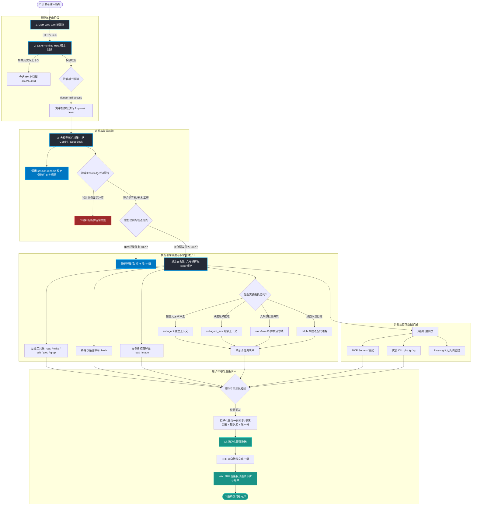

# DSH 宿主系统能力体系索引与全景架构 (DSH Capabilities Matrix)

> ### 🏷️ **版本信息与实施追踪**
> - **当前文档版本**：`v1.2.0`
> - **对应实施版本**：`v1.2.0`
> - **版本治理规范**：遵循 [`rules/workflow/versioning_standard.md`](../rules/workflow/versioning_standard.md)
> - **最后更新日期**：2026-09-16
> - **版本状态**：`[Release 稳定生效]`

本文档是 DeepSeek Harness (DSH) 宿主运行环境与基座能力的**系统化全景图与端到端流转法典**，旨在为智能体和开发者提供一站式的系统分层定位、核心机制说明与执行流转流程图。

---

## 🏗️ 一、系统全景架构与层级关系

```text
┌─────────────────────────────────────────────────────────────────────────────┐
│                       1. DSH Web GUI (客户端呈现层)                           │
│   ┌───────────────────────────┬───────────────────────────┬─────────────┐   │
│   │ 侧边栏投影 (Title 8字锁定) │ 视口吸顶 (GFM 零乱码卡片) │ SSE 实时多路流│   │
│   └───────────────────────────┴───────────────────────────┴─────────────┘   │
└──────────────────────────────────────┬──────────────────────────────────────┘
                                       │ HTTP / SSE / JSON RPC
┌──────────────────────────────────────▼──────────────────────────────────────┐
│                      2. DSH Runtime Host (宿主执行层)                        │
│   ┌─────────────────────┬─────────────────────┬─────────────────────────┐   │
│   │   ApiProxy 路由网关  │   会话持久化引擎     │    沙箱安全控制中心     │   │
│   │   (Fetch Handler)   │   (JSONL.zstd 增量) │  (danger-full-access)   │   │
│   └─────────────────────┴─────────────────────┴─────────────────────────┘   │
└──────────────────────────────────────┬──────────────────────────────────────┘
                                       │ 工具调度、上下文派发与权限放行
┌──────────────────────────────────────▼──────────────────────────────────────┐
│                    3. Execution Core (底层执行引擎与核心工具)                 │
│   ┌─────────────────────────┬─────────────────────────┬─────────────────┐   │
│   │   基础文件读写与正则检索  │    系统终端与视觉多模态   │   任务目标与治理 │   │
│   │ (read, write, edit, rg) │    (bash, read_image)   │(todo_write, goal)│  │
│   ├─────────────────────────┴─────────────────────────┴─────────────────┤   │
│   │                      多智能体协同编排生态                           │   │
│   │ - subagent (单轮独立沙箱)           - workflow (JS 原生高并发流水线)│   │
│   │ - subagent_fork (克隆上下文深度分支) - ralph (无状态冷启动自愈环路)   │   │
│   └─────────────────────────────────────────────────────────────────────┘   │
└──────────────────────────────────────┬──────────────────────────────────────┘
                                       │ 开放协议适配与动态挂载
┌──────────────────────────────────────▼──────────────────────────────────────┐
│                   4. Extension Ecosystem (外部开放扩展生态)                   │
│   - Anthropic MCP 标准 Servers (Postgres, Git, Filesystem, Brave Search)    │
│   - 系统级优质 CLI 工具链 (gh, jq, ripgrep, docker, ffmpeg)                  │
│   - OpenAPI / Swagger 接口自动反射工具  - Playwright / Puppeteer 无头浏览器   │
└─────────────────────────────────────────────────────────────────────────────┘
```

---

## 🔄 二、任务端到端流转全景流程图 (Panoramic Flowchart)



---

## ⚡ 三、核心能力维度与机制

### 1. 会话生命周期与投影机制 (Session & Projections)
- **多会话压缩持久化**：会话历史存储于 `$DSH_HOME/sessions/.../session.jsonl.zstd`，具备高压缩比与低延迟回放能力；
- **Title 投影与实时锁定**：
  - 客户端通过 `session/projection` 事件流监听标题变动；
  - 智能体通过 RPC 调用 `session.rename`（或脚本 `./scripts/rename_session.sh`）向 host 发送强一致的标题更新，即时同步至侧边栏，杜绝标题截断乱序；
- **Fork 会话分支**：支持基于历史指定序列创建无缝承接的子会话。

### 2. 沙箱隔离与安全基线 (Sandbox Policy)
- **沙箱模式**：
  - `danger-full-access`（当前模式）：完全访问模式，文件系统与 Bash 不受限，需智能体自律；
  - `workspace-write`：工作区受限写入；
  - `read-only`：只读安全模式。
- **免审批策略 (`Approval: never`)**：所有操作免弹窗静默放行，智能体自主守门，严禁破坏宿主外部路径，确保原子性操作。

### 3. 多模态视觉解析 (Multimodal Vision)
- **原生免库支持**：支持直接通过 `read_image` 传入本地 PNG/JPEG/WebP/GIF；
- **宿主放行配置**：宿主 `$DSH_HOME/settings.yaml` 必须包含 `input: [text, image]` 模态声明，工具链门禁即自动放行，无需冗余安装第三方图像转换库。

### 4. 智能编排与多智能体系统 (Multi-Agent Orchestration)
- **单轮独立委托 (`subagent`)**：干净隔离上下文，适用于独立外包研究与代码审查；
- **连贯分支委托 (`subagent_fork`)**：克隆当前完整对话历史，适用于延续性推理与专项深入；
- **大规模流水线 (`workflow`)**：原生 JS 脚本编排，提供 `pipeline`、`parallel`、`agent` 异步并发管道；
- **反思重试环路 (`ralph`)**：基于外部共享工作区的全新冷启动自主迭代循环。

---

## 🧭 四、快捷定位与指引

- **外部生态扩展矩阵**：参见 [`indexes/extension_ecosystem.md`](extension_ecosystem.md)
- **图表生成标准指南**：参见 [`docs/diagram_generation_guide.md`](../docs/diagram_generation_guide.md)
- **工具函数调用详查**：参见 [`indexes/tool_interfaces.md`](tool_interfaces.md)
- **规则检索入口**：参见 [`indexes/rules_index.md`](rules_index.md)
- **长期避坑经验**：参见 [`memory/lessons_learned.md`](../memory/lessons_learned.md)
