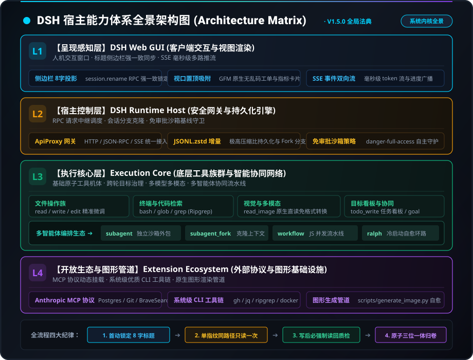
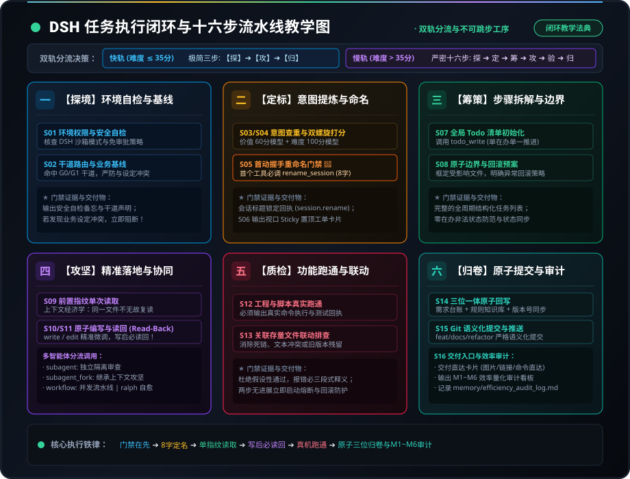

# DSH 宿主系统能力体系索引与全景架构 (DSH Capabilities Matrix)

> ### 🏷️ **版本信息与实施追踪**
> - **当前文档版本**：`v3.3.0`
> - **对应实施版本**：`v3.3.0`
> - **版本治理规范**：遵循 [`rules/workflow/versioning_standard.md`](../rules/workflow/versioning_standard.md)
> - **最后更新日期**：2026-09-16
> - **版本状态**：`[Release 稳定生效]`

本文档是 DeepSeek Harness (DSH) 宿主基座能力的**系统化全景图、能力树形拓扑与双层调用法典**，旨在为智能体和开发者提供一站式的架构解构、极速寻址地图与标准化执行规范。

---

## 🎨 系统架构与执行流转高保真教学图

### 1. DSH 宿主能力体系全景架构图 (Architecture Matrix)


> 💡 **矢量图源文件**：[`assets/generated_images/dsh_system_architecture_infographic.svg`](../assets/generated_images/dsh_system_architecture_infographic.svg) | 高清栅格图：[`assets/generated_images/dsh_system_architecture_infographic.svg.png`](../assets/generated_images/dsh_system_architecture_infographic.svg.png)

### 2. DSH 任务执行闭环与十六步流水线教学图 (Execution Flowchart)


> 💡 **矢量图源文件**：[`assets/generated_images/dsh_pipeline_teaching_flowchart.svg`](../assets/generated_images/dsh_pipeline_teaching_flowchart.svg) | 高清栅格图：[`assets/generated_images/dsh_pipeline_teaching_flowchart.svg.png`](../assets/generated_images/dsh_pipeline_teaching_flowchart.svg.png)

---

## 🌲 一、DSH 宿主全景能力六维树形拓扑 (Capability Tree)

通过自顶向下的树形拓扑，将宿主基座能力系统化归为 **6 大一级支柱 ➔ 18 个二级模块 ➔ 40+ 项具体能力**，实现秒级定位：

```text
DeepSeek Harness (DSH) 宿主全景能力架构树
├── 1. CLI 命令行与终端基座 (Command-Line & Terminal)
│   ├── 1.1 系统终端通道 (bash / pwsh 原生执行与退出码监控)
│   ├── 1.2 异步后台任务调度 (Jobs: job_list / job_output / job_kill)
│   └── 1.3 核心运维自动化脚本 (disk_check_and_cleanup / rename_session / generate_image / init_dir)
│
├── 2. MCP 开放标准协议生态 (Model Context Protocol)
│   ├── 2.1 文件与受限沙箱服务 (@modelcontextprotocol/server-filesystem)
│   ├── 2.2 代码版本管理服务 (@modelcontextprotocol/server-git / server-github)
│   ├── 2.3 语义与知识图谱记忆 (@modelcontextprotocol/server-memory)
│   └── 2.4 外部数据与自动化服务 (server-postgres / server-puppeteer / brave-search)
│
├── 3. API 网关与宿主通信总线 (API Gateway & RPC Remotes)
│   ├── 3.1 会话全生命周期管控 (session.rename / session.fork / session.models)
│   ├── 3.2 动态设置与偏好存储 (settings.describe / settings.mutate)
│   └── 3.3 本地工作区与目录流 (workspaces.openPath / host.listDirectory)
│
├── 4. 插件与动态前端呈现体系 (Plugins & Presentation)
│   ├── 4.1 Cordis 动态内核机制 (cordis-plugin-loader / cordis-plugin-hmr)
│   ├── 4.2 Web 前端插槽系统 (Single / Keyed / List / Chain 四类 React Slots)
│   └── 4.3 动态运行时加载协议 (dsh-typert-loader / typert-protocol)
│
├── 5. 多智能体协同与流水线编排 (Multi-Agent & Workflow)
│   ├── 5.1 单轮独立沙箱委托 (subagent - 独立纯净上下文)
│   ├── 5.2 继承式克隆分支委托 (subagent_fork - 承接上下文深度推演)
│   ├── 5.3 高并发 JavaScript 流水线 (workflow - pipeline / parallel / agent 并发)
│   └── 5.4 无状态冷启动自愈闭环 (ralph - 跨轮次持久化自主演进)
│
└── 6. Skill 动态专家技能编排 (Dynamic Agent Skills)
    ├── 6.1 本地技能反射与加载 (skill / dsh-tool-skill)
    ├── 6.2 文件系统技能库 (dsh-skill-filesystem)
    └── 6.3 垂直领域业务技能包 (Unity 规范 / Web 路由 / 算法质检 / 自动化脚本)
```

---

## 📑 二、双层能力标准化规范体系 (Two-Tier Capability Specification)

为了满足“外部快速路由检索”与“内部精准无误执行”的双向诉求，DSH 所有工具与能力必须建立双层规范：

### 1. 外层接口索引卡 (Outer Indexing Spec)
部署于能力检索与路由索引层（如 [`indexes/tool_interfaces.md`](tool_interfaces.md)），核心字段：
- **能力名称与签名**：标准具名标识；
- **核心职能描述**：一句话说明核心定位；
- **正向适用边界 (When to use)**：2~3 个必须使用的典型场景；
- **反例与禁忌场景 (When NOT to use)**：严禁使用的反例与易混淆的替代品；
- **快速触发口令**：CLI 指令、快捷命令或调用函数。

### 2. 内层实操执行手册 (Inner Execution Playbook)
部署于具体实现与操作指南中，核心要素：
- **输入参数模型 (Options & JSON Schema)**：详细类型与默认值；
- **标准调用代码/命令示例**：可一键运行的高保真代码；
- **执行生命周期与前端卡片映射**：在 Web GUI 激活的对应可视化组件（如 TerminalCard、DiffCard）；
- **异常防御与自愈机制**：常见报错识别与回滚步骤。

---

## ⚡ 三、核心机制与宿主保障

### 1. 会话生命周期与投影机制 (Session & Projections)
- **多会话压缩持久化**：会话历史存储于 `$DSH_HOME/sessions/.../session.jsonl.zstd`，具备高压缩比与低延迟回放能力；
- **Title 投影与实时锁定**：智能体通过 RPC 调用 `session.rename`（脚本 `./scripts/rename_session.sh`）锁定侧边栏 8 字标题，消除截断；
- **Fork 会话分支**：支持基于历史指定序列创建无缝承接的子会话。

### 2. 沙箱隔离与安全基线 (Sandbox Policy)
- **沙箱模式**：当前为 `danger-full-access` 完全访问模式，免审批静默放行（`Approval: never`）；
- **白名单保护铁律**：`knowledge/`、`memory/`、`rules/`、`indexes/`、`docs/` 核心资产绝对禁止删除。

### 3. 多模态视觉解析 (Multimodal Vision)
- **原生免库支持**：通过 `read_image` 原生工具解析本地 PNG/JPEG/WebP/GIF，免装外部图像库；
- **宿主放行配置**：宿主 `$DSH_HOME/settings.yaml` 声明 `input: [text, image]` 模态。

---

## 🧭 四、快捷定位与指引

- **工具双层详细接口手册**：参见 [`indexes/tool_interfaces.md`](tool_interfaces.md)
- **外部生态扩展矩阵**：参见 [`indexes/extension_ecosystem.md`](extension_ecosystem.md)
- **原生可视化组件体系法典**：参见 [`knowledge/common/dsh_native_ui_components.md`](../knowledge/common/dsh_native_ui_components.md)
- **项目 DSH 赋能规划卡模板**：参见 [`templates/project_dsh_bootstrap_template.md`](../templates/project_dsh_bootstrap_template.md)
- **规则检索入口**：参见 [`indexes/rules_index.md`](rules_index.md)
- **长期避坑经验**：参见 [`memory/lessons_learned.md`](../memory/lessons_learned.md)
