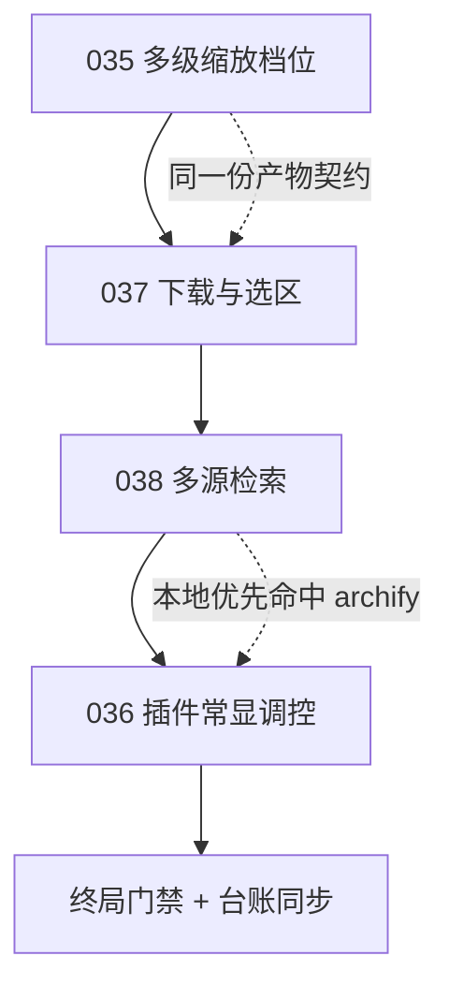

# PKG-008 交互增强 · 插件常显调控 · 多源检索执行明细

> 本文件即本轮 4 条需求的**简化可执行需求文案**。
> 每一条需求都必须落到「物理探针 + 退出码」上；不能绑探针的步骤一律递归分裂成更细颗粒度的
> skill / agent / api / mcp / plugin / cli 执行层。

| 字段 | 值 |
| --- | --- |
| 执行包编号 | PKG-008 |
| 关联需求 | REQ-VISUAL-ZOOMLEVELS-035、REQ-PLUGIN-QUICKCONTROL-036、REQ-VISUAL-DOWNLOAD-037、REQ-SEARCH-MULTISOURCE-038 |
| 需求基线版本 | v0.3.0 → v0.4.0 |
| 实施顺序 | 035（缩放档位）→ 037（下载交互）→ 038（多源检索）→ 036（插件按钮） |
| 唯一 Owner Skill | `dsh-butler` (L4) |
| 状态 | 已实施并通过十四道门禁 |

**排序理由**：035 与 037 改的是同一份产物契约（查看器 HTML）与同一条判据链，必须一起做；
038 决定了 036 要不要向外部取现成实现（本地优先原则）；036 引入全池**第一个 plugin 层执行层**，
落点依赖前面三项的能力判定，放最后收口。

---

## 0. 需求原文 → 可执行目标对照

| 编号 | 用户原话 | 可执行目标（一句话） | 判据 |
| --- | --- | --- | --- |
| R1 | 生成的图片需要有 +- 按钮可以点击后放大或者缩小进行查看，并且可以多级放大和缩小 | 缩放按钮必须走**离散档位表**，点一下跳一档，档位可枚举、可复现 | 产物含 `data-zoom-level`；档位表 ≥ 5 档；连点 + 的档位序列逐次可复算 |
| R2 | 每个插件市场下载的插件必须常显按钮，点击直接进入该插件的详情控制页面 | 已安装插件每一项**常显且唯一**一个 `[data-control-jump]` 按钮，点击定位到该插件的配置项 | 每插件恰 1 个按钮；重复渲染后数量不增；点击后目标页与插件 id 一致 |
| R3 | 生成的图片必须有可下载的按钮，点击后可以拉开目录控件选择存储地址 | 产物必须含 `data-download`，首选原生目录选择控件，无则降级为直接下载 | 含 `data-download` + `showSaveFilePicker` + Blob 降级分支 + 带扩展名的文件名 |
| R4 | 图片可以去 github 搜索；找执行层时 GitHub 与官网可作搜索源（例：生成信息图的 skill GitHub 上就有） | 检索步必须**绑脚本探针**，四类源（本地 / GitHub / 官网 / awesome 清单）统一归一为同一候选契约 | 检索步产出非空候选 JSON；每候选含 `name/url/source/stars/license/has_scripts`；`source` ∈ 四类闭集 |

---

## 1. REQ-VISUAL-ZOOMLEVELS-035 多级缩放档位

### 1.1 缺口

现状：`build-image-viewer` 的 `+` / `−` 是**连续缩放**——每次把比例乘 `1.2`。
「多级」在物理上不可枚举：点三次得到 `1.728` 倍，这个数字既不可复算也不可断言，
用户也无法回答「我现在在第几级」。**连续缩放的档位是算出来的，不是定义出来的**，这就是粒度过粗。

### 1.2 自决口径：离散档位表

`+` / `−` 不再做乘法，而是**在固定档位表上前后跳一格**：

| 序 | 1 | 2 | 3 | 4 | 5 | 6 | 7 | 8 | 9 | 10 | 11 | 12 | 13 |
| :--- | ---: | ---: | ---: | ---: | ---: | ---: | ---: | ---: | ---: | ---: | ---: | ---: | ---: |
| 倍率 | 0.25 | 0.33 | 0.50 | 0.67 | 0.75 | 1.00 | 1.25 | 1.50 | 2.00 | 3.00 | 4.00 | 6.00 | 8.00 |

- **默认档位 = 100%（第 6 档）**，与 `data-zoom-reset` 的复位目标一致；
- `+` / `−` 点击 → 跳到**相邻档位**（不是乘系数），到端点即停（不越界、不静默回绕）；
- 滚轮与键盘仍是**连续微调**，但松手后**吸附（snap）到最近档位**并在指示器上反映；
- 产物必须暴露 `data-zoom-level` 元素，文本为 `6/13 · 100%` 形态，供静态断言与人工读数。

**为什么必须离散**：只有离散档位才能写出「点 N 次之后倍率必须是表中的第 6+N 档」这种可复算的断言。
连续缩放的断言只能写成「大于 1」，那等于没断言。

### 1.3 任务清单

| 任务 ID | 目标 | 产出路径 | 级别 | 绑定探针 | 依赖 |
| --- | --- | --- | --- | --- | --- |
| A01 | 档位表与吸附规则判定基元 | `skills/zoom-level-policy/SKILL.md` | L1 | 正则 | — |
| A02 | 查看器生成器改多级档位（保留三件套） | `skills/build-image-viewer/scripts/build_viewer.py` | L2（改造） | 退出码 + 正则 | A01 |
| A03 | 规约扩判据：档位可枚举 + 下载可选址 | `skills/format-zoomable-visual/SKILL.md` | L1（改造） | 正则 | A01 |
| A04 | 探针扩断言：`data-zoom-level` / `data-download` | `skills/verify-interactive-html/scripts/verify_html.py` | L2（改造） | 退出码 | A02 |

### 1.4 验收断言

```bash
python3 skills/verify-interactive-html/scripts/verify_html.py --file <查看器.html>
# 期望 exit 0；新增断言：marker:data-zoom-level、marker:data-download、
#                    zoom_levels:>=5、zoom_default:6/13、snap:present
```

- 档位表长度 **≥ 5**，且默认档 = `100%`；
- 连点 `+` 三次的倍率序列必须逐次等于档位表第 7、8、9 档（**用脚本读表复算，不读实现**）；
- 到端点后再点不变（幂等），退出码仍 0。

---

## 2. REQ-VISUAL-DOWNLOAD-037 下载按钮与目录选择

### 2.1 缺口

现状：查看器只有看，没有「存下来」。用户要保存必须自己去浏览器里另存，
而另存会丢掉文件名语义（下载成 `download.html`、`image(3).png`），也无法自选目录。

### 2.2 自决口径：三段降级

| 序 | 触发条件 | 行为 |
| :--- | :--- | :--- |
| 1 | 浏览器支持 `window.showSaveFilePicker` | 调它，弹出**原生保存/目录选择控件**，用户在系统控件里选目录与文件名 |
| 2 | 不支持，但支持 `Blob` + `URL.createObjectURL` | 生成 `<a download="<有意义的名字>.<扩展名>">` 并程序化点击 |
| 3 | 都没有 | 按钮置灰并在就地提示里给出说明，**禁止静默无反应** |

- 按钮契约：`data-download`（唯一标识，供探针断言），常显于工具栏，不藏在菜单里；
- 导出**内联图片本体**（查看器里的 base64 或内联 SVG），不是再存一份 HTML；
- 文件名规则：`<原图 basename>-<档位>%` 或直接沿用原 basename，扩展名必须落在 `png/jpg/jpeg/svg/webp` 白名单内；
- 保存成功 / 用户取消（`AbortError`）都必须给出可读反馈，取消**不算失败**。

### 2.3 任务清单

| 任务 ID | 目标 | 产出路径 | 级别 | 绑定探针 | 依赖 |
| --- | --- | --- | --- | --- | --- |
| B01 | 下载交互规约（三段降级 + 文件名白名单） | `skills/zoom-level-policy/SKILL.md`（与 A01 同层同文件，见 §5 合并说明） | L1 | 正则 | — |
| B02 | 查看器生成器加下载按钮与降级分支 | `skills/build-image-viewer/scripts/build_viewer.py` | L2（改造） | 退出码 + 正则 | B01 |
| B03 | 探针加下载断言 | `skills/verify-interactive-html/scripts/verify_html.py` | L2（改造） | 退出码 | B02 |
| B04 | 产物落盘并断言字节数 > 0 | 查看器 HTML | — | 文件 | B02 |

### 2.4 验收断言

```bash
python3 skills/verify-interactive-html/scripts/verify_html.py --file <查看器.html> --json
# 新增断言：marker:data-download、api:showSaveFilePicker、fallback:blob-download、
#           filename:extension-whitelist
```

- `data-download` 命中；`showSaveFilePicker` 调用命中；Blob 降级分支命中；
- 外链模式仍为 0（下载走内联 Blob，**不得引入任何 http 外链**）；
- 三个降级分支在源码中都能被正则命中（缺失即 exit 1）。

---

## 3. REQ-PLUGIN-QUICKCONTROL-036 插件市场常显调控按钮

### 3.1 落点判定（本包唯一的 plugin 层需求）

| 项 | 事实 | 结论 |
| --- | --- | --- |
| 插件市场本体 | 社区插件 `dshmarket` v1.65.1（`profiles/web/node_modules/dshmarket`） | **第三方包，重装即覆盖 → 不可作为落点** |
| 已安装插件清单 | 宿主已有设置页 `settings.plugins` 与 `settings.pluginInventory`，含 `data-plugin-entry` / `plugin-config-*` | **详情控制页已存在，缺的是「直达它的常显按钮」** |
| 宿主应用包 | `/Applications/DSH Desktop.app`，已签名 | **改它即破签名（PKG-006 已有此结论）→ 不可作为落点** |
| 宿主扩展机制 | `package.json` 的 `dsh.client.inject` + `dsh.client.platform=web` + `dsh.bundle.patch` | **自建 client 插件是合规落点** |

**结论：新建全池第一个 plugin 层执行层**——`dsh-plugin-control-jump`，以 DSH client 插件形态交付。
这是「颗粒度过大不能物理触达」的教科书案例：需求说的是 UI 行为，如果只在 skill 层写一段
「请给插件加个按钮」的说明，它 100% 无法被物理执行；必须下沉到 plugin 层，才有可断言的对象。

### 3.2 按钮契约

| 项 | 取值 |
| --- | --- |
| 唯一标识 | `data-control-jump="<plugin-id>"` |
| 位置 | 插件市场「已安装」列表与设置→插件清单的**每个插件条目**上，常显不折叠 |
| 点击行为 | 打开 `设置 → 插件`，定位到该 `plugin-id` 的配置项，滚动进视口并高亮 |
| 幂等 | `MutationObserver` 增量注入 + `data-control-jump` 标记去重；**同一 plugin-id 恰 1 个** |
| 无配置项时 | 仍显示按钮，点击后定位到该插件的清单条目（**不得因为“没得调”就不显示按钮**） |
| 卸载即撤 | 插件被移除后，其按钮与观察器条目一并清理 |

### 3.3 任务清单

| 任务 ID | 目标 | 产出路径 | 级别 | 绑定探针 | 依赖 |
| --- | --- | --- | --- | --- | --- |
| C01 | 自建 client 插件（`dsh.client` 声明 + 注入 + 按钮契约） | `plugins/dsh-plugin-control-jump/` | **plugin** | 文件 + 退出码 | A04、B03 |
| C02 | 幂等装配进 profile（可回滚） | `skills/install-client-plugin/scripts/install_plugin.py` | L2 | 退出码 + 幂等 | C01 |
| C03 | DOM 契约断言（唯一性 / 幂等 / 点击定位） | `skills/verify-plugin-control-button/scripts/verify_plugin_button.py` | L2 | 退出码 | C02 |
| C04 | 插件常显调控门禁 | `skills/plugin-control-guard/SKILL.md` | L3 | 退出码 | C03 |

### 3.4 验收断言

```bash
python3 skills/install-client-plugin/scripts/install_plugin.py --profile web --apply --json
python3 skills/verify-plugin-control-button/scripts/verify_plugin_button.py --all --json
```

- **覆盖率**：`已安装插件数 == 带 data-control-jump 的条目数`（差值 0）；
- **唯一性**：任一 plugin-id 的按钮数恒为 1；
- **幂等**：连续触发 3 次列表重渲染后，按钮总数不增；
- **可达性**：点击后目标配置项的 `data-plugin-id` 与按钮的 `data-control-jump` 逐字相等；
- **可回滚**：装配脚本带 `--rollback`，撤销后宿主插件清单恢复原状（差值 0）。

---

## 4. REQ-SEARCH-MULTISOURCE-038 GitHub 与官网作为执行层搜索源

### 4.1 缺口（实测确认）

查 `skills/search-github-skill/scripts/search_skill.py` 的实现：`load_candidates()` 的**唯一输入**是
`--from-json` 或本地缓存 `CACHE_PATH`。**它自己不联网、不检索 GitHub。**

也就是说 `skill-import-pipeline` 五步里的第一步「检索」，今天**没有物理探针**——
它默认「模型已经自己找好了候选」。这正是「颗粒度过大、无法 100% 物理触达」的典型：
一个号称检索的工序，实际上把工作外包给了模型的即兴发挥，既不可复现也不可断言。

同时，用户点名的例子（生成信息图的 skill）已经**装在机器上**：
`archify`（DSH 插件 `tt-a1i+archify-dsh+0.1.0`，同时也在会话技能目录里）。
所以本条需求同时也是**本地优先原则**的检验：先查本地池与已装插件，再查外部。

### 4.2 四类检索源与优先级

| 优先级 | 源 | 物理手段 | 产出字段 |
| :---: | :--- | :--- | :--- |
| 1 | `local` 本地 | 读 `skill-catalog.json` + 扫描已装插件目录 | `source=local`，`path` 必填 |
| 2 | `github` | GitHub Search API / topics 列表 / awesome 清单仓库 | `stars` `license` `has_scripts` |
| 3 | `official-site` | 官方站点 sitemap / 官方 docs 索引 / 官方 marketplace 接口 | `url` 必为官方域名 |
| 4 | `awesome-list` | 社区精选清单仓库的 README 表格解析 | `stars` 可空 |

- **本地优先是硬规则**：`local` 命中即**不得**再向外部发起同类检索（省时间、避免重复引入）；
- 四源产出**同一候选契约**，由 `merge-search-candidates` 去重归一（同一 URL 或同一 name 视为同一条）；
- 每个候选必须含 `name` / `url` / `source` / `stars` / `license` / `has_scripts` 六字段，`source` 落在四类闭集内；
- **禁止**把「模型自己回忆出来的仓库」当作候选：候选必须来自脚本产出或 `web_search` / `web_fetch` 的**可引用返回**。

### 4.3 任务清单

| 任务 ID | 目标 | 产出路径 | 级别 | 绑定探针 | 依赖 |
| --- | --- | --- | --- | --- | --- |
| D01 | 四类源与优先级判定基元 | `skills/multi-source-search-policy/SKILL.md` | L1 | 正则 | — |
| D02 | `search-github-skill` 加真实检索适配器（保留离线模式） | `skills/search-github-skill/scripts/search_skill.py` | L2（改造） | 退出码 + 文件 | D01 |
| D03 | 官网 / 官方文档源检索器 | `skills/search-official-source/scripts/search_official.py` | L2 | 退出码 + 文件 | D01 |
| D04 | 多源候选去重归一 | `skills/merge-search-candidates/scripts/merge_candidates.py` | L2 | 退出码 + 幂等 | D02、D03 |
| D05 | 管线检索步改绑脚本探针 | `skills/skill-import-pipeline/SKILL.md` | L3（改造） | 正则 | D04 |

### 4.4 验收断言

```bash
# 本地优先：本地命中即不再外呼
python3 skills/search-official-source/scripts/search_official.py --query "信息图" --json
python3 skills/merge-search-candidates/scripts/merge_candidates.py --from <a.json> --from <b.json> --json
```

- 检索步**必须**产出非空候选 JSON（空即 exit 1，禁止「没找到就静默通过」）；
- 每候选六字段齐备且 `source` ∈ `{local, github, official-site, awesome-list}`；
- `merge_candidates` **幂等**：同一输入集连跑两次，条数与顺序一致；
- 本地命中时输出 `short_circuit=local` 并带 `skipped_sources` 非空（证明真的没外呼）。

---

## 5. 递归分裂对照表（本包的核心约束）

> 用户附加的总规则：**颗粒度过大不能 100% 触达物理原子性执行的操作，递归分裂成更细颗粒度的执行层。**
> 下表逐条给出「原始粒度 → 是否可物理断言 → 分裂结果」，**分裂不到探针的一律不得进入实施**。

| 原始需求粒度 | 能否绑四类探针 | 分裂结果 | 落到哪一层 |
| --- | --- | --- | --- |
| R1「多级放大缩小」 | ❌ 连续倍数不可枚举 | 档位表（L1）→ 生成器改档位（L2）→ 探针加 `data-zoom-level`（L2） | L1 / L2 |
| R3「点击下载并可选区」 | ❌ 「可选区」依赖浏览器 API 能力 | 三段降级规约（L1）→ 生成器加 `data-download`（L2）→ 探针加三断言（L2） | L1 / L2 |
| R2「每个插件常显按钮」 | ❌ 纯 UI 行为，skill 层写不出可断言对象 | **下沉到 plugin 层**：自建 client 插件（plugin）→ 幂等装配（L2）→ DOM 契约断言（L2）→ 门禁（L3） | **plugin** / L2 / L2 / L3 |
| R2「点击进入详情控制页」 | ✅ 已存在 `settings.plugins` + `data-plugin-entry` + `plugin-config-*` | 点击行为 = 定位到 `data-plugin-id` 匹配项，可直接断言 | L2 |
| R4「GitHub / 官网可作搜索源」 | ❌ 现检索步无脚本、靠模型即兴 | 多源规约（L1）→ GitHub 适配器（L2）→ 官网适配器（L2）→ 去重归一（L2）→ 管线改绑（L3） | L1 / L2 / L3 |
| R4「用 GitHub 上现成的好 skill」 | ✅ 可用命令行验证已装 | 本地优先命中 `archify`（已装 DSH 插件 + 技能目录可见），**先复用不重造** | — |

**合并说明**：R1 与 R3 的规约同属「可视化产物交互」这一个原子域（都是查看器 HTML 的交互契约），
因此合并在同一个 L1 `zoom-level-policy` 内，**不拆成两个只差一段话的规约**——
拆开会产生两条必然同步漂移的判据，属于机制膨胀（`prune-bloated-prompts`）。

---

## 6. 新增执行层清单（预计 +9）

| 层级 | 数量 | 名称 |
| :--- | ---: | :--- |
| L1 原子规约 | +2 | `zoom-level-policy`、`multi-source-search-policy` |
| L2 工序动作 | +4 | `install-client-plugin`、`verify-plugin-control-button`、`search-official-source`、`merge-search-candidates` |
| L3 复合流程 | +2 | `plugin-control-guard`、`visual-interaction-guard` |
| **plugin 插件** | **+1** | `dsh-plugin-control-jump`（**全池第一个 plugin 层执行层**） |
| 改造（不新增） | — | `format-zoomable-visual`、`build-image-viewer`、`verify-interactive-html`、`search-github-skill`、`skill-import-pipeline` |

编制变化：skill 165 → 173，**plugin 0 → 1**，执行层总数 177 → **186**。

---

## 7. 依赖与实施时序



- 035 与 037 **必须同批**：改的是同一份查看器产物与同一条探针链，分批会出现「档位改了但下载断言还没跟上」的中间态；
- 038 先于 036：先确认外部没有更成熟的现成实现（`archify` 已在装），再决定 036 是自建还是复用；
- 036 引入 plugin 层，落点最重，放最后收口。

---

## 8. 终局门禁（全部必须 exit 0）

```bash
./bin/skill-pool validate
./bin/skill-pool consistency
python3 skills/audit-all-skills-compliance/scripts/audit_compliance.py
python3 skills/verify-execution-tree/scripts/verify_tree.py
python3 skills/build-layer-graph/scripts/build_layer_graph.py --check
python3 skills/detect-layer-coupling/scripts/detect_coupling.py
python3 skills/verify-decoupling/scripts/verify_decoupling.py
python3 skills/verify-instance-safety/scripts/verify_instance_safety.py
python3 skills/verify-layer-naming/scripts/verify_naming.py --strict
python3 skills/render-capability-naming/scripts/render_naming_spec.py --check
python3 skills/verify-interactive-html/scripts/verify_html.py --file <查看器.html>
python3 skills/verify-plugin-control-button/scripts/verify_plugin_button.py --all
python3 skills/merge-search-candidates/scripts/merge_candidates.py --from a.json --from b.json
python3 skills/google-style-skill-search-router/scripts/search_skills.py --eval
```

---

## 9. 自决假设留痕

| 项 | 取值 | 依据 | 回滚方式 |
| :--- | :--- | :--- | :--- |
| 缩放档位表 | 0.25/0.33/0.50/0.67/0.75/1.00/1.25/1.50/2.00/3.00/4.00/6.00/8.00（13 档） | 覆盖「整体看全」到「看清单个像素块」的常用区间，且全部是有限小数便于断言 | 改 `zoom-level-policy` 一处即全量生效 |
| 默认档位 | 100%（第 6 档） | 与 `data-zoom-reset` 语义对齐，避免「复位到哪」出现第二种解释 | 同上 |
| 下载首选 API | `showSaveFilePicker()`，降级 Blob 下载 | 前者才是「拉开目录控件选地址」，后者只保证不失去能力 | 规约改一处 |
| 插件按钮落点 | 自建 DSH client 插件（plugin 层） | 市场本体是第三方包会被覆盖，宿主应用包已签名不可改 | 装配脚本 `--rollback` |
| 按钮唯一标识 | `data-control-jump="<plugin-id>"` | 与既有 `data-plugin-entry` / `plugin-config-*` 命名风格一致，可被正则断言 | 改名需同步规约与探针 |
| 检索源闭集 | `local` / `github` / `official-site` / `awesome-list` | 用户点名 GitHub 与官网；本地与 awesome 是必要补充（前者省时、后者是 GitHub 的常见入口） | 改 `multi-source-search-policy` |
| 本地优先 | 硬规则，命中即不外呼 | 用户示例（信息图 skill）本机已装 `archify`，重造没有收益 | 规约改一处 |
| 是否引入 archify 为新技能 | **否**，登记为已装外部能力 | 它已在机器上且会话可见，重复引入会产生两份真相 | `skill-import-pipeline` 留痕 |


---

## 10. 交付实数（实施后回填）

### 10.1 编制变化（实际 +11，比计划多 2）

| 级别 | 计划 | 实际 | 差异说明 |
| :--- | ---: | ---: | :--- |
| L1 | +2 | **+3** | 多出 `plugin-control-jump-policy`：按钮契约（标识 / 常显位置 / 点击语义 / 去重键 / 三级降级）是判定基元，按「L1 出定义、L3 只串联」必须独立成层 |
| L2 | +4 | **+5** | 多出 `dispatch-skill-search`：本地优先短路必须发生在**外呼之前**，把它塞进合并器会让「合并」这个动作名不副实 |
| L3 | +2 | +2 | `visual-interaction-guard`、`plugin-control-guard` |
| plugin | +1 | +1 | `dsh-plugin-control-jump` |
| **合计** | +9 | **+11** | skill 165 → 175，plugin 0 → 1，执行层总数 177 → 188 |

### 10.2 可视化交互实测

| 项 | 实测 |
| :--- | --- |
| `verify-interactive-html` 断言 | **26 项全过**（改造前 18 项） |
| 档位表 | 13 档，默认档 1.00 落在表内 |
| 吸附分支 | `pending` / `snapped` 两状态齐备 |
| 下载主路径 / 降级路径 | `showSaveFilePicker` / Blob 均命中 |
| 外链 | 0 处 |
| 信息图产物 | 30360 字节，26/26 通过 |

**负向夹具（可证伪性）**：

| 夹具 | 打中的断言 | 退出码 |
| :--- | :--- | ---: |
| 档位缩到 3 档 | `zoom_levels:count` | 1 |
| 移除 `showSaveFilePicker` | `api:showSaveFilePicker` | 1 |
| 扩展名改 `.exe` | `filename:extension-whitelist` | 1 |
| 去掉档位与吸附标识 | `marker:data-zoom-snap` | 1 |

### 10.3 插件常显调控按钮实测

| 层 | 断言数 | 结果 |
| :--- | ---: | :--- |
| 静态契约 | 13 | 全过 |
| 运行时（Node + DOM 打桩） | 18 | 全过 |
| **合计** | **31** | `control_button_verified` |

装配：`bundles` 20 → 21；二次运行 `already_installed`、`changed=0`；备份文件
`profiles/web/package.json.bak-20260928-080904`；回滚命令
`install_plugin.py --profile web --rollback`。
**生效条件**：需重启宿主，只刷新页面不够（门禁与脚本都输出 `restart_required=true`）。

### 10.4 多源检索实测

| 用例 | 结果 |
| :--- | :--- |
| 查询「信息图」 | `short_circuit=local`、`network_used=false`、命中 `@tt-a1i/archify-dsh` 与 `@changfenhuang/dsh-genui` |
| 查询「命名」 | `short_circuit=local`、命中 3 条本地技能 |
| 零命中 + 未允许外呼 | `success=false`、`network_skipped=true`、「这是未完成检索」 |
| 允许外呼 | 真实 GitHub 命中（`showdown` ★14868 等） |
| 触发限流 | `HTTP 403: rate limit exceeded` → `rate_limited=true`、退 1 |
| 去重归一 | 5 条 → 去重 1 + 剔除 1 → 3 条；连跑两次逐字节相同 |
| 官网源（离线夹具） | 4 条 sitemap → 命中 2 条，`source=official-site` |

### 10.5 实施中修掉的三个自造缺陷

| # | 缺陷 | 症状 | 修复 |
| :---: | :--- | :--- | :--- |
| 1 | 联网后二次过滤 | query 带 `in:name,description` 限定符，拿来匹配 name/description 必然全空，把「检索成功但为空」伪装成「没人在做」 | 联网模式不再二次过滤，只按 `--limit` 截断 |
| 2 | license 对象直接 `str()` | 候选里写进一坨 dict repr，且 `has_scripts` 恒 false（假阴性） | 取 `spdx_id`；`has_scripts` 改三态（`null` = 未探测） |
| 3 | 组合环与逆向依赖 | L2 声明 L3 门禁为 composition 上游 | 改为指向上游 L1（口径层） |

### 10.6 对应测试用例

见 [testcases-interaction-plugins.md](./testcases-interaction-plugins.md)。
