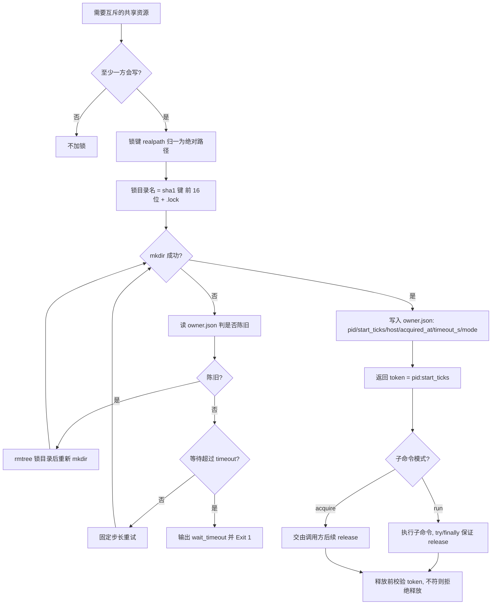

# Acquire Atomic Lock (物理原子锁获取与释放器)

## Overview

本技能是 `atomic-lock-policy` 的物理执行层：把 L1 的「载体必须是内核原子原语」「锁键归一化」
「持有者标识」「超时」「陈旧回收」「释放必达」六条口径落成一个可被 shell 与 Python 同时调用的锁原语。

它只做四件事：

1. **`acquire`**：`mkdir` 原子目录抢锁，失败则判陈旧或等待，直到获得或等待超时；
2. **`release`**：校验 token 一致后删除锁目录，**拒绝释放他人的锁**；
3. **`status`**：列出锁根下全部锁，逐条判 `held` / `stale` 并给出原因；
4. **`run`**：持锁执行一条子命令，`try/finally` + 信号处理器保证无论如何都释放，子进程退出码原样透传。

它不做并发压测、不出互斥证据——那件事归 `verify-atomic-mutual-exclusion`。

### 两种锁模式（本技能最关键的设计）

| 模式 | 语义 | 陈旧判据 | 适用 |
| :--- | :--- | :--- | :--- |
| `lease`（默认） | 锁**跨命令调用**存活。持有者进程退出 ≠ 锁失效，锁靠租约到期回收 | `start_ticks` 与存活进程不符（PID 被复用）**或** 持有超时 | 多步任务先 `acquire`、中间跨若干次命令、最后 `release` |
| `live` | 锁与持有进程**同生共死**，进程没了锁就该没了 | `pid` 不存在 **或** `start_ticks` 不符 **或** 持有超时 | `run` 子命令（自动强制 `live`） |

**为什么必须分两套**：若用 `live` 判据去管 `lease` 场景，`acquire` 命令自己退出后锁会立刻被判
`pid_not_alive` 回收，互斥彻底失效；若用 `lease` 判据去管 `live` 场景，崩溃进程会把锁拖到超时才放手。
这不是优化选项，是两套不同的正确性口径。

## When to Use

- 需要对一份共享资源（文件 / 目录 / 端口 / 实例）做**跨进程互斥**访问时；
- 需要在 shell 脚本里包住一段临界区命令时（用 `run`）；
- 需要排查「锁是不是被别人持有 / 是不是陈旧残留」时（用 `status`）。

**触发禁区**：只读访问不加锁；单进程内的线程同步不用本技能（走线程锁）；
跨主机网络文件系统上的锁不在本技能保证范围内（`mkdir` 语义在各 NFS 实现上不一致），必须改用外部协调服务。

## Workflow



1. `[probe:regex]` 校验 `action` 落在闭集 `{acquire, release, status, run}` 且非 `status` 时 `--key` 非空；缺参输出 `missing_key` 并退 2；
2. `[probe:regex]` 归一化锁键：`port:` / `instance:` 前缀键逐字符保留，其余键走 `os.path.realpath` 并剥除尾部斜杠；归一化后为空即退 2；
3. `[probe:exitcode]` 确保锁根目录存在（`makedirs(exist_ok=True)`），不可写即输出 `lock_root_unwritable` 并退 2；
4. `[probe:exitcode]` `mkdir` 原子获取：成功即写入 `owner.json`（先写 `.tmp` 再 `os.replace`），失败进第 5 步；
5. `[probe:regex]` 读 `owner.json` 判陈旧：按锁内 `mode` 分档（`lease` 只认 PID 复用与持有超时，`live` 另认 `pid_not_alive`），`owner.json` 缺失视为在建中；
6. `[probe:exitcode]` 陈旧即 `shutil.rmtree` 锁目录后重新 `mkdir`（**禁止就地改写锁内容**），并把命中的回收原因累积进 `reclaimed`；
7. `[probe:length]` 未陈旧则按固定步长 `WAIT_STEP_S` 重试，累计等待达到 `--wait`（缺省等于 `--timeout`）即输出 `wait_timeout` 与持有者快照并退 1；
8. `[probe:regex]` `release` 时比对 token（`pid:start_ticks`）与锁内记录，不符输出 `token_mismatch` 并退 1，**绝不允许释放他人的锁**；
9. `[probe:exitcode]` `run` 模式安装 `SIGINT` / `SIGTERM` / `SIGHUP` 处理器，`try/finally` 保证任何路径都释放，子进程退出码原样作为本进程退出码；
10. `[probe:exitcode]` `status` 输出锁根下全部锁的 `state`（`held` / `stale`）与 `reason`，聚合 `held` 与 `stale` 计数，恒退 0。

## Input Contract

| 参数 | 适用 action | 口径 |
| :--- | :--- | :--- |
| `--key` | `acquire` / `release` / `run` | 共享资源键；路径键走 `realpath` 归一，`port:` / `instance:` 前缀键逐字符保留 |
| `--lock-root` | 全部 | 锁根目录，默认 `/tmp/dsh-atomic-locks` |
| `--timeout` | 全部 | 默认 **300 秒**：既是等待上限，也是锁的持有上限 |
| `--wait` | `acquire` / `run` | 等待获取的上限秒数，缺省等于 `--timeout` |
| `--mode` | `acquire` | `lease`（默认）或 `live`；`run` 强制 `live` |
| `--token` | `release` | 持有者 token（`pid:start_ticks`），不符即拒绝释放 |
| `-- <命令...>` | `run` | 在第一个独立 `--` 之后给出子命令 |

## Usage & Script

```bash
# 1) 跨命令调用加锁（lease 模式，默认）：acquire 后锁不受本进程退出影响
python3 skills/acquire-atomic-lock/scripts/atomic_lock.py acquire --key skills/a/SKILL.md --timeout 300
# → {"success":true,"token":"1234:ps:Mon Sep 28 ...","lock_path":"/tmp/dsh-atomic-locks/xxxx.lock"}
# 后续用同一 token 释放：
python3 skills/acquire-atomic-lock/scripts/atomic_lock.py release --key skills/a/SKILL.md --token "1234:ps:Mon Sep 28 ..."

# 2) 包住一条命令（live 模式，自动强制）：命令跑完即释放，退出码透传
python3 skills/acquire-atomic-lock/scripts/atomic_lock.py run \
  --key docs/operations/skill-catalog.json --timeout 120 -- ./bin/skill-pool catalog

# 3) 端口与实例类资源键
python3 skills/acquire-atomic-lock/scripts/atomic_lock.py run --key port:43129 -- /usr/bin/true
python3 skills/acquire-atomic-lock/scripts/atomic_lock.py acquire --key instance:hindsight-bank-01 --timeout 60

# 4) 查看锁根下全部锁与陈旧情况
python3 skills/acquire-atomic-lock/scripts/atomic_lock.py status --lock-root /tmp/dsh-atomic-locks
```

## Success Contract

| 退出码 | 含义 |
| :--- | :--- |
| 0 | `acquire` 获取成功 / `release` 释放成功 / `status` 完成枚举 / `run` 取子进程退出码（子进程为 0 时本进程也为 0） |
| 1 | 等待超时未获锁（`wait_timeout`）、token 不符拒绝释放（`token_mismatch`）、锁已不存在（`lock_not_found`） |
| 2 | 输入不可读（缺 `--key`、锁键归一化后为空、锁根目录不可写、`run` 缺子命令、子命令不可执行） |

JSON 契约（`acquire`）：`{"success","acquired","key","lock_path","token","owner":{...},"attempts","reclaimed"}`；
`owner` 含 `key` / `pid` / `start_ticks` / `host` / `acquired_at` / `timeout_s` / `mode` 七个字段。

## Boundaries & Constraints

- **只做锁，不做调度**：本技能不决定谁该先跑、不排队、不抢占，只回答「锁拿到没有」；
- **伪原子载体明确禁止**：不提供 `exists-then-write`、pid 文件读改写、应用层布尔标志等实现，出现即违反 `atomic-lock-policy` 口径①；
- **释放必须校验 token**：无 token 校验的实现会在 A 超时释放后误删 B 刚拿到的锁，属严重缺陷；
- **释放必达**：`try/finally` + 信号处理器缺一不可；`SIGKILL` 无法捕获，那是陈旧回收存在的理由；
- **不做跨主机保证**：`os.uname().nodename` 只用于记录，不用于分布式协调；
- **确定性**：陈旧判定只依赖锁内记录字段与输入参数，无随机退避、无主观「是否卡住」判断。
