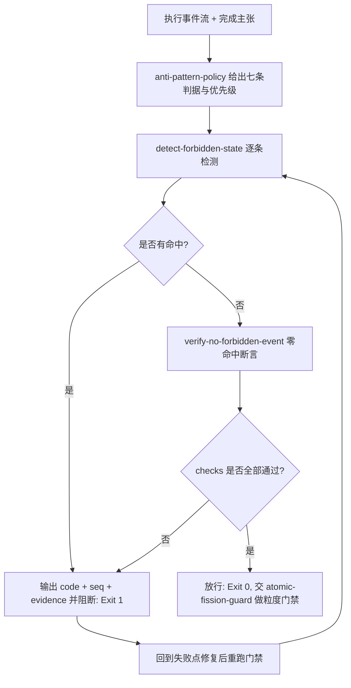

# Anti Pattern Guard (反例门禁)

## Overview

本技能是 L3 复合流程级总控，把反例层的三个原子能力串成一道门禁：
`anti-pattern-policy` 出清单与判据 → `detect-forbidden-state` 出命中证据 → `verify-no-forbidden-event` 出零命中断言。
它挂载于管家 **「③ 冲突·冗余·质量」** 集群，是任何「本次执行是否已经失败」的最终裁决点。

**反例层与能力层互补而非并列**：
能力层管「能做什么」——技能多、通路全、效率高，都是**加分项**；
反例层管「绝不允许发生什么」——死循环、假完成、静默降级，都是**生死线**。
因此二者不可互相抵扣：能力再强也不能豁免一条反例命中，反例零命中也不等于能力足够。
正确的问题顺序是**先用反例层排除「已经失败」，再用能力层评价「做得如何」**。

**命中即阻断，禁止「记录后继续」**：
命中反例时，只把结果写进日志然后接着跑，等同把反例层降级成观察层——这与本层存在的理由直接冲突。
唯一合法处置是：**停止推进**，输出命中的 `code` 与 `seq`，回到失败点修复后重跑门禁，直到 `hits == 0` 且 `--strict` 下事件非空。

## When to Use

- 管家准备宣布「任务完成」之前，需要证明整段事件流零反例命中时；
- 某段执行出现重复动作、长时间静默、反复失败等可疑迹象，需要物理定性时；
- 交付验收需要给出「AP-01 ~ AP-07 逐条未命中」的可复算证据时。

**触发禁区**：纯只读查询、纯问答与无事件流可判的轻量交互不经过本门禁；本门禁不修复状态、不生成事件流，只做裁决与阻断。

## Gate Chain (门禁链条)

| 序 | 环节 | 承载技能 | 物理产物 | 不通过时 |
| :--- | :--- | :--- | :--- | :--- |
| 1 | 清单 | `anti-pattern-policy` | 七条反例的判据与阈值（AP-01 ~ AP-07） | 判据写不出即不得入层 |
| 2 | 检测 | `detect-forbidden-state` | `hits[]`（`code` + `seq` + `evidence`）与 `summary` | 有命中即记录现场 |
| 3 | 断言 | `verify-no-forbidden-event` | `checks[]`（零命中 + 严格模式事件非空） | 退 1 即阻断 |

**唯一放行判据**：`verify-no-forbidden-event` 的 `checks` 全部 `pass == true`，即 `hits == 0`（`--strict` 时还需 `checked_events > 0`）。
**禁止事项**：不得把命中结果只记录后继续执行；不得以「已加日志」「影响很小」「时间紧」为由跳过阻断；不得只报最严重的一条反例而隐去其余命中。

## Workflow



1. `[probe:regex]` 由 `anti-pattern-policy` 确认七条判据齐备，断言编号落在 `AP-0[1-7]` 闭集内且条数为 7；
2. `[probe:file]` 确认被裁决的事件流文件存在且非空（`--strict` 语义要求非空），缺失即阻断；
3. `[probe:exitcode]` 调 `detect-forbidden-state`，退 0 表示零命中、退 1 表示有命中、退 2 表示事件流不可解析；
4. `[probe:regex]` 断言每条命中的 `evidence` 同时含反例编号与事件 `seq` 列表，杜绝「只说违规不给序号」；
5. `[probe:exitcode]` 命中即阻断：输出 `code` 与 `seq` 后停止推进，禁止「记录后继续」，修复后必须回到第 3 步重跑；
6. `[probe:exitcode]` 零命中后调 `verify-no-forbidden-event --strict`，退 0 才允许进入下一步；
7. `[probe:regex]` 断言 `checks` 中 `no_forbidden_event` 与 `strict_events_present` 两项均为 `pass == true`；
8. `[probe:exitcode]` 门禁通过后交 `atomic-fission-guard` 做粒度门禁，二者全过方可宣布完成。

## Usage & Script

本技能为链式门禁，无独立脚本，按序执行两个承载技能的命令：

```bash
# 1) 检测：命中即给编号 + seq + 证据
python3 skills/detect-forbidden-state/scripts/detect_forbidden.py --events /tmp/events.jsonl --json

# 2) 断言：零命中 + 严格模式下事件非空
python3 skills/verify-no-forbidden-event/scripts/verify_no_forbidden.py --events /tmp/events.jsonl --strict --json
```

## Success Contract

链上门禁的退出码语义（取最后一条未通过的命令的退出码）：

| 退出码 | 含义 |
| :--- | :--- |
| 0 | 零命中且（`--strict` 下）事件非空，门禁放行 |
| 1 | 命中任一条 AP，或 `--strict` 下事件流为空（不允许「空过」） |
| 2 | 事件流缺失或不可解析（缺参、文件不可读、JSONL 行非法、事件非对象、检测模块不可加载） |

## Boundaries & Constraints

- 门禁只做**裁决与阻断**，不修复状态、不生成事件流、不自动改写他人技能契约；
- **禁止「记录后继续」**：命中反例时任何形式的继续推进都视为门禁失效；
- 反例层与能力层**互补而非并列**：能力强不豁免反例命中，反例零命中也不代表能力达标；
- 阈值只由 `anti-pattern-policy` 的默认口径与 `detect-forbidden-state` 的 CLI 显式参数决定，禁止在门禁层另立阈值；
- 本门禁不替代 `atomic-fission-guard`：反例层判「是否已经失败」，粒度门禁判「步骤是否可物理断言」，二者串联而非互相取代。
