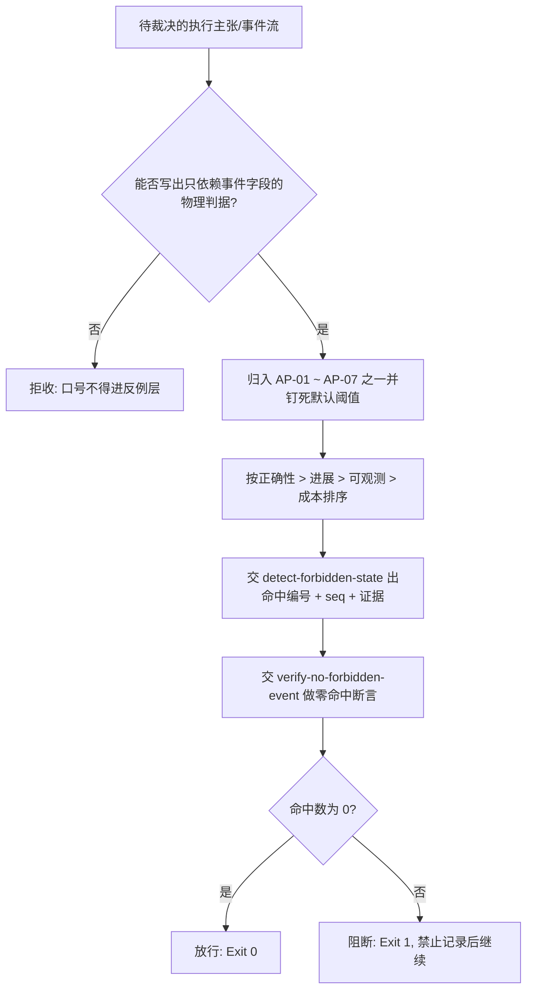

# Anti Pattern Policy (反例层判定基元)

## Overview

**核心立场**：能力层管「能做什么」，反例层管「**绝不允许发生什么**」，二者互补而非并列。
能力层回答「有没有这项本事」，反例层回答「出现了这件事，本次执行就已经失败」——前者是加分项，后者是生死线。

**准入门槛（本层的唯一纪律）**：每条反例都必须能写出**物理判据**——即一个只依赖事件字段、无随机、不看系统当前时间、同输入同输出的可复算谓词。
写不出物理判据的口号（如「要稳健」「要友好」「要有反馈意识」）**一律不得进入本层**，因为它们无法被机器判定，只能被人类自我感觉。

本技能只出判据与优先级，不做检测：检测交 `detect-forbidden-state`，断言交 `verify-no-forbidden-event`，门禁交 `anti-pattern-guard`。

## When to Use

- 管家需要判定「本次执行是否已经触犯反例」时的唯一判据来源；
- 新增管控机制前，需要判断其主张能否落成物理反例时；
- 事件流检测脚本需要确定阈值口径、命中优先级与证据字段时。

**触发禁区**：纯只读查询、纯问答与无事件流可判的交互不经过本规约；本规约不授权中断任务、不授权改写任何文件，只给出「什么算已经失败」。

## Forbidden Patterns (七条反例与物理判据)

| 编号 | 反例 | 物理判据（只依赖事件字段） | 默认阈值 |
| :--- | :--- | :--- | :--- |
| AP-01 | 死循环 | 连续相同 `action` 且 `state` 不变 | ≥ 5 次 |
| AP-02 | 无反馈 | 连续 `silent=true` 步数超阈值，或相邻 `ts` 间隔超阈值 | 20 步 / 120 秒 |
| AP-03 | 无限重试 | 同一 `action` 且 `ok=false` 重复超阈值且 `state` 未变 | > 3 次 |
| AP-04 | 假完成 | `claim_done=true` 但 `probe_exit != 0` | 任一命中即违规 |
| AP-05 | 静默降级 | `caught_error=true` 且 `logged=false` 后仍继续 | 任一命中即违规 |
| AP-06 | 预算爆炸 | 单事件 `context_tokens` 超预算 | > 30000 |
| AP-07 | 播报风暴 | 同一 `tier=micro` 的 `text` 原文重复出现 | > 3 次 |

判据的确定性口径（三条硬约束）：

1. **时间只从事件字段读**：`ts` 是整数秒，相邻间隔越界才算 AP-02；**禁止取系统当前时间**，否则同一事件流两次运行结论不同；
2. **缺失字段按保守方向解释**：`claim_done=true` 而 `probe_exit` 缺失，视为「非 0」（没有探针证据就不得声明完成）；`caught_error=true` 而 `logged` 缺失，视为「未记录」（fail-safe）；
3. **只认显式取值**：`silent` 只认显式 `true`，`ok=false` 只认显式 `false`，`tier` 只认显式 `"micro"`，其余一律不计入命中。

## Priority (判定优先级)

正确性 > 进展 > 可观测 > 成本，严格按序裁决：

| 优先级 | 反例 | 语义面 | 为何排在这个位置 |
| :--- | :--- | :--- | :--- |
| 1 | AP-04 / AP-05 | 正确性 | 假完成与静默降级会让「已完成」变成谎言，一切后续结论失效 |
| 2 | AP-01 / AP-03 | 进展 | 死循环与无限重试说明系统没有推进，继续跑只是浪费 |
| 3 | AP-02 / AP-07 | 可观测 | 无反馈与播报风暴损伤可观测性，但系统仍在推进 |
| 4 | AP-06 | 成本 | 预算爆炸是资源问题，优先级最低但同样必须命中即阻断 |

同一条事件流可同时命中多条反例（例如同一批失败重试既触发 AP-01 也触发 AP-03），此时**全部上报，不合并、不取其一**：反例层只做加法。

## Workflow



1. `[probe:regex]` 对每条候选反例匹配「是否只依赖事件字段」：出现系统当前时间、随机数或主观形容词的候选一律拒收；
2. `[probe:length]` 为每条被接收的反例钉死数值阈值（AP-01/AP-02/AP-03/AP-06/AP-07 各有唯一默认值，AP-04/AP-05 为任一命中即违规）；
3. `[probe:regex]` 断言反例编号落在 `AP-0[1-7]` 闭集内，闭环外编号一律拒绝入层；
4. `[probe:exitcode]` 交 `detect-forbidden-state` 执行检测，退 0 表示零命中、退 1 表示有命中、退 2 表示事件流不可解析；
5. `[probe:exitcode]` 交 `verify-no-forbidden-event` 做零命中断言（`--strict` 下空事件流不得空过），该命令退 0 方可放行；
6. `[probe:regex]` 对每条命中断言其证据中必含反例编号与事件 `seq` 列表，杜绝「只说违规不给序号」。

## Usage & Script

本技能为纯规约，无独立脚本；判据的物理执行由下游两个 L2 探针承载：

```bash
# 1) 检测：命中即给编号 + seq + 人类可读证据
python3 skills/detect-forbidden-state/scripts/detect_forbidden.py --events /tmp/events.jsonl --json

# 2) 断言：要求 hits == 0；--strict 下空事件流不得空过
python3 skills/verify-no-forbidden-event/scripts/verify_no_forbidden.py --events /tmp/events.jsonl --strict --json
```

## Success Contract

本规约自身不含脚本，退出码语义由执行代理脚本承载：

| 退出码 | 含义 |
| :--- | :--- |
| 0 | 事件流零命中反例，或条目本身可被物理判定并已入层 |
| 1 | 命中任一条 AP，或 `--strict` 下事件流为空（不允许「空过」） |
| 2 | 事件流缺失或不可解析（缺参、文件不可读、JSONL 行非法、事件非 JSON 对象） |

## Boundaries & Constraints

- 本规约只输出判据与优先级裁决，**不检测、不写文件、不中断任何任务**；
- 反例层与能力层**互补而非并列**：能力缺失只是减分，反例命中即为失败，二者不可互相抵扣；
- 严禁把无法物理判定的话术（「要稳健」「要有反馈意识」「应尽量避免」）写成反例条目；
- 阈值只能通过显式 CLI 参数覆盖，禁止在检测脚本内引入第二套默认口径；
- 反例层不做加法豁免：命中多条即上报多条，禁止「只报最严重的一条」。
