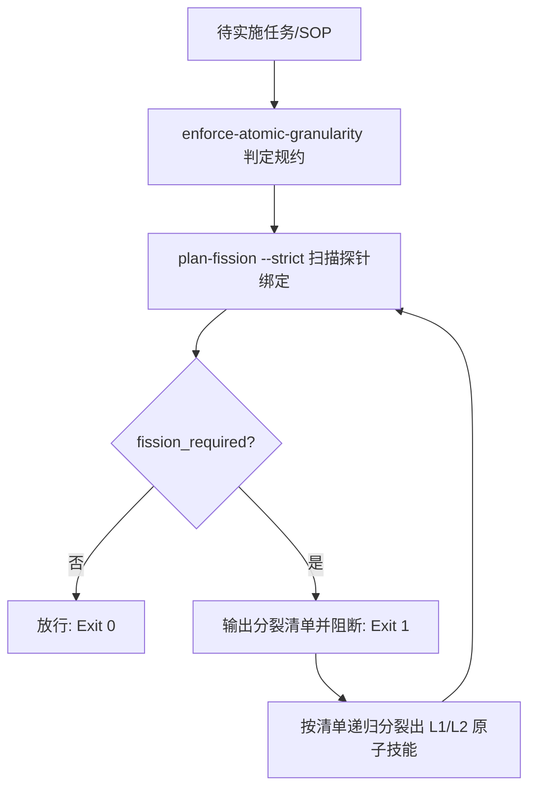

# Atomic Fission Guard (粒度递归分裂门禁)

## Overview

Atomic Fission Guard 是管家「不可物理断言即不得实施」这一红线的执行者。
它把 L1 判定规约与 L2 分裂规划串成一道门禁：任何写入类任务的实施前，都必须先证明自己的步骤能够被机器验证。

## When to Use

- 管家准备实施任何写入类任务（新增/修改技能、脚本、配置）之前的强制前置；
- 收到「优化管控机制」并要求递归分裂到物理原子级时；
- 定期体检存量 SOP，发现粒度过粗的步骤时。

**触发禁区**：纯只读查询与纯问答不经过本门禁，避免治理开销污染轻量交互。

## Workflow



1. `[probe:file]` 确认待检目标（技能目录或 SOP 文本）存在且非空；
2. `[probe:regex]` 以 `enforce-atomic-granularity` 的四类探针规约作为唯一判据；
3. `[probe:exitcode]` 调用 `plan-fission --strict`，退出码 0 即放行，1 即阻断；
4. `[probe:regex]` 断言阻断输出中必含待分裂步骤的步骤序号，杜绝「阻断但不给方案」；
5. `[probe:exitcode]` 分裂完成后必须回到第 3 步重跑，直至放行。

## Usage & Script

```bash
# 门禁模式：放行 0 / 阻断 1
python3 skills/atomic-fission-guard/scripts/fission_guard.py --target skills/plan-fission

# 仅查看判定明细，不阻断（恒返回 0）
python3 skills/atomic-fission-guard/scripts/fission_guard.py --target skills/plan-fission --report
```

## Success Contract

- Exit Code 0：目标全部步骤均已绑定四类合法探针之一；
- Exit Code 1：存在未绑定探针的步骤（输出必含步骤序号）或目标不可读。

## Boundaries & Constraints

- 门禁只做**阻断**与**方案输出**，不自动改写他人技能契约；分裂动作需显式执行；
- 不允许任何写入类任务以「时间紧」「改动小」为由跳过本门禁。
