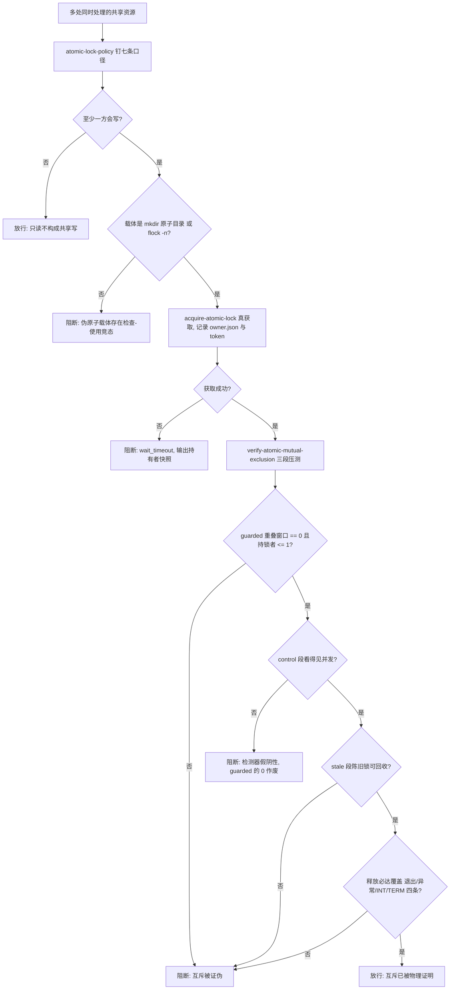

# Atomic Lock Guard (并发处理原子锁放行门禁)

## Overview

本技能是 L3 复合流程级总控，把原子锁的三个原子能力串成**一道放行门禁**：

| 序 | 环节 | 承载技能 | 物理产物 | 不通过时 |
| :--- | :--- | :--- | :--- | :--- |
| 1 | 口径 | `atomic-lock-policy` | 七条口径：载体 / 锁键 / 顺序 / 持有者 / 超时 / 陈旧回收 / 释放必达 | 载体非内核原语即不得装锁 |
| 2 | 真获取 | `acquire-atomic-lock` | 锁目录 + `owner.json`（七字段）+ token | 等待超时或 token 不符即阻断 |
| 3 | 真压测 | `verify-atomic-mutual-exclusion` | `guarded` / `control` / `stale` 三段证据 + 四项断言 | 任一断言失败即阻断 |
| 4 | 断言 | 本门禁 | 三段证据齐备性判定 + 陈旧回收正向验证 | 缺段即阻断 |

**放行的唯一合法证据是三段齐备**，不是「代码里写了 `mkdir`」：

1. `guarded` 段重叠窗口 = 0 且任一瞬间持有者 ≤ 1；
2. `control` 段（**不取锁**）重叠窗口 > 0 —— 证明检测器看得见并发，前一条的 0 不是假阴性；
3. `stale` 段陈旧锁可判定且可回收 —— 证明崩溃残留不会永久瘫痪资源池。

**只有第 1 段是典型的自欺**：一个恒返回「互斥成功」的实现同样能满足第 1 段。
门禁必须同时看到「同一个检测器在不加锁时确实看见了并发」，才算把假阴性这条路堵死。

本门禁与本池既有的并行锁链**串联而非取代**：

| 能力 | 证明什么 | 属于 |
| :--- | :--- | :--- |
| `parallel-lock-guard` | 这批任务**理论上**不该并行（锁集合无交集、无等待环） | 方案层（声明） |
| `atomic-lock-guard` | 这份资源**实际上**真的互斥（临界区重叠为 0） | 执行层（物理） |

方案层通过而执行层没装锁，等于「算好了不该撞车，然后两辆车同时开进路口」。

## When to Use

- 准备把多个进程 / 任务派去**同时处理同一份共享资源**（文件、目录、端口、实例）之前；
- 修改过锁实现（换载体、改释放路径、改陈旧判据）后需要回归放行时；
- 交付验收需要给出「多处同时处理已被物理互斥」的可复算证据串时。

**触发禁区**：只读并发、无共享写、单进程内线程同步均不经过本门禁；
本门禁只做裁决与阻断，**不获取锁、不压测、不中断进程、不改写任何业务文件**。

## Workflow

以下 Mermaid 图即本门禁的链条（口径 → 真获取 → 真压测 → 断言），随后十条有序步骤是它的物理执行序：



1. `[probe:regex]` 由 `atomic-lock-policy` 钉死七条口径，断言每条都有物理判据（载体在闭集内、锁键可归一、顺序为全序、持有者含 `start_ticks`、超时有唯一默认值、陈旧判据按模式分档、释放覆盖四条路径）；
2. `[probe:regex]` 逐处判定「至少一方会写」：全只读即直接放行，**禁止**给只读场景装锁（装锁只会无谓串行化）；
3. `[probe:regex]` 断言锁载体落在闭集 `{mkdir-atomic-dir, flock-exclusive}` 内，出现 `exists-then-write` / pid 文件读改写 / 应用层布尔标志一律阻断；
4. `[probe:file]` 断言 `acquire-atomic-lock` 脚本存在且可执行，缺失即阻断（无锁实现无从压测）；
5. `[probe:exitcode]` 调 `acquire-atomic-lock` 真获取：退 0 记录 `token` 与 `owner.json` 七字段，退 1（`wait_timeout`）即阻断并输出持有者快照，退 2 即判输入不可读；
6. `[probe:exitcode]` 调 `verify-atomic-mutual-exclusion` 出三段证据：退 0 才进入放行，退 1 阻断并保留 `checks` 现场，退 2 判依赖不可用；
7. `[probe:length]` 断言 `guarded.overlap_windows == 0` 且 `guarded.max_concurrent_holders <= 1`，并断言 `guarded.entries == workers × rounds`（有 worker 异常即视为证据不完整）；
8. `[probe:length]` 断言 `control.overlap_windows > 0` 且 `control.max_concurrent_holders > 1`：控制段看不见并发即判**检测器假阴性**，第 7 步的 0 一律作废；
9. `[probe:exitcode]` 断言 `stale.detected_stale` 与 `stale.reclaimed_and_acquired` 双真，即口径⑥ 的正向验证成立；
10. `[probe:regex]` 断言释放路径覆盖退出 / 异常 / `INT` / `TERM` 四条且带 token 校验：缺任一条即阻断，并强制走完 `release` 把本轮压测留下的锁清干净。

## Usage & Script

本技能为链式门禁，无独立脚本，按序执行承载技能的命令（任一环失败即停止，不进入下一环）：

```bash
# 1) 真获取：mkdir 原子目录 + owner.json + token
python3 skills/acquire-atomic-lock/scripts/atomic_lock.py acquire --key docs/operations/skill-catalog.json --timeout 300

# 2) 真压测：三段证据（持锁 / 无锁对照 / 陈旧回收）
python3 skills/verify-atomic-mutual-exclusion/scripts/verify_mutual_exclusion.py --workers 16 --rounds 20 --hold-ms 5 --json

# 3) 收尾：按 token 释放本轮压测锁
python3 skills/acquire-atomic-lock/scripts/atomic_lock.py release --key docs/operations/skill-catalog.json --token "<上一步返回的 token>"

# 4) 体检：确认无残留锁
python3 skills/acquire-atomic-lock/scripts/atomic_lock.py status --lock-root /tmp/dsh-atomic-locks
```

以 `run` 模式包住一次真实写入（推荐形态，释放由 `try/finally` 兜底）：

```bash
python3 skills/acquire-atomic-lock/scripts/atomic_lock.py run \
  --key docs/operations/skill-catalog.json --timeout 300 -- python3 skills/dsh-butler/scripts/sync_catalog.py
```

## Success Contract

链上门禁的退出码语义（取最后一条未通过的命令的退出码）：

| 退出码 | 含义 |
| :--- | :--- |
| 0 | 四环全过：口径齐备、真获取成功、三段证据齐备且四项断言全真、释放四路径覆盖，互斥已被物理证明 |
| 1 | 任一环失败：伪原子载体 / `wait_timeout` / `token_mismatch` / 重叠窗口非零 / 控制段看不见并发 / 陈旧锁不可回收 / 释放路径不完整 |
| 2 | 输入不可读或依赖脚本不可用（缺参、锁根不可写、`--workers < 2`、依赖模块加载失败） |

**唯一放行判据**：`verify-atomic-mutual-exclusion` 的 `checks` 四项 `pass == true`，且 `verdict == mutual_exclusion_proven`。
**禁止事项**：不得以「只跑持锁段」代替三段证据；不得在重叠非零时「先记下来继续」；不得以「代码里写了锁」替代压测结果。

## Boundaries & Constraints

- 门禁只做**裁决与阻断**，不获取锁、不中断进程、不重排正在运行的任务、不改写任何业务文件（仅写临时锁目录）；
- **三段证据缺一不可**：尤其 `control` 段不可省——省掉它就等于接受一个无法证伪的 0；
- **判据不在本层新增**：七条口径归 `atomic-lock-policy`，三段证据归 `verify-atomic-mutual-exclusion`，门禁只串联不复制；
- **禁止「记录后继续」**：任一环失败即停止推进，修复后必须从口径环节重跑，不得从中间环续跑；
- 本门禁不替代 `parallel-lock-guard`：后者证明「方案可并行」，本门禁证明「临界区真互斥」，二者串联；
- 本门禁不替代 `atomic-fission-guard`：粒度门禁判「步骤是否可物理断言」，本门禁判「互斥是否被物理证明」；
- 本门禁通过只代表**可以同时处理这份资源**，不代表可以跳过任何既有写入前置门禁（如 `catalog-consistency-guard`、`zero-restart-guard`）。
