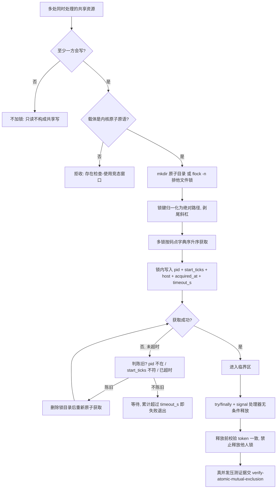

# Atomic Lock Policy (物理原子锁判定基元)

## Overview

本规约是「多处同时处理同一份共享资源」场景下**物理互斥**的唯一口径来源：只出定义与判据，
不获取锁、不压测、不断言。获取与释放交 `acquire-atomic-lock`，真并发互斥证据交 `verify-atomic-mutual-exclusion`，
放行交 `atomic-lock-guard`。

**核心立场**：声明层的锁检查**不能**替代物理互斥。
`declare-lock-set` / `detect-lock-conflict` / `verify-no-lock-violation` 证明的是「两个任务理论上不该并行」——
那是对**方案**的静态判定。两个进程真的同时 `open(...,'w')` 同一份文件时，静态检查一行都拦不住。
要真的拦住，只能靠操作系统提供的**原子原语**。

七条硬口径（本层只此七条，禁止任何下游技能另立第二套）：

### ① 锁载体 = `mkdir` 原子目录 或 `flock -n` 排他文件锁

只有这两个载体是合规的。二者都由内核保证「检查并占用」是一个不可分割的动作：

| 载体 | 原子性来源 | 适用 | 判定 |
| :--- | :--- | :--- | :--- |
| `mkdir` 原子目录 | `mkdir(2)` 在目标已存在时返回 `EEXIST`，检查与创建不可分割 | 跨进程、跨语言、可被 `ls` 直接观测、崩溃残留可读 | 目录已存在即抢锁失败 |
| `flock -n` 排他文件锁 | `flock(2)` 的 `LOCK_EX\|LOCK_NB` 由内核维护锁表，进程退出自动释放 | 同机多进程、需自动释放兜底 | 已有排他锁即抢锁失败 |

**明确禁止**的伪原子载体（写了等于没锁）：

- 「先 `os.path.exists` 再 `open(...,'w')`」——两个系统调用之间存在竞态窗口，两个进程可同时通过检查；
- 「写一个 pid 文件然后读它」——读到的可能是半截内容，也可能是过期内容；
- 应用层布尔标志、内存变量、数据库里的 `locked=true` 字段（无唯一约束时）——进程外不可见或非原子。

### ② 锁键 = 归一化绝对资源路径

锁键必须经 `os.path.realpath` 归一为绝对路径并剥除尾部斜杠。
**同一份资源经不同写法描述必须得到同一个键**，否则两个进程会各自以为拿到了锁：

| 原写法 | 归一化结果 |
| :--- | :--- |
| `skills/a/../a/SKILL.md` | `<root>/skills/a/SKILL.md` |
| `./skills/a/SKILL.md` | `<root>/skills/a/SKILL.md` |
| `skills/a/` | `<root>/skills/a` |
| 经符号链接的路径 | 链接解析后的真实路径 |

端口与实例类资源沿用 `parallel-lock-policy` 的四类键形态（`port:43129`、`instance:<id>`），
它们不参与路径归一化，但必须逐字符一致。

**为什么必须是绝对路径**：相对路径依赖进程的工作目录，两个进程 cwd 不同时，
同一个文件会被算成两个不同的键，锁因此形同虚设。

### ③ 加锁顺序 = 字典序固定顺序

与 `parallel-lock-policy` 第②条同源：一个任务需要多把锁时，按锁键码点升序依次获取。
字典序是全序，在同一全序下取锁**不可能**出现等待环，这是本层认定唯一合规的防死锁手段。

**禁止**按业务优先级、按资源重要性、按到达时间排定加锁顺序——它们都不是全序，都会制造等待环。

### ④ 持有者标识 = `PID` + 进程起始时间戳

锁内必须记录 `pid` 与 `start_ticks`（进程起始时刻的单调计数）两者。

**为什么不能只用 PID**：PID 会被操作系统复用。上一个持有者崩溃后，内核把同一个 PID 分配给一个无关的新进程，
此时「PID 存在」会让我们误判锁仍被合法持有，于是永不回收。
加入 `start_ticks` 后，复用 PID 的新进程起始时间必然不同，陈旧锁立刻可判。

`host` 字段用于区分同机不同机器名的挂载场景；跨主机共享目录上的锁**不在本层保证范围内**。

### ⑤ 超时默认 300 秒，超时即判失败并立即释放

每个锁带 `timeout_s`，**默认 300 秒**（与 `parallel-lock-policy` 同一默认值，禁止另立）。

- **等待超时**：申请者在 `timeout_s` 内拿不到锁即判本次执行失败并退出，**绝不无限等待**；
- **持有超时**：锁的持有时间超过 `timeout_s` 即被视为过期，后续申请者有权回收；
- 超时判定的输入是锁内记录的时间戳，**不取系统当前时间做「是否卡住」的主观判断**，
  只做 `now - acquired_at > timeout_s` 这一个算术比较。

### ⑥ 陈旧锁必须可回收

陈旧判据随**锁模式**分档，两种模式缺一不可：

| 模式 | 语义 | 谁在用 | 陈旧判据 |
| :--- | :--- | :--- | :--- |
| `lease`（默认） | 锁**跨命令调用**存活：持有者进程退出不等于锁失效，锁靠租约到期回收 | 多步任务先 `acquire`、中间跨若干次命令调用、最后 `release` | `start_ticks` 与存活进程不符（PID 被复用）**或** 持有已超时 |
| `live` | 锁与持有进程**同生共死**，进程没了锁就该没了 | `run` 子命令：包住一条命令，命令跑完即释放 | `pid` 不存在 **或** `start_ticks` 不符 **或** 持有已超时 |

**为什么必须区分**：用 `lease` 判据去管 `live` 场景，崩溃进程会把锁拖到超时才放手；
用 `live` 判据去管 `lease` 场景更致命——`acquire` 命令自己退出后，锁会被下一个申请者
立刻判成 `pid_not_alive` 而回收，**互斥彻底失效**。二者不是可选优化，是两套不同的正确性口径。

回收动作本身必须是「**删除陈旧锁目录 → 重新 `mkdir`**」，禁止「就地改写锁内容」——就地改写不是原子操作。

**没有第⑥条，第①条会变成陷阱**：一个崩溃的持锁进程会永久锁死整个资源池，
这比不加锁更糟——不加锁是偶发冲突，加了不可回收的锁是确定性瘫痪。

### ⑦ 释放必达：`trap` EXIT / INT / TERM

持锁进程必须在退出路径上无条件释放：正常结束、异常抛出、`Ctrl-C`、被 `kill`，
四条路径都要释放。落地手段是 `try/finally` 加 `signal` 处理器，或 shell 的 `trap 'release' EXIT INT TERM`。

- 释放前必须校验 token（`pid` + `start_ticks`）与锁内记录一致，**防止释放掉别人的锁**；
- `SIGKILL` 无法捕获，这是第⑥条陈旧回收存在的理由——两条口径互为兜底，缺一不可。

## When to Use

- 同一份共享资源（文件 / 目录 / 端口 / 实例）可能被**多个进程同时处理**，需要真的互斥时；
- 需要判断某个既有并发方案用的是「伪原子载体」还是「真内核原语」时；
- 下游 `acquire-atomic-lock` / `verify-atomic-mutual-exclusion` / `atomic-lock-guard` 需要引用载体清单、超时默认值与陈旧判据的唯一真相源时。

**触发禁区**：只读同一资源、无写入的场景不加锁（不加锁才是正确的并行）；
单进程内多线程且已有 GIL 级保护或线程锁的场景不由本层负责；
跨主机网络文件系统上的锁不在本层保证范围内，必须走外部协调服务。

## Workflow



1. `[probe:regex]` 逐处检查是否「至少一方会写」：全只读即判不需加锁，据此**拒绝**给只读场景装锁（装锁会无谓串行化）；
2. `[probe:regex]` 断言锁载体落在闭集 `{mkdir-atomic-dir, flock-exclusive}` 内，出现 `exists-then-write` / `pidfile-read-write` / 应用层布尔标志一律判不合格；
3. `[probe:regex]` 断言锁键经 `realpath` 归一为绝对路径且无尾部斜杠，出现相对路径即判不合格（cwd 不同会导致键不同）；
4. `[probe:length]` 断言同一任务的多把锁按码点升序排列，顺序非全序即判违反防死锁口径；
5. `[probe:regex]` 断言锁内六个字段齐备：`pid` / `start_ticks` / `host` / `acquired_at` / `timeout_s` / `mode`，缺 `start_ticks` 即判陈旧判定失效，缺 `mode` 即判模式口径分裂；
6. `[probe:length]` 断言 `timeout_s` 为 300 或缺省时解析为 300，出现第二套默认值即判口径分裂；
7. `[probe:exitcode]` 交 `acquire-atomic-lock` 做真获取与释放，退 0 才代表持有成立；
8. `[probe:regex]` 断言两种锁模式（`lease` / `live`）都已实现且陈旧判据按模式分档，回收方式为「删除后重新 `mkdir`」，出现「就地改写锁内容」或单模式冒充两用即判不合格；
9. `[probe:exitcode]` 交 `verify-atomic-mutual-exclusion` 出物理互斥证据，临界区重叠窗口必须为 0；
10. `[probe:regex]` 断言释放路径覆盖退出 / 异常 / `INT` / `TERM` 四条且带 token 校验，缺任一条即判释放不达。

## Usage & Script

本规约是纯规约，无独立脚本；七条口径由下游两个 L2 探针承载：

```bash
# 1) 真获取 / 释放（内核原子原语，陈旧可回收，释放必达）
python3 skills/acquire-atomic-lock/scripts/atomic_lock.py acquire --key skills/a/SKILL.md --json
python3 skills/acquire-atomic-lock/scripts/atomic_lock.py run --key docs/x.json -- <命令...>

# 2) 真并发互斥压测：N 进程抢同一把锁，断言临界区重叠窗口为 0
python3 skills/verify-atomic-mutual-exclusion/scripts/verify_mutual_exclusion.py --workers 16 --rounds 20 --json
```

## Success Contract

本规约自身不含脚本，退出码语义由承载脚本给出：

| 退出码 | 含义 |
| :--- | :--- |
| 0 | 持有成立 / 互斥被证明（临界区重叠窗口 0，任一瞬间持有者 ≤ 1） |
| 1 | 载体伪原子、锁键未归一、加锁顺序非全序、锁字段缺失、互斥被证伪 |
| 2 | 输入缺失或不可解析、依赖不可用、锁根目录不可写 |

## Boundaries & Constraints

- 本规约只输出定义与判据，**不获取锁、不压测、不中断任何进程、不写文件**；
- **声明层不得冒充互斥保证**：`parallel-lock-policy` 系列证明「方案可并行」，本层证明「临界区真的互斥」，二者串联而非互相取代；
- **默认值唯一**：`timeout_s` 默认 300 秒只在本层给定，禁止下游另立；
- **禁止不可回收的锁**：没有陈旧回收分支的锁实现一律判不合格，因为崩溃残留会确定性瘫痪资源池；
- **跨主机不保证**：网络文件系统上的 `mkdir` 与 `flock` 语义不统一，本层只保证同机同内核命名空间内互斥；
- **确定性**：判定只依赖锁内记录字段与输入参数，禁止随机退避、禁止按系统时间做主观「是否卡住」判断。
