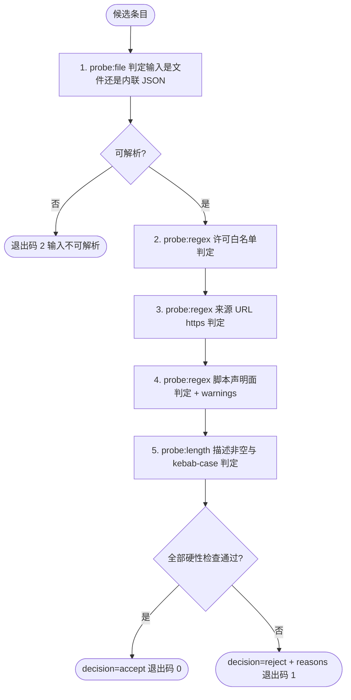

# Audit Imported Skill (引入候选审计)

## Overview

本技能是「GitHub 技能引入管线」的第 2 步（T17，REQ-BUTLER-IMPORT-012）。
它在任何外部资产落地前执行**物理可复核的体检**：许可是否在白名单内、来源 URL 是否为 https、
是否声明含脚本、描述是否非空、名称是否为 kebab-case，最后给出 `accept` / `reject` 裁决。

核心口径：**引入即纳管，拒绝必留痕**。被拒绝的候选必须带明确许可/安全理由，不得静默丢弃或静默跳过。

## When to Use

**正触发**：
- `search-github-skill` 产出候选清单后，逐个执行引入前体检；
- 用户要求「这个 GitHub 技能能不能引入 / 许可合不合规 / 安不安全」；
- 作为 `skill-import-pipeline` 的第 2 步被串联调用。

**触发禁区**：本技能**只出裁决与理由，不落地任何文件**——契约归一交 `normalize-skill-contract`、集群归属交 `place-skill-into-cluster`；也不做深度代码审计（`has_scripts=true` 时只加 `warnings` 提醒人工审脚本，不代替人工安全评审）。

## Workflow



**有序步骤**：

1. `[probe:file]` 解析 `--candidate`：先按文件路径探测，文件不存在则按内联 JSON 字符串解析；两者皆失败即退出码 2。
2. `[probe:regex]` 判定许可是否命中白名单 `MIT, Apache-2.0, BSD-2-Clause, BSD-3-Clause, ISC, MPL-2.0, Unlicense, CC0-1.0`（大小写不敏感），`UNKNOWN` 视为不通过。
3. `[probe:regex]` 判定来源 URL 是否存在且以 `https://` 开头。
4. `[probe:regex]` 判定 `has_scripts`：无论真假均记为通过，但为真时**必须**写入 `warnings` 提醒人工逐行审脚本。
5. `[probe:length]` 判定 `description` 非空、`name` 为 kebab-case（含长度与连字符结构检查）。
6. `[probe:exitcode]` 汇总裁决：全通过 → `accept` / 退出码 0；任一硬性项失败 → `reject` / 退出码 1，并在 `reasons` 写明每一条拒绝理由。

## Usage & Script

```bash
# 1. 白名单许可候选：应接受，退出码 0
python3 skills/audit-imported-skill/scripts/audit_skill.py \
  --candidate '{"name":"pdf-toolkit","url":"https://github.com/acme/pdf-toolkit","license":"MIT","has_scripts":true,"description":"PDF 处理"}'
echo "exit=$?"

# 2. UNKNOWN 许可候选：应拒绝并给出理由，退出码 1
python3 skills/audit-imported-skill/scripts/audit_skill.py \
  --candidate '{"name":"mystery-skill","url":"https://github.com/acme/mystery-skill","license":"UNKNOWN","description":"来源不明"}'
echo "exit=$?"

# 3. 从文件读取候选条目（search_skill.py 输出的单条候选）
python3 skills/audit-imported-skill/scripts/audit_skill.py --candidate /tmp/candidate.json
```

## Success Contract

| 退出码 | 语义 |
| :--- | :--- |
| `0` | 裁决为 `accept`，该候选可进入契约归一阶段 |
| `1` | 裁决为 `reject`，`reasons` 中必须含明确许可/安全/契约理由 |
| `2` | 输入不可解析（既不是可读文件，也不是合法 JSON） |

输出结构：

```json
{
  "success": false,
  "candidate": "mystery-skill",
  "checks": [{"id": "license-whitelist", "passed": false, "reason": "..."}],
  "warnings": [],
  "decision": "reject",
  "reasons": ["许可不合规：许可 UNKNOWN 不在白名单内"]
}
```

- `checks` 逐项 pass/fail **且每项必带理由**，不接受无理由判定；
- 退出码 1 时 `reasons` 不得为空——静默丢弃候选即视为本技能失败。

## Boundaries & Constraints

- **只审不写**：本技能不创建、不修改、不删除任何文件，纯裁决；
- **白名单闭集**：许可判定只认上述 8 项（大小写不敏感），其他许可一律拒绝并说明；
- **含脚本不是拒绝理由**：`has_scripts=true` 只产生 `warnings`，引入前的脚本人工审查责任不因审计通过而免除；
- **拒绝必留理由**：任何 `reject` 都必须在 `reasons` 中留下可复核的许可/安全/契约依据，禁止静默跳过改选下一候选而不记录。
