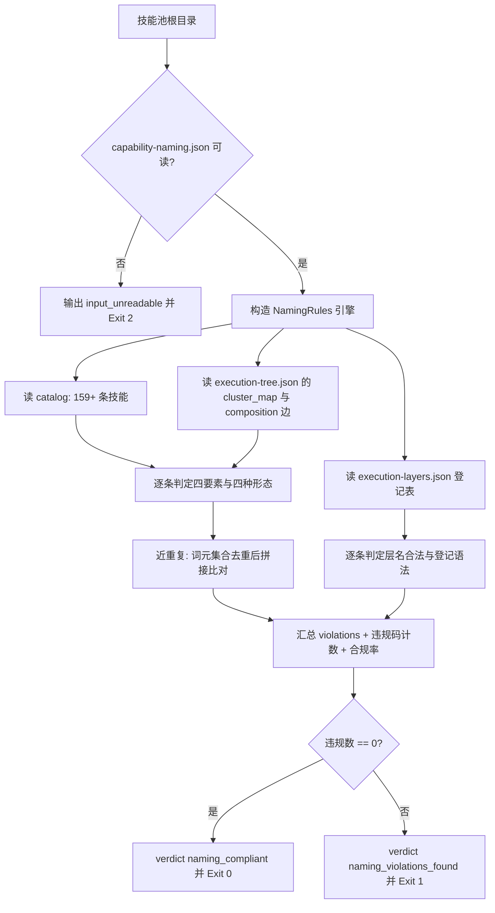

# Audit Layer Naming (全量执行层命名体检器)

## Overview

本技能是 `capability-naming-policy` 的物理执行层：把四要素与四种命名形态落成一次**可复算的全量扫描**。
它只做一件事——**把违规找出来，并说清楚违规在哪一条判据、哪一个文件、第几行**。

它不做整改（归 `rename-execution-layer`）、不做合规率断言（归 `verify-layer-naming`）、不渲染文档（归 `render-capability-naming`）。

### 判据实现只有一份

规则引擎在 `skills/audit-layer-naming/scripts/naming_rules.py`，是**全池唯一实现**。
`verify-layer-naming` 与 `render-capability-naming` 都通过 `importlib` 加载这同一份模块。
禁止任何下游另抄一份判据——两份判据必然漂移，漂移之后同一个技能在体检里合规、在门禁里违规。

### 违规码闭集

`catalog_id_empty` / `syntax_charset` / `segments` / `length` / `banned_word` / `synonym_alias` /
`shape_action` / `shape_orchestration` / `shape_l4` / `level_prefix` / `description_too_short` /
`owner_missing` / `dir_missing` / `frontmatter_mismatch` / `near_duplicate` / `layer_unknown` /
`registry_grammar`。

新增违规码必须同时改 `naming_rules.py` 与本 SKILL.md，否则码表与实现会分叉。

## When to Use

- 新增或改名任何执行层之后，需要确认全池命名仍然合规时；
- 需要定位「哪一条判据、哪个文件、第几行」违规时；
- 作为 `layer-naming-guard` 门禁的第一环，为整改提供待办清单时。

**触发禁区**：只读诊断，**不改名、不写文件、不重建索引**；不负责技能功能描述的质量评审（只校验前缀与字节数）；不负责层级升降。

## Workflow



1. `[probe:file]` 定位 `skills/audit-layer-naming/scripts/naming_rules.py`，缺失即输出 `rules_missing` 并退 2（**绝不内置兜底判据**，否则与验签器判据分叉）；
2. `[probe:file]` 加载 `docs/operations/capability-naming.json`，缺失或不可解析即退 2；
3. `[probe:file]` 加载 `docs/operations/skill-catalog.json`，缺失即退 2；`execution-layers.json` 与 `execution-tree.json` 缺失时降级为空上下文但不中断；
4. `[probe:regex]` 逐条判定 id 语法：正则 `^[a-z][a-z0-9]*(-[a-z0-9]+)*$`，命中即记 `syntax_charset`；
5. `[probe:length]` 判定段数与长度：段数不在 `2~5` 且不在单段白名单记 `segments`，长度不在 `3~48` 记 `length`；
6. `[probe:regex]` 判定禁词与同义别名：与禁词表有交集记 `banned_word`，首段是别名记 `synonym_alias`；
7. `[probe:regex]` 按层级判定形态：L2 首段必须在动词表内（否则 `shape_action`），L3 首段是动词或末段是编排名词（否则 `shape_orchestration`），L4 必须 `dsh-butler`；
8. `[probe:regex]` 判定「做什么」：description 未以登记前缀开头记 `level_prefix`，字节数 `< 20` 记 `description_too_short`；
9. `[probe:file]` 判定「归属」与物理一致：L1/L2 无 composition 引用、L3 无集群归属记 `owner_missing`；`skills/<id>/` 不存在记 `dir_missing`；Frontmatter `name` 与 id 不一致记 `frontmatter_mismatch`（两项只对 `scope=local-pool` 生效）；
10. `[probe:exitcode]` 做近重复判定（词元集合去重后升序拼接比对），汇总 `violations`、`violation_codes`、`compliance_rate`；零违规退 0，有违规退 1。

## Usage & Script

```bash
# 全量体检
python3 skills/audit-layer-naming/scripts/audit_naming.py --all --json

# 只看某一类违规（如只看形态类）
python3 skills/audit-layer-naming/scripts/audit_naming.py --all --codes shape_action,shape_orchestration

# 限制输出条数（大整改时看前 10 条）
python3 skills/audit-layer-naming/scripts/audit_naming.py --all --limit 10 --json
```

实测输出（整改前 → 整改后）：

| 时点 | 执行层总数 | 合规数 | 合规率 | 违规码分布 |
| :--- | ---: | ---: | ---: | :--- |
| 整改前 | 159 | 156 | 0.9811 | `shape_action` 1、`shape_orchestration` 2、`synonym_alias` 1 |
| 整改后 | 160 | 160 | **1.0000** | 无 |

## Success Contract

| 退出码 | 含义 |
| :--- | :--- |
| 0 | 零违规（`verdict = naming_compliant`） |
| 1 | 存在违规（`verdict = naming_violations_found`），`violations` 给出逐条证据 |
| 2 | 输入不可读（词表 / catalog 缺失或不可解析、判据模块缺失） |

JSON 契约：`{"success","verdict","spec_version","compliance":{...},"violation_codes":{...},"violations":[{"code","id","level","detail","location"}],"registry_violations":[...]}`；
`location` 形如 `docs/operations/skill-catalog.json:1234`，可直接跳到违规行。

## Boundaries & Constraints

- **只读诊断**：不写任何文件、不改名、不重建索引；
- **判据唯一**：规则实现只存在于 `naming_rules.py`，本技能不含第二份判据，也不允许下游各写一份；
- **不内置兜底词表**：真相源 JSON 缺失即退 2，绝不用硬编码词表兜底；
- **确定性**：只依赖 catalog / 磁盘 / 词表 / 登记表四处事实，禁止随机与系统时间，同输入恒得同结论；
- **不评功能质量**：只校验「做什么」的前缀与字节数，不评价描述写得好不好。
