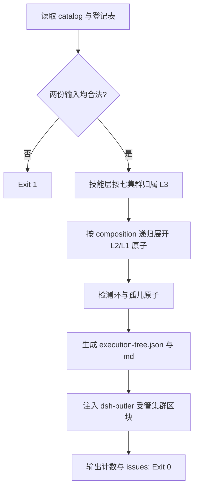

# Build Execution Tree (执行层树生成)

## Overview

本技能是 L2 工序动作级工具，把六个执行层合并成一棵树，并让这棵树成为**唯一真相源**。
凡是要展示层级与集群归属的文档，都从这里取内容，不再手写。

## When to Use

- 技能池编目或执行层登记表发生变更之后；
- 需要在文档里展示集群/层级结构时（改为引用受管区块）；
- 需要判断某个技能归属哪个集群、某条执行层位于树的哪一层时。

**触发禁区**：不负责登记条目（那由 `register-execution-layer` 负责），也不负责判定一致性（那由 `verify-execution-tree` 负责）。

## Workflow



1. `[probe:file]` 断言 `skill-catalog.json` 与 `execution-layers.json` 存在且非空；
2. `[probe:regex]` 校验登记表条目的 layer 合法、`source=repo` 的 path 存在；
3. `[probe:exitcode]` 把 L3/L4 技能按七集群归属，并按 `composition` 递归展开 L2/L1 原子，深度上限 8；
4. `[probe:regex]` 检测 composition 环与**孤儿原子**（未被任何父级引用的 L1/L2）；
5. `[probe:file]` 写出 `execution-tree.json` 与 `execution-tree.md`，并向 `dsh-butler/SKILL.md` 注入行锚定的 `TREE:BEGIN~TREE:END` 受管区块；
6. `[probe:exitcode]` 输出六层计数、`issues` 与 `changed` 后返回 0。

## Usage & Script

```bash
python3 skills/build-execution-tree/scripts/build_tree.py
python3 skills/build-execution-tree/scripts/build_tree.py --check   # 只检测是否需要重建
```

## Success Contract

- Exit Code 0：树已生成（或 `--check` 时已最新）；
- Exit Code 1：输入缺失/非法，或 `--check` 检测到陈旧；
- 幂等：同一输入连续两次生成，两个产物与受管区块逐字节相同。

## Boundaries & Constraints

- **集群归属表内置于本脚本**，它是集群归属的唯一判据；文档不得另行手写；
- 孤儿原子与 composition 环记入 `issues`，由 `verify-execution-tree` 决定是否阻断。
