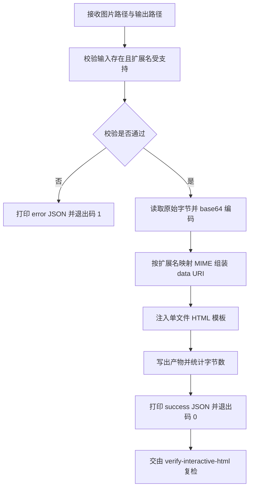

# Build Image Viewer (单文件交互查看器生成器)

## Overview

Build Image Viewer 是 `format-zoomable-visual` 规约的唯一落地生成器。
它把一张图片物理内联为 base64 data URI，编译成一个自包含的 HTML 文件：双击即开，不联网、不装依赖、不加载任何外部资源。

产物内建完整交互：点击缩略图打开全屏遮罩、放大 / 缩小 / 复位三个按钮、鼠标滚轮缩放、鼠标拖拽平移、ESC 关闭、`+` / `-` / `0` 键盘快捷键。三个控制按钮分别带 `data-zoom-in` / `data-zoom-out` / `data-zoom-reset` 属性，供 `verify-interactive-html` 物理探测。

## When to Use

- 需要把一张图片（PNG / JPG / JPEG / SVG / WebP）交付为用户可自由缩放的查看器时；
- 需要把拓扑图、结构图、长截图等超出视口的图形做成可放大查看的成品时；
- 需要为 `interactive-image-viewer` 复合流程提供「生成」环节的执行体时。

**触发禁区**：纯文本、表格、纯 Mermaid 源码、以及宿主 GenUI 原生组件不适用本技能——它们已有原生交互，强行生成 HTML 只会制造重复载体。

## Workflow



1. `[probe:file]` 断言 `--image` 指向的路径真实存在且是常规文件，否则打印错误 JSON 并退出 1；
2. `[probe:regex]` 以扩展名白名单 `png|jpg|jpeg|svg|webp` 排他匹配，不命中即退出 1；
3. `[probe:length]` 断言读入的原始字节数大于 0，空文件直接阻断；
4. `[probe:regex]` 组装 base64 data URI 并注入模板，产物必须同时含 `data-zoom-in`、`data-zoom-out`、`data-zoom-reset` 三个控制标识；
5. `[probe:regex]` 断言产物文本不含 `src="http`、`href="http`、`url(http`、`<script src=`、`<link ` 五类外部引用模式；
6. `[probe:file]` 断言输出文件已落盘且字节数大于 0；
7. `[probe:exitcode]` 返回 0，并把 `out` / `bytes` / `image` 以单行 JSON 打到 stdout。

## Usage & Script

```bash
# 1. 真实输入（把路径换成你自己的图片即可）
python3 skills/build-image-viewer/scripts/build_viewer.py \
  --image /path/to/topology.png \
  --out /tmp/topology-viewer.html \
  --title "管家拓扑图"

# 2. 无素材时的自包含冒烟测试：先用纯标准库现场生成一张最小 PNG
python3 - <<'PY'
import base64, pathlib
png = base64.b64decode(
    "iVBORw0KGgoAAAANSUhEUgAAAAEAAAABCAYAAAAfFcSJAAAADUlEQVR42mP8z8BQDwAEhQGAhKmMIQAAAABJRU5ErkJggg=="
)
pathlib.Path("/tmp/sample.png").write_bytes(png)
print("wrote /tmp/sample.png", len(png), "bytes")
PY

python3 skills/build-image-viewer/scripts/build_viewer.py \
  --image /tmp/sample.png \
  --out /tmp/sample-viewer.html \
  --title "冒烟测试查看器"

# 3. 幂等验证：同输入重复运行，产物字节级一致
python3 skills/build-image-viewer/scripts/build_viewer.py --image /tmp/sample.png --out /tmp/a.html
python3 skills/build-image-viewer/scripts/build_viewer.py --image /tmp/sample.png --out /tmp/b.html
shasum -a 256 /tmp/a.html /tmp/b.html
```

成功时 stdout 形如：

```json
{"success": true, "out": "/tmp/sample-viewer.html", "bytes": 8123, "image": "/tmp/sample.png"}
```

## Success Contract

| 退出码 | 触发条件 | stdout |
| :--- | :--- | :--- |
| 0 | 输入合规、产物已落盘且字节数 > 0 | `{"success": true, "out": ..., "bytes": ..., "image": ...}` |
| 1 | 输入不存在 / 不是常规文件 / 扩展名不支持 / 读取失败 / 输出不可写 | `{"success": false, "error": "..."}` |

契约附加项：

- 同一输入重复运行，除文件名外产物内容逐字节稳定（模板不含时间戳，禁止引入随机数或当前时间）；
- 产物为**单个** HTML 文件，不得拆分出附属 CSS / JS / 图片文件。

## Boundaries & Constraints

- 只接受单张图片输入；多图、目录、网络 URL、压缩包一律拒绝（网络 URL 会破坏零依赖原则）；
- 严禁在产物中引入 CDN、外链脚本、外链样式、外链字体或 `@import`；SVG 也必须以 base64 内联，不得输出带命名空间字面量的行内 SVG 标签；
- 三个控制属性名 `data-zoom-in` / `data-zoom-out` / `data-zoom-reset` 是下游探针的稳定契约，不得改名或换成 class 选择器；
- 本技能只负责生成，不负责判定交付资格；判定必须交给 `verify-interactive-html`；
- 不覆盖式破坏用户已有文件之外的路径，不触碰仓库内任何其他文件。
