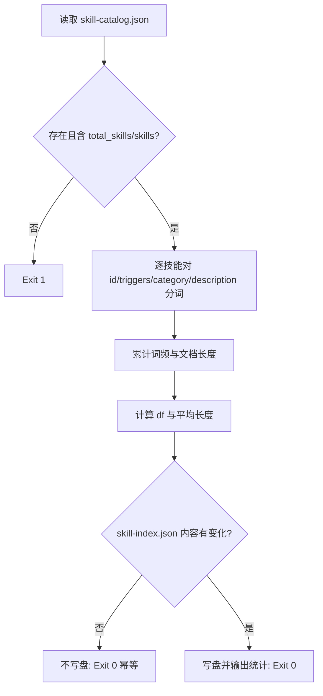

# Build Inverted Index (倒排索引生成)

## Overview

本技能是 L2 工序动作级工具，是 Google 式检索的地基：把「哪份技能文档里出现过哪个词」预先算好。
它同时导出确定性分词器 `tokenize()`，供查询解析与排序复用，保证索引侧与查询侧使用**同一套切词规则**。

## When to Use

- 技能池编目（`skill-catalog.json`）发生任何变更之后；
- 检索结果异常，需要先确认索引是否陈旧时；
- 作为库被 `parse-query` / `rank-skills-bm25` / `google-style-skill-search-router` 导入以复用分词器时。

**触发禁区**：不得用它检索业务文档；本索引只覆盖技能编目。

## Workflow



1. `[probe:file]` 读取并断言 `docs/operations/skill-catalog.json` 存在且含 `total_skills` / `skills` 两个字段；
2. `[probe:regex]` 对每个技能的 `id`、`triggers`、`category_title`、`description` 四个字段分词（ASCII 词 + CJK 一元/二元）；
3. `[probe:length]` 累计每个 term 的文档频次 `df`、每个字段的词频 `tf` 与字段长度；
4. `[probe:file]` 写出 `docs/operations/skill-index.json`（键排序、无时间戳，保证幂等）；
5. `[probe:exitcode]` 输出统计 JSON 并返回 0；catalog 缺失或非法返回 1。

## Usage & Script

```bash
python3 skills/build-inverted-index/scripts/build_index.py
python3 skills/build-inverted-index/scripts/build_index.py --check   # 只检测索引是否需要重建
```

## Success Contract

- Exit Code 0：索引已是最新（`--check`）或已成功重建；
- Exit Code 1：catalog 缺失/非法，或 `--check` 检测到索引陈旧；
- 幂等：同一份 catalog 连续两次重建，`skill-index.json` 逐字节相同。

## Boundaries & Constraints

- 索引只服务技能检索，不索引 `docs/**` 正文；
- 分词规则一经发布不得随意更改，否则必须重建索引并在 SKILL.md 中记录版本。
