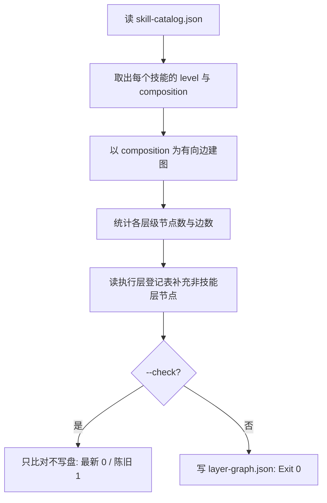

# Build Layer Graph (层间依赖图生成)

## Overview

本技能是 L2 工序动作级工具，把「谁被允许调用谁」这层契约变成一张**可计算的图**。
检测器在这张图上跑，而不是各自去解析 frontmatter——一份输入，一份口径。

## When to Use

- 新增、拆分、合并任一执行层技能之后；
- 检测或断言解耦之前（它是两者的共同输入）；
- 需要看清某层的入度/出度时。

**触发禁区**：本技能**只建图不判违规**——五类违规判定归 `detect-layer-coupling`，避免同一判据两处实现。

## Workflow



1. `[probe:file]` 断言 `docs/operations/skill-catalog.json` 与 `docs/operations/execution-layers.json` 存在且含必需字段；
2. `[probe:regex]` 逐技能取 `level`（缺 `level` 计入 `skipped` 并上报，不入图）；
3. `[probe:exitcode]` 以 `composition` 为有向边建图，边去重排序；
4. `[probe:length]` 统计 `layers` 各层节点数与总边数；
5. `[probe:file]` 写 `docs/operations/layer-graph.json`（键排序、无时间戳、幂等）；`--check` 只比对不写盘。

## Usage & Script

```bash
python3 skills/build-layer-graph/scripts/build_layer_graph.py
python3 skills/build-layer-graph/scripts/build_layer_graph.py --check
```

## Success Contract

- Exit Code 0：已写盘，或 `--check` 时图已最新；
- Exit Code 1：输入缺失/不可读，或 `--check` 检测到陈旧；
- Exit Code 2：catalog 缺少 `skills` 字段等结构性错误。

## Boundaries & Constraints

- 图的边**只来自 `composition`**；脚本里的 importlib 加载属于「事实边」，由 `detect-layer-coupling` 单独比对，不混进这张契约图；
- 不做环检测——那是检测器的职责（建图与判违规分离，避免口径分裂）。
