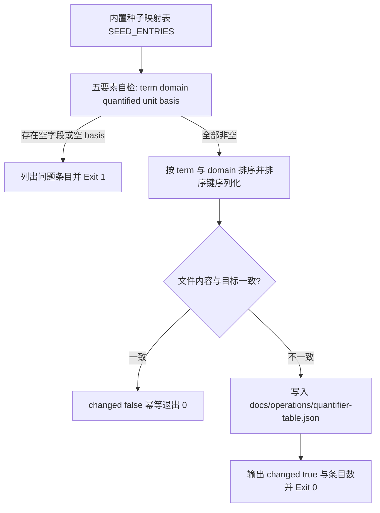

# Build Quantifier Table (场景量化映射表生成器)

## Overview

本技能是「修饰程度词必须量化」流水线的**第二个环节**，把 L1 规约的四要素纪律落成一张可被
机器查询的表：`docs/operations/quantifier-table.json`。

表结构（字段顺序固定，键排序输出）：

| 字段 | 含义 | 硬门槛 |
| :--- | :--- | :--- |
| `term` | 模糊词，如 `高` / `大` / `快` | 非空 |
| `domain` | 场景，如 `成年男性身高` / `接口响应` | 非空 |
| `quantified` | 数值或区间，如 `>=180` / `P95<=200` | 非空 |
| `unit` | 单位，如 `cm` / `ms` | 非空 |
| `basis` | 依据来源：公开统计 / 国家标准 / 行业惯例 / 本项目既有基线 | **非空，缺一条即 exit 1** |

三条设计纪律：

1. **场景优先**：条目主键是 `(term, domain)`，同一词在不同场景可有不同数值，
   禁止只按 `term` 建全局映射；日志场景的 `>=100 MB` 不得搬到代码库场景；
2. **缺 basis 即不合格**：脚本自检逐条校验五要素，发现空 `basis` 就列出问题条目并 exit 1，
   **宁可不写也不留空凑数**；
3. **幂等且无时间依赖**：条目按 `(term, domain)` 排序、JSON 键排序、末尾单换行、无时间戳，
   连跑两次第二次必为 `changed:false`。

内置种子表覆盖 `高 大 快 多 好 严重 频繁 明显 显著 稳定 偏高 偏低 较高 较多 丰富 完善`
共 16 个词、52 条映射，每个词至少 3 个场景，每条都给出可追溯的 `basis`。

## When to Use

- 需要新增或修订程度词的场景量化值时（唯一合法写入入口）；
- `detect-vague-modifier` 判定「某词是否已有映射」前，需要保证映射表存在且最新时；
- 交付前怀疑映射表漂移，需要只检测不写入时（`--check`）。

**触发禁区**：本技能只维护量化映射表，不检测文本、不改写正文、不动 `skill-catalog.json` 等其它索引；含糊词的具像化映射不在本表范围内。

## Workflow



1. `[probe:file]` 读取脚本内置的 `SEED_ENTRIES`，逐条确认 `term` 与 `domain` 均已给出（场景优先，禁止全局映射）；
2. `[probe:length]` 逐条断言 `quantified` 与 `unit` 字段长度大于 0，空值即记入问题清单；
3. `[probe:regex]` 逐条断言 `basis` 非空且不只有空白字符，缺 `basis` 的条目一律判不合格；
4. `[probe:file]` 读取既有 `docs/operations/quantifier-table.json`，与「排序 + 键排序 + 单换行」的确定性文本逐字节比对；
5. `[probe:exitcode]` 带 `--check` 时只比对不写入：一致退 0，陈旧或缺失退 1；
6. `[probe:exitcode]` 无参数时写入并输出 `changed`：第二次运行必须为 `changed:false`，自检失败退 1、写入故障退 2。

## Usage & Script

```bash
# 生成或刷新映射表（幂等：第二次运行 changed:false）
python3 skills/build-quantifier-table/scripts/build_quantifier_table.py

# 只检测是否最新：一致退 0，陈旧退 1
python3 skills/build-quantifier-table/scripts/build_quantifier_table.py --check

# 打印条目数（词数与逐词分布）
python3 skills/build-quantifier-table/scripts/build_quantifier_table.py --list

# 打印条目数并输出 JSON
python3 skills/build-quantifier-table/scripts/build_quantifier_table.py --list --json
```

产物片段示例：

```json
{
  "entries": [
    {"basis": "公开身高分布：中国成年男性平均身高约 170 cm，180 cm 约处前 10% 分位",
     "domain": "成年男性身高", "quantified": ">=180", "term": "高", "unit": "cm"}
  ],
  "table_version": "1.0.0"
}
```

## Success Contract

| 字段 | 类型 | 含义 |
| :--- | :--- | :--- |
| `success` | 布尔 | 自检通过且写动作成功（`--check` 下表示已是最新） |
| `changed` | 布尔 | 本次是否真的改写了文件；连跑第二次必为 `false` |
| `path` | 字符串 | 产物相对路径 `docs/operations/quantifier-table.json` |
| `count` | 整数 | 条目总数（种子表 52 条） |
| `table_version` | 字符串 | 表版本号，当前 `1.0.0` |

退出码：

| 码 | 含义 |
| :--- | :--- |
| 0 | 写入成功（含 `changed:false`），或 `--check` 检测到已是最新 |
| 1 | 存在缺 `basis` 或字段为空的条目；或 `--check` 检测到陈旧/缺失 |
| 2 | 输出目录不可写等 I/O 故障 |

## Boundaries & Constraints

- **唯一写入者**：`docs/operations/quantifier-table.json` 只允许本脚本写入，禁止手工编辑；
- **禁止空 basis**：`basis` 必须可追溯到公开统计、国家标准、行业惯例或本项目既有基线；
- **禁止无场景条目**：`domain` 为空等于退回全局映射，与场景优先原则冲突，一律判不合格；
- **确定性**：无随机数、无系统时间、无网络，同一版本连跑两次产出同一字节序列；
- **不越权**：不检测文本、不改写交付正文、不修改仓库其它索引文件。
