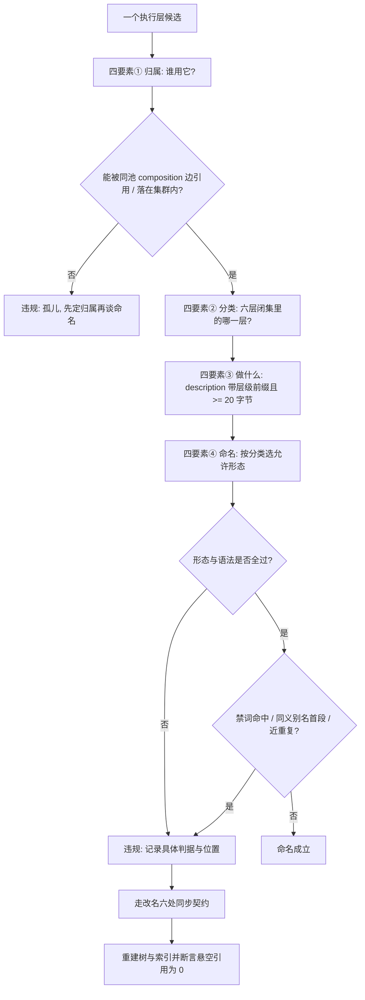

# Capability Naming Policy (能力层命名判定基元)

## Overview

本规约是**能力层命名的唯一口径来源**：只出定义与判据，不检测、不改名、不写文件。
检测交 `audit-layer-naming`，整改交 `rename-execution-layer`，断言交 `verify-layer-naming`，
放行交 `layer-naming-guard`。

**词表与形态的唯一真相源是 `docs/operations/capability-naming.json`**，不是本文件。
本文件解释「为什么这样定」，JSON 定义「具体是什么」。禁止在本文件或任何下游技能里另抄一份词表——
两份词表必然漂移，漂移之后同一个技能在审计脚本与门禁脚本里会得到两种结论。

## 四要素（缺一不可）

| # | 要素 | 字段 | 它回答的问题 | 判据落点 |
| :---: | :--- | :--- | :--- | :--- |
| 1 | **归属** | `owner` | 它归谁管？ | L1/L2 必须被至少一条同池 `composition` 边引用；L3 必须落在七个集群之一；L4 是根 |
| 2 | **分类** | `layer` | 它是哪一种执行层？ | 六层闭集 `skill` / `cli` / `agent` / `api` / `mcp` / `plugin`，须与执行层登记表逐字一致 |
| 3 | **做什么** | `intent` | 它到底做什么？ | `description` 非空且 ≥ 20 字节，且带已登记的层级声明前缀 |
| 4 | **命名** | `id` | 它物理上叫什么？ | 目录名 + catalog `id` + Frontmatter `name` 三处逐字一致，且落在一个已登记形态内 |

**顺序不可颠倒**：先定归属（谁用），再定分类（哪一层），再定做什么（动词与宾语），最后才派生名字。
反过来「先起个名字再想它做什么」正是坏名字的来源。

## 四种已登记命名形态

| 形态 | 判据 | 强制层级 | 例 |
| :--- | :--- | :--- | :--- |
| `action` 动作形态 | 首段 ∈ 动词词汇表 | **L2 强制** | `verify-layer-naming`、`rename-execution-layer` |
| `orchestration` 编排形态 | 末段 ∈ 编排名词表 | L3 二者取一 | `layer-naming-guard`、`intent-detector` |
| `policy` 规约形态 | 末段 ∈ `policy`/`spec`/`standard`/`protocol` | L1 允许 | `atomic-lock-policy` |
| `vendor` 厂商边界形态 | 整名为单段且 ∈ 单段厂商白名单 | 外部平台边界技能 | `github` |

### 层级与形态的绑定

| 层级 | 要求 | 为什么 |
| :--- | :--- | :--- |
| **L1** | 形态自由，只受语法、禁词、同义归一与唯一性约束 | 规约描述的是「什么必须成立」而不是「做什么动作」，强制动词开头会逼出 `enforce-xxx` 这种语义空转的名字 |
| **L2** | **必须动作形态** | 工序动作层就是「做一个动作」，非动词开头意味着名字没回答「做什么」 |
| **L3** | 动作形态 **或** 编排形态 | 总控既可能是动作（`visualize-governance-topology`）也可能是实体（`intent-detector`），二者都合法，但必须落在登记表内 |
| **L4** | id 固定 `dsh-butler` | 全池唯一中枢，改名会破坏全部上位引用 |

**为什么 L1 例外**：L1 有 38 条全是规约。若强制动词开头，`chinese-end-to-end`、`no-conversational-filler`、
`milestone-only-progress` 这类名字会被迫改成 `enforce-chinese-only` 之类——语义没有变准，只是换了个动词壳。
规约层的命名形态自由是本池长期形成的稳定约定，规范应当**承认并固化**它，而不是制造 38 次无收益改名。

## 语法约束

| 项 | 取值 |
| :--- | :--- |
| 形态 | `<verb>-<object>[-<qualifier>]` |
| 正则 | `^[a-z][a-z0-9]*(-[a-z0-9]+)*$` |
| 字符集 | 仅小写 ASCII 字母 / 数字 / 连字符；禁止下划线、空格、大写、中文、连续连字符、首尾连字符 |
| 段数 | 2 ~ 5（单段仅限厂商边界形态） |
| 长度 | 3 ~ 48 字符 |

## 禁词与同义归一

**禁词**（出现即违规）：`util` `utils` `helper` `helpers` `misc` `temp` `tmp` `new` `old` `bak`
`final` `copy` `test2` `data2` `stuff` `thing` `v2`。

这些都是**信息量为零**的词：它们不说明能力做什么，只说明它相对于什么而存在（新旧、备份、临时、杂项）。
一个名字一旦带 `util`，它就会变成什么东西都往里塞的垃圾桶。

**同义归一**：`search` / `find` / `query` / `lookup` / `seek` 五词在检索语义上不可区分，
全池**只允许 `search` 作为首段**出现。同一动作出现四种命名，检索与路由都要为同一个概念维护四条同义词路径。

**不列入同义、明确登记边界的词对**（把它们当同义词合并才是错的）：

| 词对 | 边界 |
| :--- | :--- |
| `check` / `verify` | `check-*` 单点静态检测，只返回事实；`verify-*` 断言 + 退出码裁决，用于放行门禁 |
| `build` / `generate` | `build-*` 输入是既有数据源、产物幂等；`generate-*` 输入是参数或模板 |
| `audit` / `detect` | `audit-*` 遍历全量对象出违规清单；`detect-*` 扫描定位命中项 |

## 改名的六处同步契约

改名**不是**只改目录名。任何一次改名必须同时改掉下表六处，漏一处即判悬空引用：

| # | 同步对象 | 位置 |
| :---: | :--- | :--- |
| 1 | 目录名 | `skills/<id>/` |
| 2 | 技能 ID | `docs/operations/skill-catalog.json` 的 `id` 与 `name` |
| 3 | 契约头 | `skills/<id>/SKILL.md` 的 YAML Frontmatter `name` |
| 4 | 组装边 | 全池 `composition` / `depends_on` 引用 |
| 5 | 树与索引 | `execution-tree.json` / `execution-tree.md` / `skill-index.json` / `layer-graph.json` / `instance-safety.json` |
| 6 | 文档与登记 | `docs/**` 受管区块与正文提及、`docs/operations/execution-layers.json` |

## When to Use

- 新增任何执行层之前，需要按四要素派生一个合规 id 时；
- 判断某个既有 id 是否违规、违规在哪一条判据上时；
- 设计一次改名，需要确认要同步哪六处、哪一处漏了会变成悬空引用时；
- 下游 `audit-layer-naming` / `rename-execution-layer` / `verify-layer-naming` / `layer-naming-guard` 需要引用词表与形态定义时。

**触发禁区**：本规约只出判据，**不检测、不改名、不写任何文件**；不负责执行层的层级升降（那是 `place-skill-into-cluster` 与 catalog 的事）；不负责技能的功能描述质量评审。

## Workflow



1. `[probe:regex]` 校验四要素齐备：`owner` 可判定、`layer` 落在六层闭集内、`description` 非空且 ≥ 20 字节、`id` 非空；缺任一项即判命名未定；
2. `[probe:regex]` 断言 `id` 匹配 `^[a-z][a-z0-9]*(-[a-z0-9]+)*$`，出现下划线、大写、中文、连续或首尾连字符一律违规；
3. `[probe:length]` 断言段数落在 `2~5`、长度落在 `3~48`；单段名只有整名 ∈ 单段厂商白名单才放行，其余单段名违规；
4. `[probe:regex]` 按层级判定形态：L2 首段必须在动词表内；L3 首段在动词表内**或**末段在编排名词表内；L1 形态自由；L4 必须是 `dsh-butler`；
5. `[probe:regex]` 断言 `description` 前缀与 `scope` 匹配：同池技能用层级前缀，系统内置技能用 `系统能力：` 前缀，混用或缺失即违规；
6. `[probe:regex]` 断言 `id` 的分段不含禁词表中的任一词；
7. `[probe:regex]` 断言首段不是同义组别名（`find` / `query` / `lookup` / `seek`），别名一律需归一为保留词 `search`；
8. `[probe:length]` 做唯一性判定：先按 `id` 精确比对，再把每条 `id` 做「拆分 → 词元集合去重 → 升序拼接」后比对，任一两条拼接结果相同即判近重复；
9. `[probe:file]` 断言目录名、catalog `id`、Frontmatter `name` 三处逐字一致，任一不一致即判契约头与物理目录漂移；
10. `[probe:exitcode]` 需要改名时，强制走六处同步契约并重建树与索引，交 `verify-layer-naming` 断言悬空引用为 0，退 0 才算整改成立。

## Usage & Script

本规约是纯规约，无独立脚本；词表落在 JSON，判据由下游三个 L2 探针承载：

```bash
# 0) 词表与形态的唯一真相源
python3 -c "import json;d=json.load(open('docs/operations/capability-naming.json'));print(d['version'],len(d['verb_vocabulary']),'动词')"

# 1) 全量命名体检（含违规位置）
python3 skills/audit-layer-naming/scripts/audit_naming.py --all --json

# 2) 幂等整改（先干跑看影响面，再 apply）
python3 skills/rename-execution-layer/scripts/rename_layer.py --plan renames.json --dry-run --json
python3 skills/rename-execution-layer/scripts/rename_layer.py --plan renames.json --apply --json

# 3) 悬空引用与合规率断言
python3 skills/verify-layer-naming/scripts/verify_naming.py --strict --json
```

## Success Contract

本规约自身不含脚本，退出码语义由承载脚本给出：

| 退出码 | 含义 |
| :--- | :--- |
| 0 | 全部执行层命名合规率 100%，且零悬空引用 |
| 1 | 存在违规（形态 / 语法 / 禁词 / 同义别名 / 近重复 / 三处不一致 / 悬空引用） |
| 2 | 输入不可读或词表缺失（`capability-naming.json` 不存在或不可解析） |

## Boundaries & Constraints

- 本规约只输出定义与判据，**不检测、不改名、不写文件、不重建索引**；
- **词表唯一**：动词表、编排名词表、禁词表、同义组只存在于 `docs/operations/capability-naming.json`，本文件与任何下游技能禁止另抄一份；
- **L1 形态自由是经过论证的例外**，不是为了省事：强制 L1 动词开头会制造 38 次语义无变化的改名；
- **改名必须六处同步**：只改目录名的改名在下一个门禁就会被判悬空引用，属于把问题推给未来；
- **不改 L4**：`dsh-butler` 是根，改名会破坏全部上位引用；
- **确定性**：全部判定只依赖 catalog / 磁盘 / 词表三处事实，禁止随机、禁止取系统当前时间，同输入恒得同结论。
