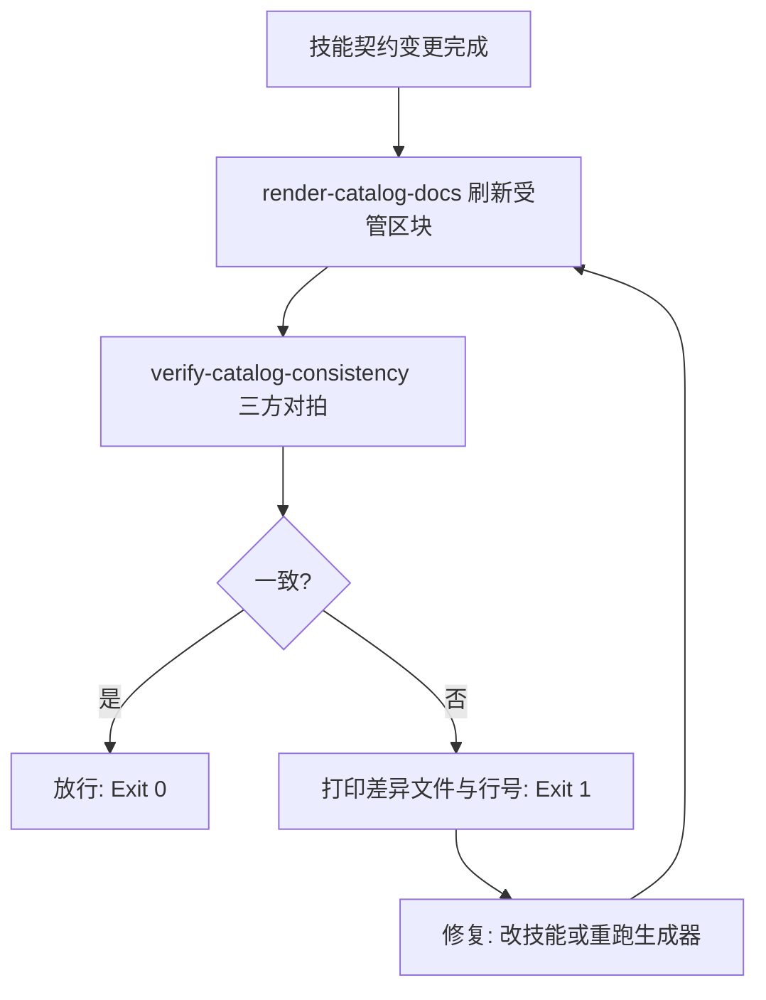

# Catalog Consistency Guard (口径一致性门禁)

## Overview

Catalog Consistency Guard 负责让「文档说的」和「技能声明的」永远是同一件事。
它把生成器与探针串成一条闭环：先生成，再对拍，不一致就阻断，绝不带着漂移继续往前走。

## When to Use

- 任何技能新增、修改、删除之后；
- 技能池的任何写入类交付之前（与 `atomic-fission-guard` 并列的前置门禁）；
- 发现「文档与技能描述不符」类问题时。

**触发禁区**：只读问答不触发；本门禁不做业务判断，只做口径一致判断。

## Workflow



1. `[probe:exitcode]` 运行 `render-catalog-docs`，退出码 0 方可继续；
2. `[probe:exitcode]` 运行 `verify-catalog-consistency`，退出码 0 即放行；
3. `[probe:regex]` 断言阻断输出中每条 issue 均带 `file` 与 `line` 字段，杜绝「只说不一致但不指位置」；
4. `[probe:regex]` 出现 C4（正文手写漂移）时必须删除手写表或改由受管区块承载，而不是逐行改对。

## Usage & Script

```bash
# 一键门禁
python3 skills/render-catalog-docs/scripts/render_docs.py
python3 skills/verify-catalog-consistency/scripts/verify_consistency.py

# 或经 CLI
./bin/skill-pool consistency
```

## Success Contract

- Exit Code 0：受管区块已刷新且四方一致；
- Exit Code 1：受管区块无法生成，或对拍发现任一不一致。

## Boundaries & Constraints

- 门禁不修改技能契约内容，只改受管区块；
- 不允许以「文档只是描述」为由放宽 C4 检查 —— 口径漂移正是由此产生的。

## Forbidden

- 禁止绕过本门禁直接提交技能契约变更。
