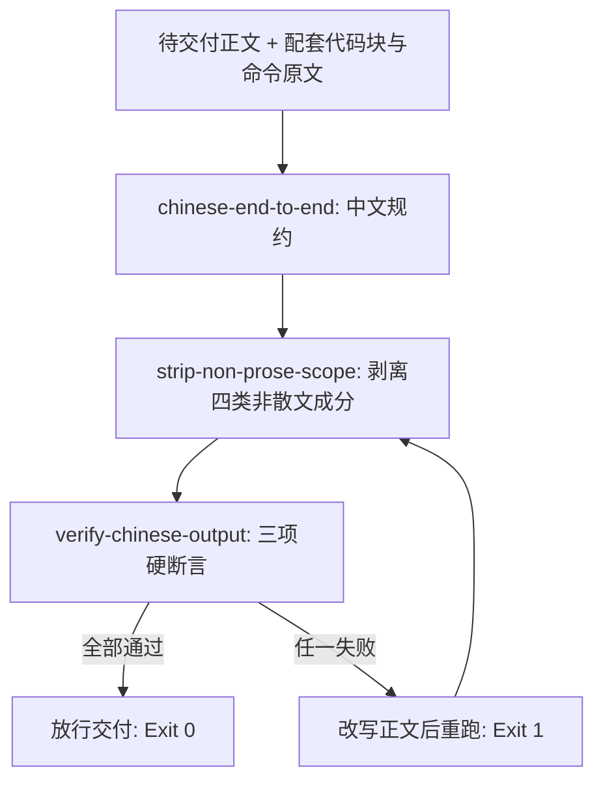

# Chinese End To End (全流程中文输出规约)

## Overview

本技能是 L1 原子级基础规约，对应需求 `REQ-BUTLER-ZHFLOW-019`（全流程中文输出）。
它规定一条不可让渡的语言纪律：凡面向用户的机器产物，**散文部分一律使用中文**。

本规约的覆盖范围（缺一不可）：

| 产物形态 | 中文要求 | 说明 |
| :--- | :--- | :--- |
| 回复正文 | 必须中文 | 结论、方案、清单、说明逐句中文 |
| 进度播报 | 必须中文 | 里程碑与计数说明使用中文 |
| 报错信息 | 必须中文 | 面向用户的失败原因、处置建议使用中文 |
| 解释说明 | 必须中文 | 原理、权衡、取舍的文字表达使用中文 |
| 脚本注释 | 必须中文 | 文档字符串、行内注释一律中文 |

**设计前提（实测结论，必须作为判据基础）**：本仓库技术文档的中文占比只有 25%~40%（`product.md` 约 40.1%、`workflows.md` 约 25.4%），
拉丁字母几乎全是**路径、命令、JSON 键与技能 id**。因此「纯中文」判定**必须先剥离非散文成分再断言**，
按整体字符占比一刀切，会把任何一份合格的技术交付都判成违规。

由此确立两条互补规则：

1. **技术标识符保留原文**：路径、命令、代码、技能 id、JSON 键一律照抄，禁止硬译；
2. **保留即须释义**：标识符**首次出现必须紧跟中文释义**，英文缩写**首次出现必须给出中文全称**。

## When to Use

- 任何面向用户的交付出口：最终回复、过程播报、报错文案、脚本注释与说明文档；
- 编写新技能契约（`SKILL.md` / `README.md`）与新脚本时，作为语言基线；
- 用户反馈「中英混杂」「看不懂这串英文是什么意思」时，作为改写依据。

**触发禁区**：代码块与命令原文不在此规约约束内——` ``` ` 围栏内的源码、shell 命令、JSON 载荷、报错原文一律豁免，禁止翻译、禁止改写。

## Workflow



1. `[probe:file]` 确认待交付正文及其配套脚本文件真实存在，脚本注释同样计入本规约覆盖范围；
2. `[probe:regex]` 用汉字区间 `[\u4e00-\u9fff]` 与中文标点正则自检正文，出现成句英文即判违规；
3. `[probe:regex]` 用「路径、命令、JSON 键、技能 id」识别技术标识符，允许原文保留，但要求其后紧跟中文释义；
4. `[probe:regex]` 用「≥2 连续大写字母」正则识别英文缩写，首次出现必须给出中文全称，例如模型上下文协议（MCP）；
5. `[probe:exitcode]` 交由 `verify-chinese-output` 断言，退出码 0 才可交付；非 0 必须改写正文后重跑，禁止带违规交付。

## Usage & Script

本技能为纯规约技能，自身不带脚本；判定由下游 L2 脚本物理承载，命令真实可跑：

```bash
# 1. 剥离非散文成分，得到「待检正文」与白名单命中
python3 skills/strip-non-prose-scope/scripts/strip_scope.py \
  --text "模型上下文协议（MCP）用于连接外部工具，详细用法见 docs/operations/workflows.md。" --json

# 2. 三项硬断言：中文占比 ≥ 0.85、非白名单拉丁词 = 0、缩写首现必须有中文全称
python3 skills/verify-chinese-output/scripts/verify_chinese.py \
  --text "模型上下文协议（MCP）用于连接外部工具，详细用法见 docs/operations/workflows.md。" --json

# 3. 对真实交付文档整篇判定（代码块与命令原文自动豁免）
python3 skills/verify-chinese-output/scripts/verify_chinese.py \
  --file docs/operations/workflows.md --json
```

## Success Contract

本规约为原子规约，无自有退出码；判定结论由下游脚本承载，退出码语义固定为：

| 码 | 含义 | 判定方 |
| :--- | :--- | :--- |
| 0 | 待检正文中文占比达标、非白名单拉丁词为 0、缩写均有中文释义 | `verify-chinese-output` |
| 1 | 存在违规（成句英文、非白名单拉丁词、缩写无中文全称） | `verify-chinese-output` |
| 2 | 输入缺失或文件不存在不可读 | `verify-chinese-output` |

## Boundaries & Constraints

- **豁免面**：` ``` ` 围栏代码块、行内反引号内容、URL、文件路径四类非散文成分不参与占比判定；
- **禁止硬译**：标识符与命令保留原文，禁止把 `docs/operations/workflows.md` 译成中文路径；
- **禁止堆砌**：不得使用「机器翻译腔」凑中文占比（如把 `CLI` 写成「命令行界面工具程序」再反复重复）；
- **零宽容**：白名单之外的拉丁词零容忍，本规约不提供任何宽限档位；
- **可复算**：同一输入必须得到同一判定结论，不引入随机数与时间戳。
