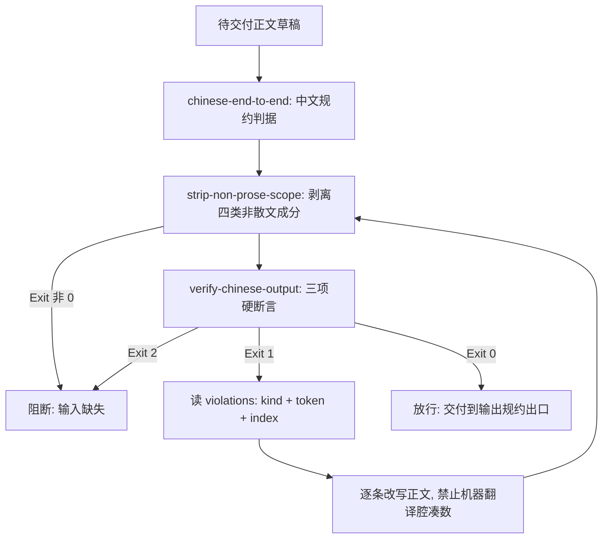

# Chinese Output Guard (全流程中文输出门禁)

## Overview

Chinese Output Guard 是「全流程中文输出」的**唯一交付出口门禁**，挂载于管家**「④ 输出规约」集群**
（与 `standard-output-framework`、`milestone-progress-reporter`、`concise-chinese-bold-guard`、
`schema-guard`、`iconized-output-showcase`、`tail-metrics-showcase` 同集群）。

它把三块能力积木按依赖顺序串成一条可阻断的流水线：

| 环节 | 组成技能 | 级别 | 职责 |
| :--- | :--- | :--- | :--- |
| ① 规约 | `chinese-end-to-end` | L1 | 定纪律：散文一律中文，标识符保留原文但首现必须紧跟中文释义 |
| ② 剥离 | `strip-non-prose-scope` | L2 | 按固定顺序剥离代码块、行内代码、URL、文件路径，产出待检正文 |
| ③ 断言 | `verify-chinese-output` | L2 | 三项硬断言：CJK 占比 ≥ 0.85、非白名单拉丁词 = 0、缩写必须有中文释义 |

两条不可让渡的红线：

- **代码块与命令原文豁免**：` ``` ` 围栏内的源码、shell 命令、JSON 载荷一律不得翻译、不得改写，
  也不参与占比判定；
- **白名单外拉丁词零容忍**：断言 2 是严格档，没有宽容参数，不存在「少量英文可接受」的口子。

**设计前提（实测）**：本仓库技术文档的中文占比只有 25%~40%，拉丁字母几乎全是
**路径、命令、JSON 键与技能 id**。所以门禁的判据只能是**剥离后的待检正文占比**，
按整体字符占比一刀切会让任何一份合格的技术交付都违规。

第三条纪律：**不得用机器翻译腔凑中文占比**。把 `CLI` 硬译成「命令行界面工具程序」并反复堆砌，
或用「的的的」式冗词把分母灌水，属于规避门禁，按违规处理——缩写该给的是**中文全称**（如命令行界面（CLI）），
不是把标识符本身译掉。

## When to Use

- 管家「④ 输出规约」出口前的强制门禁：任何面向用户的回复、播报、报错与说明交付前必须过；
- 编写或大改技能契约（`SKILL.md` / `README.md`）后，检查是否夹带未释义的英文；
- 收到「夹英文看不懂」「中英混杂」反馈时，用门禁定位到具体违规 token 与位置。

**触发禁区**：纯代码交付、纯命令行片段、纯 JSON 载荷不经过本门禁——它们整体属于豁免面；
本门禁只判语言形态，不评价结论对错、不评价篇幅长短。

## Workflow



1. `[probe:file]` 确认待交付正文草稿与其配套脚本、命令原文已分离存放，代码块原文进入豁免面；
2. `[probe:exitcode]` 以 `chinese-end-to-end` 的规约判据调用 `strip-non-prose-scope` 剥离非散文成分，退出码非 0 即阻断；
3. `[probe:exitcode]` 调用 `verify-chinese-output` 三项断言，退出码 0 才继续，退出码 1 即阻断，退出码 2 按输入缺失处理；
4. `[probe:regex]` 逐条读取 `violations` 的 `kind` 与 `token`，按 `latin_word` / `cjk_ratio` / `abbr_no_gloss` 三类分别改写；
5. `[probe:length]` 断言改写后非白名单拉丁词为 0 个，且每个独立大写缩写的首现都带中文全称；
6. `[probe:exitcode]` 重跑门禁直至 Exit 0，才允许把正文交付到「④ 输出规约」出口，禁止带违规交付。

## Usage & Script

本技能为纯编排技能，不自带脚本；三个环节的脚本均已就位，命令真实可跑：

```bash
# 环节②：剥离非散文成分，查看有多少成分被豁免
python3 skills/strip-non-prose-scope/scripts/strip_scope.py \
  --file docs/operations/workflows.md --json

# 环节③：三项硬断言（门禁判定点，退出码即放行结论）
python3 skills/verify-chinese-output/scripts/verify_chinese.py \
  --file docs/operations/workflows.md --json

# 端到端一次判定：退出码 0 放行 / 1 阻断 / 2 输入缺失
python3 skills/verify-chinese-output/scripts/verify_chinese.py \
  --file docs/operations/workflows.md --json && echo "门禁放行"
```

## Success Contract

| 码 | 含义 | 门禁动作 |
| :--- | :--- | :--- |
| 0 | 三项断言全部通过 | 放行交付 |
| 1 | 存在违规（占比不达标 / 非白名单拉丁词 / 缩写无中文释义） | 阻断，按 `violations` 改写后重跑 |
| 2 | 输入缺失、文件不存在不可读，或剥离器不可用 | 阻断，先补齐输入 |

判定产物为 `verify-chinese-output` 的五字段 JSON：`success` / `cjk_ratio` / `scope_len` / `violations` / `checks`。

## Boundaries & Constraints

- **只阻断不代写**：门禁不自动改写正文，改写必须显式执行并重跑，禁止静默放行；
- **豁免面不可滥用**：把该写成散文的内容塞进代码块来规避占比，属于违规规避，一经发现即判拒不通过；
- **禁止凑数**：不得用机器翻译腔、重复冗词或硬译标识符提升中文占比；
- **判定权唯一**：占比与白名单口径只在 `verify-chinese-output` 定义，本门禁不另写一套词表；
- **零第三方依赖**：全链路纯 Python 3 标准库，无随机数与时间戳，同一输入产出同一放行结论。
