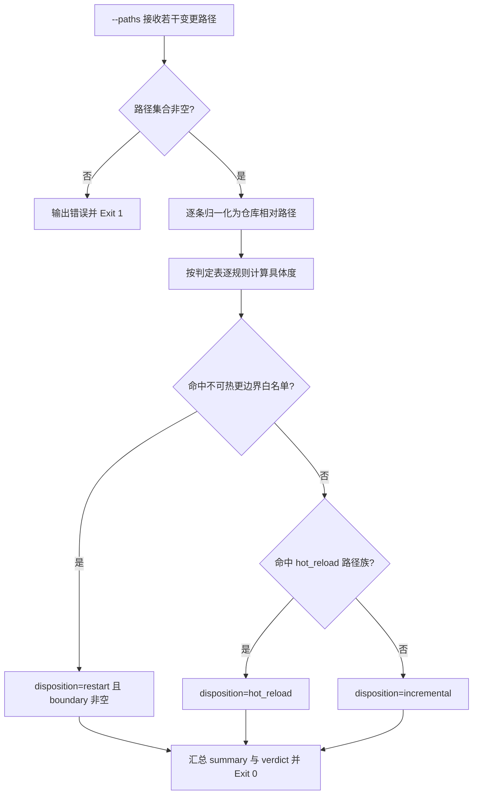

# Classify Change Scope (变更范围处置判定器)

## Overview

Classify Change Scope 是 `prefer-hot-reload-policy` 规约的物理执行层：
把 L1 的三级处置定义与判定表落成**纯字符串驱动、可复算**的判定函数，
供写入门禁与重启证据断言直接调用。

它只做一件事——给每条变更路径贴上 `disposition` / `reason` / `boundary` 三个标签，并汇总一条总判定。
它不执行任何重建命令，也不修改任何文件。

**判定起点是「不需要重启」**：只有命中「不可热更边界」白名单的路径才被判为 `restart`，
且该条判定必须带非空 `boundary`（命中的白名单模式）；其余路径一律 `hot_reload` 或 `incremental`。

## When to Use

- 写入门禁准备判断「这批改动要不要重启宿主或刷新产物」时；
- 复核某个 `restart` 声明「凭什么它算不可热更」时；
- 为 `verify-no-unnecessary-restart` 提供逐路径的处置判据时。

**触发禁区**：纯只读查询且没有任何路径改动时不判定；本技能只判路径归属，不判断改动内容是否正确，也不代为执行重建命令。

## Workflow



1. `[probe:file]` 断言 `--paths` 集合非空：过滤空白项后为空即输出错误并退 1，路径本身不存在的条目照样保留参与判定；
2. `[probe:regex]` 逐条归一化路径（统一分隔符、折叠 `//`、剥离仓库根前缀与 `./`），再按判定表计算每条规则命中的具体度；
3. `[probe:length]` 取具体度最大者（同分取表内靠前者，即先长后短）；命中的 `restart` 规则必须写出非空 `boundary` 白名单模式；
4. `[probe:regex]` 白名单未命中时依次判 `docs/operations/*.json`、`skills/**`、`docs/**`、`bin/skill-pool` 为 `hot_reload`；
5. `[probe:exitcode]` 全部规则皆未命中时判为 `incremental`，并汇总 `summary` 三计数与 `verdict`，退 0。

## Usage & Script

```bash
# 一次判定四条仓库内路径：应全部 hot_reload，verdict = no_restart_needed
python3 skills/classify-change-scope/scripts/classify_scope.py \
  --paths skills/dsh-butler/SKILL.md docs/requirements/index.md \
          docs/operations/skill-catalog.json bin/skill-pool --json

# 宿主应用 bundle：必须判为 restart 且带 boundary
python3 skills/classify-change-scope/scripts/classify_scope.py \
  --paths "/Applications/DSH Desktop.app/Contents/Resources/app/package.json" --json

# Web 产物与打包产物同理
python3 skills/classify-change-scope/scripts/classify_scope.py --paths apps/web/src/main.ts dist/main.bundle.js --json

# 未识别路径：保守判为 incremental
python3 skills/classify-change-scope/scripts/classify_scope.py --paths some/unknown/file.txt --json

# 不存在的路径同样给出判定（不报错）
python3 skills/classify-change-scope/scripts/classify_scope.py --paths skills/not-created-yet/SKILL.md --json

# 缺参：--paths 为空 → Exit 1
python3 skills/classify-change-scope/scripts/classify_scope.py --paths

# 人类可读紧凑输出（disposition<TAB>path<TAB>reason + verdict 行）
python3 skills/classify-change-scope/scripts/classify_scope.py --paths bin/skill-pool
```

## Success Contract

- Exit Code 0：每条路径都得到唯一处置，结果由 stdout 的 JSON 承载（`decisions` / `summary` / `verdict`）；
- Exit Code 1：`--paths` 缺失或过滤后为空，无路径可判定。

JSON 契约：`{"success":true,"decisions":[{"path","disposition","reason","boundary"}],"summary":{"hot_reload":n,"incremental":n,"restart":n},"verdict":"no_restart_needed|restart_required"}`；
任一 `restart` 条目的 `boundary` 必须非空。

## Boundaries & Constraints

- **确定性**：判定只依赖固定判定表与路径字符串，禁止随机数、时间戳、网络与模型主观判断；
- **不改动任何文件**：本技能只读路径字符串，不创建、不修改、不删除，也不代为执行重建命令；
- **路径不存在不报错**：判定不依赖文件存在性，避免时序差异制造不确定结论；
- **判定表唯一**：扩展或修改规则必须同步回写 `prefer-hot-reload-policy` 的判定表，禁止出现第二份口径；
- **restart 必须可举证**：凡输出 `restart` 必须带非空 `boundary`，禁止无边界重启。
