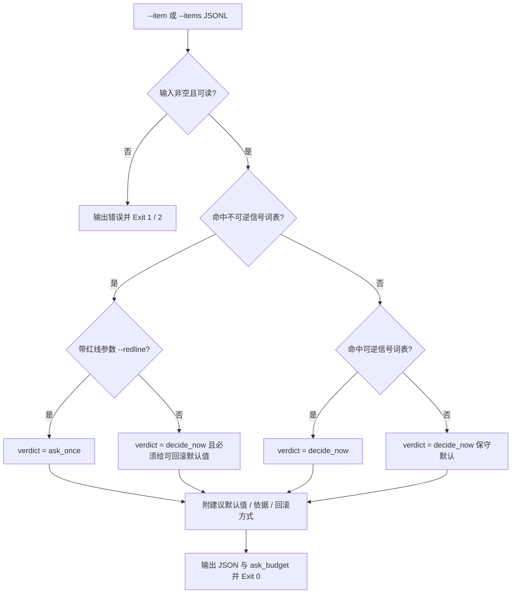

# Classify Decision Reversibility (决策可逆性判定器)

## Overview

Classify Decision Reversibility 是 `one-shot-resolution-policy` 规约的物理执行层：
把 L1 的判定优先级落成**纯词表驱动、可复算**的判定函数，供留痕层与门禁层直接调用。
它只做一件事——给每个不确定项贴上 `reversible` 与 `verdict` 两个标签，并附上建议默认值，绝不自行执行任何变更。

**红线唯一真相源**：本技能不复制红线清单。红线编号 R1~R5 的定义源是 `skills/fastlane-redline-policy/SKILL.md`，
调用方通过 `--redline` 把编号作为**输入参数**传入，本脚本只做「有/无红线」的布尔判定。

## When to Use

- 任务推进中出现两可选项，需要判定「该自行决断还是允许问一次」时；
- 为 `record-assumptions` 生成待留痕清单时；
- 为 `verify-no-unnecessary-question` 准备提问合法性证据时；
- 复核某个提问「凭什么它被允许」时。

**触发禁区**：本技能只做判定不执行变更、也不真正发起提问；只读问答与一步可完成的交互不进入判定。

## Workflow



1. [probe:file] 断言输入来源存在：`--item` 去空白后非空，`--items` 指向真实存在的可读 JSONL 文件；
2. [probe:regex] 用不可逆信号词表匹配项描述（删除 / 清空 / 覆盖 / 发布 / 部署 / 推送 / 上线 / 卸载 / 安装 / 格式化 / 迁移 / `rm -rf` / `drop` / 需求变更 / 基线）；
3. [probe:regex] 未命中不可逆信号时，用可逆信号词表匹配（命名 / 注释 / 文档 / 说明 / 格式 / 排序 / 重命名 / 草稿 / 文案 / 阈值 / 默认值）；
4. [probe:exitcode] 按固定优先级落签：不可逆 + 红线 → `ask_once`；不可逆无红线 / 仅可逆 / 均未命中 → 三种情形一律 `decide_now`；
5. [probe:length] 断言输出每条决策必含 `item` / `redline` / `reversible` / `verdict` / `reason` / `default_choice` / `rollback` 字段，且 `ask_budget.allowed == 1`。

## Usage & Script

```bash
# 单条判定
python3 skills/classify-decision-reversibility/scripts/classify_decision.py \
  --item "阈值取 0.85 还是 0.9" --json

# 多条判定：--redline 紧跟在它所修饰的 --item 之后（交错配对，不错位）
python3 skills/classify-decision-reversibility/scripts/classify_decision.py \
  --item "阈值取 0.85 还是 0.9" \
  --item "命名风格用 kebab-case 还是 snake_case" \
  --item "输出文件放 docs/operations 还是 docs/requirements" \
  --item "删除旧的日志目录" --redline R1 \
  --item "推送到远端" --redline R2 \
  --json

# JSONL 批量输入（每行 {"item": "...", "redline": "R1"|null}）
printf '{"item":"删除旧的日志目录","redline":"R1"}\n{"item":"阈值取 0.85 还是 0.9","redline":null}\n' > /tmp/items.jsonl
python3 skills/classify-decision-reversibility/scripts/classify_decision.py --items /tmp/items.jsonl --json

# 非 JSON 紧凑输出（verdict<TAB>redline<TAB>item<TAB>reason）
python3 skills/classify-decision-reversibility/scripts/classify_decision.py --item "注释措辞" 
```

红线编号取值必须来自 `fastlane-redline-policy` 的 R1~R5，本脚本不校验编号合法性，只判定「有没有」。

## Success Contract

- Exit Code 0：判定完成，结果由 stdout 的 JSON 承载（`decisions` + `summary` + `ask_budget`）；
- Exit Code 1：未提供任何 `--item` / `--items`，或参数不合法（`--item` 缺配对值、出现未知参数）；
- Exit Code 2：`--items` 指向的文件不存在或不可读。

## Boundaries & Constraints

- **确定性**：判定只依赖两份信号词表与固定优先级，禁止随机数、时间戳、外部网络与模型主观判断；
- **只判定不执行**：本技能绝不写入、删除、推送任何东西，`default_choice` 只是建议文本；
- **红线不复制**：红线清单唯一真相源是 `fastlane-redline-policy`，本技能只接收编号参数；
- **不可逆优先**：同一项同时命中可逆与不可逆信号时，按不可逆信号判定，并在 `reason` 中标注；
- **ask_once 必须批量**：本技能最多给出 1 次提问预算，若产出多个 `ask_once`，调用方必须把它们合并成一次提问。
