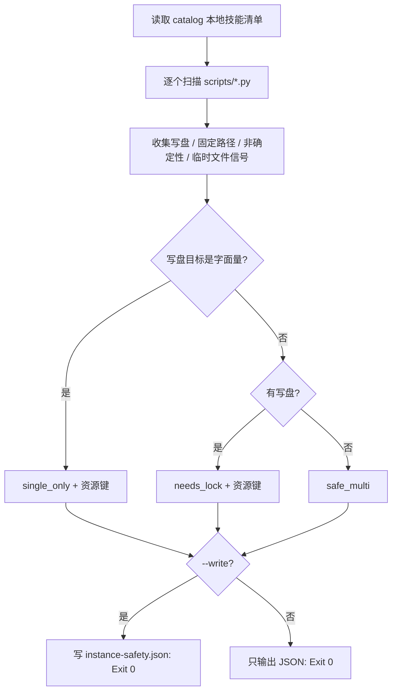

# Classify Instance Safety (实例安全分档)

## Overview

本技能是 L2 工序动作级工具，把 `instance-pool-policy` 的三档判定落成一次**可复算的静态扫描**。
它读的是脚本源码，不是文档声明——所以声明无法自欺。

## When to Use

- 新增或修改任何执行层脚本之后；
- 管家准备并行派发之前的准入判定；
- 刷新 `docs/operations/instance-safety.json` 声明表时。

**触发禁区**：本技能只做静态判定，不执行也不并发运行被扫描的脚本。

## Workflow



1. `[probe:file]` 读取 `docs/operations/skill-catalog.json` 取本地技能清单（`scope=local-pool`）；
2. `[probe:regex]` 逐脚本匹配四类信号：写盘 API、字面量固定路径、非确定性调用、固定临时文件；
3. `[probe:exitcode]` 按三档规则给出 `instance_safety`，并从写盘路径提取 `resource_keys`；
4. `[probe:file]` `--write` 时写 `docs/operations/instance-safety.json`（键排序、无时间戳、幂等）；
5. `[probe:length]` 断言 `needs_lock` / `single_only` 的 `resource_keys` 非空，为空即记入 `issues`。

## Usage & Script

```bash
python3 skills/classify-instance-safety/scripts/classify_instance_safety.py --all --json
python3 skills/classify-instance-safety/scripts/classify_instance_safety.py --all --write
python3 skills/classify-instance-safety/scripts/classify_instance_safety.py --skill build-layer-graph --json
```

## Success Contract

- Exit Code 0：扫描完成（`issues` 可为空或非空，判定结果仍有效）；
- Exit Code 1：`--skill` 指定的技能不存在；
- Exit Code 2：`--all` 与 `--skill` 均未给出，或 catalog 不可读；
- 确定性：同一份代码两次扫描结果完全一致。

## Boundaries & Constraints

- 判定基于静态正则，**不做数据流分析**：写盘路径若由拼接产生，会被保守判为 `needs_lock`；
- 非确定性信号只记录不降档（见 `instance-pool-policy` 第 4 条）。
