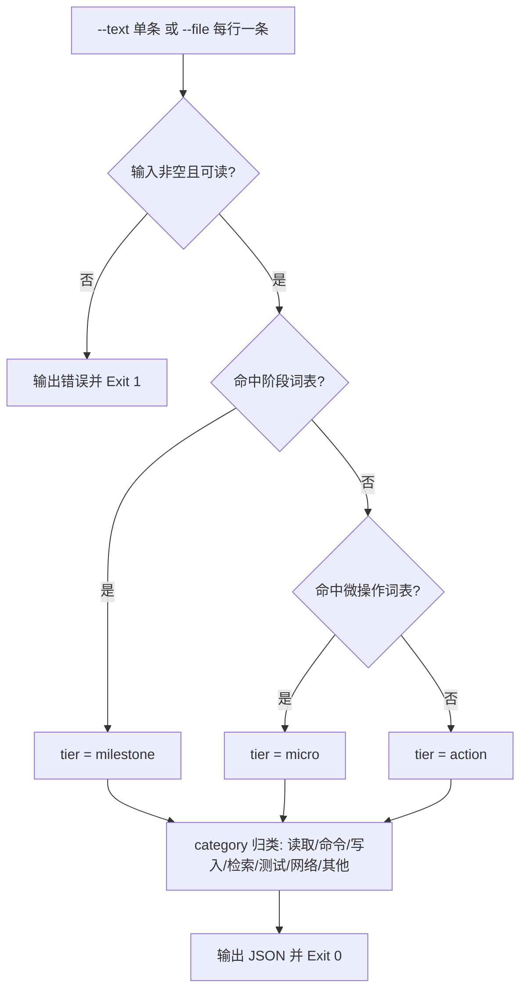

# Classify Step Tier (过程事件三档分档器)

## Overview

Classify Step Tier 是 `milestone-only-progress` 规约的物理执行层：
把 L1 的三档定义落成**纯词表驱动、可复算**的分类函数，供折叠器与预算断言直接调用。
它只做一件事——给每条事件贴上 `tier` 与 `category` 两个标签，不做任何改写、不删除任何事件。

## When to Use

- 需要把一段过程输出（每行一条事件）判定出里程碑、动作、微操作时；
- 为 `fold-repeated-events` 提供逐条分档结果时；
- 复核某条过程播报「凭什么它算里程碑」时。

**触发禁区**：纯只读问答与一步即可完成的交互不分档；本技能不判断任务价值，只做粒度归属。

## Workflow



1. `[probe:file]` 断言输入来源存在：`--text` 去空白后非空，`--file` 指向真实存在的可读文件；
2. `[probe:regex]` 命中阶段词表（完成 / 到达 / 通过 / 落库 / 交付 / 合并 / 发布 / 验收 / 全量 / 里程碑 / 阶段目标 / 结束 / 就绪）即返回 `tier=milestone`，不再往下判；
3. `[probe:regex]` 否则命中微操作词表（读取文件 / 打开 / 关闭 / 写入一行 / 执行命令 / 调用脚本 / 点击 / 滚动 / 复制 / 粘贴 / 切换窗口 / 重试一次 / 重试 / 格式化 / 编译单文件 / 单条测试 / 查看 / 列出 / 打印 / 上车 / 下车 / 进站 / 出站 / 驶入 / 驶出 / 开门 / 关门 / 拾取 / 拿起 / 放下 / 按下）即返回 `tier=micro`；
4. `[probe:exitcode]` 两表皆未命中时返回 `tier=action`，并输出 `category` 归类（读取 / 命令 / 写入 / 检索 / 测试 / 网络 / 其他）；
5. `[probe:length]` 断言输出 JSON 必含 `tier` / `category` / `matched` / `reason` / `text` 五个字段，缺字段即判定契约破损。

## Usage & Script

```bash
# 标杆样例：逐条断言三档口径（micro / micro / milestone / action / milestone）
python3 skills/classify-step-tier/scripts/classify_tier.py --text "上车" --json
python3 skills/classify-step-tier/scripts/classify_tier.py --text "下车" --json
python3 skills/classify-step-tier/scripts/classify_tier.py --text "已到达长沙" --json
python3 skills/classify-step-tier/scripts/classify_tier.py --text "在长沙加了一次油" --json
python3 skills/classify-step-tier/scripts/classify_tier.py --text "已完成全部装卸" --json

# 三档各测一条：milestone / action / micro
python3 skills/classify-step-tier/scripts/classify_tier.py --text "已在目标目录落库完成" --json
python3 skills/classify-step-tier/scripts/classify_tier.py --text "解析需求清单并归类为三条主干" --json
python3 skills/classify-step-tier/scripts/classify_tier.py --text "读取文件每一行后写入一行" --json

# 文件模式：每行一条事件，纯文本或 JSON {"text": "..."} 均可
printf '到达武汉\n打开编辑器\n整理对话结构\n' > /tmp/events.txt
python3 skills/classify-step-tier/scripts/classify_tier.py --file /tmp/events.txt --json

# 与折叠器共用同一份 jsonl 口径
printf '{"text": "已交付产物"}\n{"text": "点击保存按钮"}\n' > /tmp/events.jsonl
python3 skills/classify-step-tier/scripts/classify_tier.py --file /tmp/events.jsonl --json

# 非 JSON 紧凑输出（tier<TAB>category<TAB>原文）
python3 skills/classify-step-tier/scripts/classify_tier.py --file /tmp/events.txt
```

## Success Contract

- Exit Code 0：判定完成，结果由 stdout 的 JSON 承载（单条为扁平对象，多条为 `{"count","results"}`）；
- Exit Code 1：输入为空、`--file` 指向的文件不存在或不可读、未提供 `--text` / `--file`。

## Boundaries & Constraints

- **确定性**：判定只依赖两份词表与固定优先级，禁止随机数、时间戳、外部网络与模型主观判断；
- **只贴标签不改写**：本技能绝不删除、合并或改写事件原文，`text` 字段必须与输入逐字一致；
- **优先级不可换序**：milestone 优先于 micro，micro 优先于 action，先命中先返回；
- 词表是唯一判据来源，扩展档位必须同步更新 `milestone-only-progress` 的三档定义。
