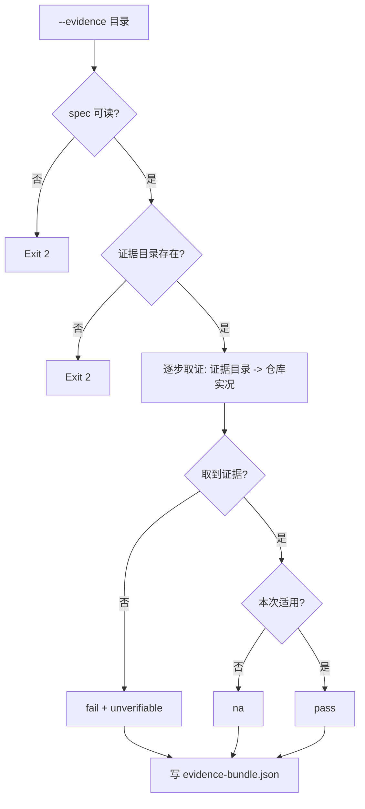

# Collect Process Evidence (流程合规取证器)

## Overview

本技能把「这次任务到底做了什么」变成一份**可复核的证据包**。它只取证，不打分、不整改。

**铁律：没有证据不等于走了这一步。** 取不到证据一律记 `fail` + `unverifiable`，
绝不因为「看起来应该做了」而给 `pass`。主上下文里「我记得我做了」不是证据。

## When to Use

- 交付前需要把本次任务的流程证据固定下来时；
- 需要一份可交给独立复核者（不共享上下文）的证据包时。

**触发禁区**：不执行任何门禁脚本、不打分、不写仓库文件（只写证据目录内的证据包）。

## Workflow



1. `[probe:file]` 加载 `process-spec.json`，缺失即输出 `spec_unreadable` 并退 2；
2. `[probe:file]` 断言 `--evidence` 目录存在，缺失即退 2（**无证据目录无从取证**）；
3. `[probe:file]` S1/S2 走仓库实况：需求索引是否含非空基线、规则指纹索引是否存在；
4. `[probe:file]` S3 先查 `evidence/problem-log-query.txt`，再查 `docs/problem-log/` 是否非空；
5. `[probe:regex]` S4 解析 `lane.json` 并断言四字段齐备（`lane`/`score`/`matched_redlines`/`reason`）；
6. `[probe:length]` S5 断言加载技能数 ≤ top-K，超限即记 fail（并给出实际条数）；
7. `[probe:exitcode]` S6/S9 读门禁结果文件：退 0 记 pass、非 0 记 fail；**无写入变更时记 na**；
8. `[probe:file]` S7 比对台账文件 mtime 与变更集合起点，台账未同步即记 fail；
9. `[probe:regex]` S8 断言提交备注非空、长度 ≥12 且不是占位词（更新/修改/临时提交）；
10. `[probe:file]` 写出 `evidence-bundle.json`（含每步 status/detail/evidence/rectify），退 0。

## Usage & Script

```bash
python3 skills/collect-process-evidence/scripts/collect_evidence.py --evidence <证据目录> --json
```

## Success Contract

| 退出码 | 含义 |
| :--- | :--- |
| 0 | 取证完成（步骤里允许有 fail） |
| 2 | 输入不可读（spec 缺失、证据目录不存在） |

## Boundaries & Constraints

- **只取证**：不打分、不整改、不改仓库；
- **无证据 = fail**：一律带 `unverifiable`，禁止默认 pass；
- **`na` 有明确条件**：只在无写入变更等明确不适用时给出；
- **确定性**：同输入同证据同输出。
