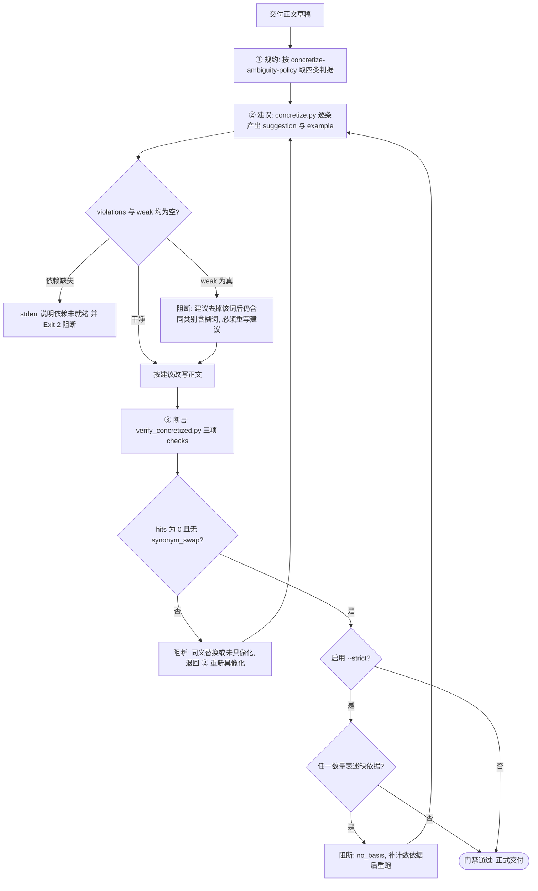

# Concretization Guard (含糊词具像化交付门禁)

## Overview

Concretization Guard 是「含糊其辞必须具像化」（`REQ-BUTLER-CONCRETIZE-024`）的复合流程门禁，
把三层原子能力串成一条**不可跳步**的流水线：

| 环节 | 承接技能 | 产物 |
| :--- | :--- | :--- |
| ① 规约 | `concretize-ambiguity-policy`（L1 元规约） | 三类含糊 + `hedge` 缓解词的具像化方式与硬规则 |
| ② 具像化建议 | `concretize-term`（L2） | 逐条 `term / category / suggestion / example / weak` |
| ③ 断言 | `verify-concretized-output`（L2） | `hits == 0`、`no_basis`、`synonym_swap` 三项 checks |

**挂载位置**：管家「④ 输出规约」集群。凡交付正文进入输出规约阶段，都必须过这道门禁。

两条硬约束：

- **`weak: true` 的建议一律不合格**：建议去掉该词后仍含同类别含糊词，等于用同义词糊过去；
- **同义替换一律不合格**：`verify-concretized-output` 报出 `synonym_swap` 即阻断，不接受「语义相近」辩解。

### 与 `quantification-guard` 的分工

两道门禁是「修饰词不得含糊」的两条腿，**互不替代、互为补充**：

| 门禁 | 管什么 | 补什么 | 唯一真相源 |
| :--- | :--- | :--- | :--- |
| `quantification-guard` | 程度词（高 / 大 / 快 / 多 / 好 / 严重 / 频繁…） | 补**数值**：场景 + 数值或区间 + 单位 + 依据 | `build-quantifier-table` 的 `quantifier-table.json` |
| `concretization-guard` | 含糊词（若干 / 相关 / 尽快 / 适当…） | 补**实体与判据**：确切数量 + 计数依据、实体清单、触发条件 + 时限 | `detect-vague-modifier` 的 `AMBIGUITY_WORDS` |

一句话：**程度词给数，含糊词给物与条件**。同一段正文可同时命中两道门禁，需分别过。

## When to Use

- 交付正文进入「④ 输出规约」阶段，需要判定「含糊词是否已具像化到位」时；
- 收到「说得太虚」「没法验收」「改了半天还是那几个词」反馈，需要定位到具体环节（规约 / 建议 / 断言）时；
- 需要向用户或上游证明「本次交付已过含糊词门禁」并给出可复算证据时。

**触发禁区**：一行命令、代码原文、纯数值报表、以及整段不含含糊词的正文不需要本门禁——没有命中就没有待具像化项，本门禁不为交付「加戏」。

## Workflow



1. `[probe:file]` 确认三层承接技能与词表唯一真相源 `skills/detect-vague-modifier/scripts/detect_vague.py` 齐备，任一缺失即 `exit 2` 阻断并写明依赖未就绪；
2. `[probe:exitcode]` 跑 `concretize-term` 的 `concretize.py`，得到逐条 `suggestion` 与 `example`，退出码非 0 即阻断；
3. `[probe:regex]` 逐条断言建议的 `weak` 字段为假：`weak: true` 表示建议去掉该词后仍含同类别含糊词，判不合格并退回重写建议；
4. `[probe:exitcode]` 按建议改写正文后跑 `verify-concretized-output` 的 `verify_concretized.py`，断言 `no_unconcretized` 与 `no_synonym_swap` 两项 checks 同时 `pass`；
5. `[probe:exitcode]` 启用 `--strict` 时追加断言 `quantity_basis` 的 `pass`，任一数量表述缺依据即按 `no_basis` 阻断并退回补依据；
6. `[probe:length]` 汇总三轮证据（`suggestions` / `counts` / `violations` / `checks`）均非空且断言全过，方可判定门禁通过。

## Usage & Script

本技能无自有脚本，串联调用下游三层：

```bash
# ① 规约：读 concretize-ambiguity-policy 的四类判据（无 CLI，判据入口见该技能 SKILL.md）

# ② 建议：逐条拿到具像化模板，检查 weak:true 的建议一律不合格
python3 skills/concretize-term/scripts/concretize.py --file <交付稿> --json

# ③ 断言：三项 checks 全过才放行（严格模式额外要求数量带依据）
python3 skills/verify-concretized-output/scripts/verify_concretized.py \
  --file <改写后的交付稿> --strict --json

# 门禁串联：②③ 任一环退出码非 0，即视为本次交付未过门禁
```

门禁放行判定表：

| 环节 | 放行条件 | 阻断动作 |
| :--- | :--- | :--- |
| ② 建议 | Exit 0 且无任何 `weak: true` | 重写该条建议，禁止直接采用 |
| ③ 断言 | Exit 0（`hits` 为空、无 `synonym_swap`） | 退回 ② 重新具像化 |
| ③ 严格断言 | 追加 `quantity_basis` pass | 补计数依据后整链重跑 |

## Success Contract

本技能自身不含脚本，退出码语义由下游两层承载，门禁口径如下：

| 码 | 含义 |
| :--- | :--- |
| 0 | 门禁通过：`concretize-term` 无 `weak` 建议，`verify-concretized-output` 三项断言全过 |
| 1 | 门禁阻断：存在 `weak: true` 建议，或断言报出 `unconcretized` / `no_basis` / `synonym_swap` |
| 2 | 依赖未就绪（`detect-vague-modifier` 缺失）或输入缺失 |

门禁证据串固定为四段：`suggestions`（建议）、`counts`（四类命中数）、`violations`（违规明细）、
`checks`（三项断言）。四段任一缺失或为空，即视为证据不成立，不得放行。

## Boundaries & Constraints

- 本门禁只判定与阻断，**不代替执行层改写正文**；
- **`weak: true` 一律不合格**：不得以「意思差不多」为由放行同义词替换；
- **同义替换零容忍**：`synonym_swap` 命中即阻断，不接受语义相近辩解；
- **词表归口**：含糊词清单只在 `detect-vague-modifier`，本门禁与下游都不得另写一份；
- **不越界**：程度词的数值化归 `quantification-guard` 一线，两道门禁各自独立放行，互不代签；
- **依赖缺失不兜底**：`detect-vague-modifier` 未就绪时以 `exit 2` 阻断，绝不用临时词表蒙混过关。
