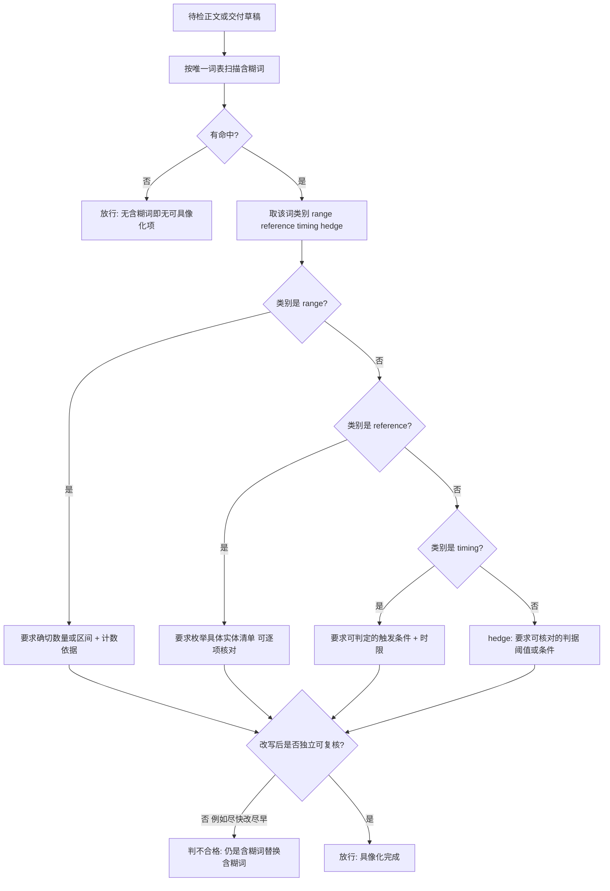

# Concretize Ambiguity Policy (含糊词具像化判定基元)

## Overview

**核心立场**：含糊词不是修辞，而是**未落地的判定条件**。「若干问题」「相关文件」「尽快处理」
这类表述在机器与验收人眼里都没有真值条件——多少个算若干、哪些算相关、多久算尽快，
无法判定，也就无法验收。

**唯一纪律**：凡出现含糊词，必须把它换成一个**可核对的对象**，而不是换一个更好听的词。

| 类别 | 典型词 | 具像化方式 | 合格样例 |
| :--- | :--- | :--- | :--- |
| 范围含糊 | 若干 / 一些 / 部分 / 多个 / 等等 | 给出确切数量或区间 **+ 计数依据** | 12 个（依据：本次扫描命中 12 处） |
| 指代含糊 | 相关 / 相应 / 等 / 其它 / 之类 | 枚举出**具体实体清单**（可核对） | a.py、b.py、c.py |
| 时序含糊 | 尽快 / 必要时 / 适时 / 及时 | 给出**可判定的触发条件 + 时限** | 在下一个门禁运行前（≤10 分钟） |
| 缓解词（hedge） | 适当 / 尽量 / 酌情 / 差不多 | 给出**可核对的判据**（阈值或条件），该词必须被取代 | 把上限从 5 提到 8（依据：当前 90% 请求落在 5 以内） |

四类共用一条判据：**改写后能否被别人独立复核**。复核不了，就等于没改。

### 硬规则：禁止用另一个含糊词替换含糊词

「尽快」→「尽早」、「若干」→「一些」、「相关」→「相应」、「适当」→「酌情」
**全部不合格**：替换前后的可判定性完全相同，等于用同义词糊过去，比不改更差。

唯一合法的替换方向只有三条，分别对应三类含糊：

- 范围含糊 → **引入确切数量 + 计数依据**；
- 指代含糊 → **引入具体实体清单**；
- 时序含糊 → **引入触发条件 + 时限**。

`hedge` 类缓解词（适当 / 尽量 / 酌情 / 差不多）的特殊性在于：它修饰的往往是一个动作的力度，
没有天然的实体对象可列。因此其具像化方式固定为**给出可核对的判据**——
把「适当加大」写成「把上限从 5 提到 8，依据：当前 90% 请求落在 5 以内」，
即用**具体阈值或条件**取代该缓解词，而不是用另一个缓解词（「酌情加大」「尽量提高」）接替它。

### 依据优先原则

数量与时限都必须带 `依据`：数字从哪里数出来的、时限依据哪个周期定的。
**没有依据的数字只是把模糊换成了一个更具体的猜测**，问题从「无法判定」变成「错误且无法追溯」。
判据的物理登记与统计由具像化环节现场产出一句话即可，但不得留空。

本规约只出判据，不检测、不建议、不断言：检测与词表归口 `detect-vague-modifier`，
具像化建议交 `concretize-term`，断言交 `verify-concretized-output`，门禁交 `concretization-guard`。

## When to Use

- 交付正文、需求条目或门禁清单里出现「若干 / 相关 / 尽快 / 适当」一类词，需要判定其是否合格时；
- 复审一次改写「到底算不算具像化」时（例如「尽快」被改成了「尽早」）；
- 收到「说得太虚」「没法验收」反馈，需要定位到具体含糊词与其应有替换方向时；
- 编写或评审具像化建议模板，需要确认模板本身没有再引入同类别含糊词时。

**触发禁区**：纯数值报表、命令与代码原文、以及已经给出确切数量与依据、已枚举实体、已写出触发条件与时限的正文不经过本规约——它们本就没有待具像化的含糊词。

## Workflow



1. `[probe:file]` 确认词表唯一真相源 `skills/detect-vague-modifier/scripts/detect_vague.py` 存在，本规约不另写第二份词表；
2. `[probe:regex]` 用该模块的模块级常量 `AMBIGUITY_WORDS` 对待检正文逐条扫描，逐条记 term 与位置；
3. `[probe:exitcode]` 逐条调用该模块的 `classify_word(term)` 取类别，类别只可能是 `range` / `reference` / `timing` / `hedge` 四者之一；
4. `[probe:regex]` 按类别核验替换方向：`range` 要求同时出现确切数量与「依据」，`reference` 要求出现可逐项核对的实体清单，`timing` 要求同时出现触发条件与时限；
5. `[probe:length]` 断言替换后的文本去掉原词后不再含同类别其它含糊词，仍含即判「含糊词替换含糊词」不合格；
6. `[probe:exitcode]` `hedge` 词只接受被具体阈值或条件取代，仍保留缓解词（含换成另一个缓解词）一律判不合格。

## Usage & Script

本技能为纯规约，无独立脚本；判据的物理执行由下游四个探针承载：

```bash
# 检测：命中含糊词与类别（词表唯一真相源）
python3 skills/detect-vague-modifier/scripts/detect_vague.py --text '请尽快处理相关问题' --json

# 具像化建议：按类别给出替换模板与占位示例
python3 skills/concretize-term/scripts/concretize.py --text '请尽快处理相关问题' --json

# 断言：无未具像化含糊词、无同义替换、数量带依据
python3 skills/verify-concretized-output/scripts/verify_concretized.py \
  --text '本次扫描命中 12 处（依据：全仓 12 个脚本静态扫描结果）' --strict --json

# 门禁：规约 → 建议 → 断言 串联放行（链路见 concretization-guard 的 SKILL.md）
python3 skills/concretize-term/scripts/concretize.py --file <交付稿> --json
python3 skills/verify-concretized-output/scripts/verify_concretized.py --file <改写稿> --strict --json
```

## Success Contract

本规约自身不含脚本，退出码语义由执行代理脚本承载：

| 退出码 | 含义 |
| :--- | :--- |
| 0 | 正文不含含糊词，或每个含糊词都已按类别具像化（数量带依据 / 实体已枚举 / 时序带触发条件与时限 / hedge 已被阈值取代） |
| 1 | 存在未具像化的含糊词，或出现「含糊词替换含糊词」 |
| 2 | 输入缺失、文件不可读，或词表唯一真相源 `detect-vague-modifier` 未就绪 |

判定产物以 `concretize-term` 与 `verify-concretized-output` 的三段式 JSON 为准：
`suggestions` / `counts` 为建议侧，`hits` / `violations` / `checks` 为断言侧。

## Boundaries & Constraints

- 本规约只出判据，**不检测、不建议、不断言、不写文件**；
- **词表归口**：含糊词清单的物理载体只有 `skills/detect-vague-modifier/scripts/detect_vague.py`
  的模块级常量 `AMBIGUITY_WORDS`，本规约与任何下游技能都不得再维护第二份词表；
- **禁止含糊词替换含糊词**：「尽快」→「尽早」、「若干」→「一些」、「适当」→「酌情」一律判不合格；
- **禁止无依据具像化**：数量与时限必须带可追溯的计数依据或周期依据，不得留空；
- **禁止越界**：程度类修饰词（高 / 大 / 快 / 多）的数值化属 `quantify-modifier-policy` 管辖，
  本规约只负责含糊词的实体与判据具像化。
