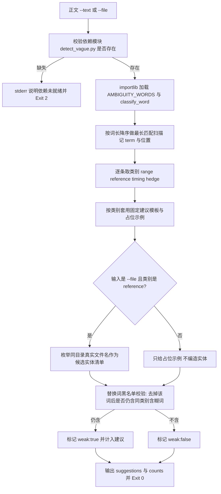

# Concretize Term (含糊词具像化建议器)

## Overview

本技能是「含糊其辞必须具像化」（`REQ-BUTLER-CONCRETIZE-024`）流水线的**建议环节**：
把 `concretize-ambiguity-policy` 的四类判据落成**逐词可执行的替换模板**。

| 输入 | 输出 |
| :--- | :--- |
| 含含糊词的正文 / 文件 | 逐条 `term / category / line / snippet / suggestion / example / weak` |

四类建议模板（固定口径，不随词变化）：

| `category` | 建议方向 | 占位示例 |
| :--- | :--- | :--- |
| `range` | 补确切数量 + 计数依据 | `若干 → 12 个（依据：本次扫描命中 12 处）` |
| `reference` | 枚举具体实体清单（可逐项核对） | `相关 → SKILL.md、README.md、concretize.py（依据：同目录实际存在的文件名）` |
| `timing` | 给出可判定的触发条件 + 时限 | `尽快 → 在下一个门禁运行前（≤10 分钟）` |
| `hedge` | 给出可核对的判据：该词必须被具体阈值或条件取代 | `适当 → 把上限从 5 提到 8，依据：当前 90% 请求落在 5 以内` |

两条硬纪律：

1. **词表唯一真相源**：含糊词清单与分类只从
   `skills/detect-vague-modifier/scripts/detect_vague.py` 的模块级常量 `AMBIGUITY_WORDS`
   与函数 `classify_word(w)` 取得；本脚本**不内置任何兜底词表**，依赖缺失即 `exit 2`；
2. **替换词黑名单校验**：若一条建议（含示例）去掉触发它的那个词之后，仍含**同类别**的其它含糊词
   ——唯一真相源词表内命中，或等长且同位仅差一字的**换字变体**（「尽快」→「尽早」）——
   该条建议即标 `"weak": true`。这正是「含糊词替换含糊词」的机器判据。

`reference` 类在 `--file` 模式下会自动枚举**同目录下真实存在的文件名**作为候选实体来源；
`--text` 模式没有目录上下文，只给占位示例，不编造实体。

## When to Use

- 交付正文或需求条目里命中含糊词，需要逐条给出可落地的替换模板与示例时；
- 人工改写前先要一份「改成什么才算合格」的对照清单时；
- 复审改写结果，需要机器判定「这段建议是不是只是换了个含糊词」时（看 `weak`）。

**触发禁区**：正文不含含糊词、或属于代码与命令原文时，本技能不产出任何建议——没有命中就没有待具像化项，不得凭空造词。

## Workflow



1. `[probe:file]` 断言词表唯一真相源 `skills/detect-vague-modifier/scripts/detect_vague.py` 存在，缺失即向 stderr 写明依赖未就绪并 `exit 2`；
2. `[probe:exitcode]` 用 `importlib.util.spec_from_file_location` 加载该模块，取其模块级常量 `AMBIGUITY_WORDS` 与函数 `classify_word`，加载或取属性失败同样 `exit 2`；
3. `[probe:regex]` 按词长降序对正文做最长匹配扫描，命中区间做占用标记，避免「等等」被拆成两个「等」；
4. `[probe:exitcode]` 逐条调用 `classify_word(term)` 取类别，只接受 `range` / `reference` / `timing` / `hedge` 四个标签，分类不是这四者时记入 `counts.unknown` 而不丢弃；
5. `[probe:file]` `--file` 模式下枚举该文件同目录下真实存在的文件名（排序、限 5 个）作为 `reference` 类的候选实体清单，`--text` 模式不编造实体；
6. `[probe:regex]` 对每条建议执行替换词黑名单校验：把该词从 `suggestion + example` 中移除后仍命中同类别其它含糊词（词表内词，或等长同位仅差一字的换字变体），即标 `"weak": true`。

## Usage & Script

```bash
# 直接给文本（无目录上下文，reference 类只给占位示例）
python3 skills/concretize-term/scripts/concretize.py --text '请尽快处理相关问题' --json

# 给文件（reference 类自动枚举同目录真实文件名）
python3 skills/concretize-term/scripts/concretize.py --file docs/requirements/index.md --json

# 人类可读输出（省略 --json）
python3 skills/concretize-term/scripts/concretize.py --file docs/requirements/index.md
```

脚本固定 `importlib` 加载依赖，不做路径猜测、不读环境变量、不提供替代词表：

```python
spec = importlib.util.spec_from_file_location("detect_vague", DEP_MODULE)
module = importlib.util.module_from_spec(spec)
spec.loader.exec_module(module)
words, classify = module.AMBIGUITY_WORDS, module.classify_word
```

输出示例（片段）：

```json
{
  "success": true,
  "suggestions": [
    {"term": "尽快", "category": "timing", "line": 1, "snippet": "请尽快处理",
     "suggestion": "给出可判定的触发条件 + 时限：把「尽快」换成「在什么事件之后、多久之内」",
     "example": "尽快 → 在下一个门禁运行前（≤10 分钟）", "weak": false}
  ],
  "counts": {"range": 0, "reference": 0, "timing": 1, "hedge": 0}
}
```

## Success Contract

输出 JSON 字段：

| 字段 | 类型 | 含义 |
| :--- | :--- | :--- |
| `success` | 布尔 | 是否完成全量扫描（命中数为 0 时同样为 `true`） |
| `suggestions[]` | 数组 | 逐条建议：`term` / `category` / `line` / `snippet` / `suggestion` / `example` |
| `suggestions[].weak` | 布尔 | 建议去掉该词后仍含同类别含糊词则为 `true`（同义替换嫌疑） |
| `counts` | 对象 | 四类命中数 `range` / `reference` / `timing` / `hedge`；出现四类之外的分类时追加 `unknown` |
| `source` | 字符串 | 输入来源：`text` 或文件路径 |

退出码：

| 码 | 含义 |
| :--- | :--- |
| 0 | 处理完成（含命中数为 0） |
| 1 | 输入缺失：未给 `--text` / `--file`，或文件不可读 / 为空 |
| 2 | 依赖模块 `detect-vague-modifier` 未就绪（文件缺失或无法加载），stderr 写明原因 |

## Boundaries & Constraints

- **禁止内置兜底词表**：依赖缺失一律 `exit 2`，绝不用任何本地词表顶替，
  也不得在仓库内复制第二份含糊词清单；
- **禁止编造实体**：`reference` 类只在能真实枚举时给出实体清单（同目录真实文件名），
  其余情况只给占位示例；
- **禁止含糊词替换含糊词**：建议模板本身不得含同类别其它含糊词（含等长同位仅差一字的换字变体），命中即标 `weak: true`；
- **只读**：不修改被检查的文件，不写任何索引与产物文件，加载依赖时不写 `.pyc`（`sys.dont_write_bytecode`）；
- **确定性**：无随机数、无系统时间、无网络，同一输入连跑两次产出同一 JSON；
- **不越界**：程度类修饰词（高 / 大 / 快 / 多）的数值化不在本技能范围内，交 `quantify-modifier` 一线。
