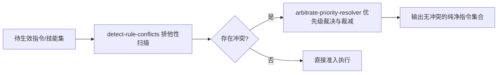

# Conflict Detector (冲突检测与仲裁自愈)

## Overview

Conflict Detector 负责在管家组合多种 Skill 或执行复杂任务前，进行规则合规对拍。发现排他矛盾时立刻自动仲裁，防止大模型陷入逻辑死锁。

## Workflow

```mermaid
flowchart LR
    Rules[待生效指令/技能集] --> Detect[detect-rule-conflicts 排他性扫描]
    Detect --> HasConf{存在冲突?}
    HasConf -->|是| Arbitrate[arbitrate-priority-resolver 优先级裁决与裁减]
    Arbitrate --> Solved[输出无冲突的纯净指令集合]
    HasConf -->|否| Direct[直接准入执行]
```

## Boundaries

- 专注于指令约束层面的冲突裁决，不干涉外部真实业务数据的逻辑矛盾。
