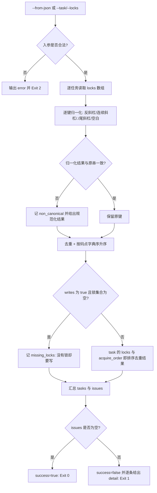

# Declare Lock Set (锁集合声明与归一化器)

## Overview

本技能是 `parallel-lock-policy` 的物理执行层：把 L1 的「粒度 = 共享资源键」与「加锁顺序 = 字典序固定顺序」
落成一个**纯字符串驱动、可复算**的声明器——给定一组并行任务，产出每个任务的规范锁集合与取锁顺序。

它只做三件事：
1. **归一化**：把锁键统一成同一种写法（反斜杠统一、折叠连续斜杠、剥离 `./` 段、剥离尾部斜杠、剥除首尾空白）；
2. **去重 + 字典序排序**：输出 `locks` 与 `acquire_order`（两者同为排序去重后的集合，顺序即加锁顺序）；
3. **报两类静态错误**：`missing_locks`（锁集合为空却 `writes:true`）与 `non_canonical`（锁键不是归一化路径，并给出规范化结果）。

它不检测冲突、不建等待图、不判超时——那三件事归 `detect-lock-conflict`。

## When to Use

- 并行任务开跑前，需要把「我锁哪些资源」写成机器可比对的规范键集合时；
- 复核某份并行方案「锁键写法是否一致」（`skills/a//b.md` 与 `skills/a/b.md` 必须归一为同一键）时；
- 为 `detect-lock-conflict` 与 `verify-no-lock-violation` 提供已归一化的输入时。

**触发禁区**：只读、无写入、无端口/实例争用的任务不声明锁；本技能不做冲突检测、不改写任何文件、不排实际调度。

## Input Contract (并行任务输入格式)

JSONL，每行一个并行任务（`--from-json`）：

```json
{"task":"pkg-006-t1","locks":["skills/a/SKILL.md","docs/operations/x.json"],"depends_on":["pkg-006-t0"],"timeout_s":300,"started_at":1000,"finished_at":1060}
```

| 字段 | 本技能是否使用 | 口径 |
| :--- | :--- | :--- |
| `task` | 是（必填） | 非空字符串；缺失即输入不可读，退 2 |
| `locks` | 是 | 数组；缺失按空集合处理，非数组即退 2 |
| `writes` | 是 | 只认显式 `true`；`true` 且锁集合为空 ⇒ `missing_locks` |
| `depends_on` / `timeout_s` / `started_at` / `finished_at` | 否 | 原样透传给下游检测器 |

归一化口径（纯字符串，无随机、无系统时间依赖）：

| 序 | 规则 | 例 |
| :--- | :--- | :--- |
| 1 | 反斜杠统一为 `/` | `skills\a\b.md` → `skills/a/b.md` |
| 2 | 连续斜杠折叠 | `skills/a//b.md` → `skills/a/b.md` |
| 3 | 剥离 `.` 段与空段 | `./skills/a/b.md` → `skills/a/b.md` |
| 4 | 剥离尾部斜杠（根 `/` 除外） | `skills/a/` → `skills/a` |
| 5 | 剥除首尾空白 | `" skills/a/b.md "` → `skills/a/b.md` |

凡归一化结果与原串不一致，即记 `non_canonical`（并给出规范化结果）；全空白键归一化后为空，同样记 `non_canonical`。

## Workflow



1. `[probe:file]` 校验 `--from-json` 指向的文件存在且不是目录；`--from-json` 与 `--task` 同给、或二者皆缺，一律输出 `error` 并退 2；
2. `[probe:regex]` 逐行解析 JSONL：空行跳过，任一行非法 JSON 或非对象即退 2；`task` 非非空字符串即退 2；
3. `[probe:regex]` 断言 `locks` 为数组：缺失按空集合处理，非数组即退 2（不猜测、不静默转换）；
4. `[probe:regex]` 逐键归一化（反斜杠统一 → 折叠连续斜杠 → 剥离 `.` 段 → 剥离尾部斜杠 → 剥除空白），并断言归一化结果非空；
5. `[probe:regex]` 逐键比对原串与归一化结果：不一致即记 `non_canonical`，`detail` 必须同时含原串与规范化结果；
6. `[probe:length]` 对归一化结果去重并按码点升序排序，断言 `acquire_order` 与 `locks` 逐元素相同（字典序即加锁顺序）；
7. `[probe:regex]` 断言写任务必有锁：`writes` 显式为 `true` 且锁集合为空即记 `missing_locks`（无锁共享写是明确禁止项）；
8. `[probe:exitcode]` 汇总 `tasks` 与按 (`task`, `kind`, `detail`) 稳定排序的 `issues`：无 issue 退 0，有 issue 退 1，输入不可读退 2。

## Usage & Script

```bash
# 文件模式：归一化 + 排序 + 两类静态错误
python3 skills/declare-lock-set/scripts/declare_lock_set.py --from-json tasks.jsonl --json

# 命令行配对模式：--task 与 --locks 依次配对（--locks 逗号分隔）
python3 skills/declare-lock-set/scripts/declare_lock_set.py \
  --task pkg-006-t1 --locks "skills/a/SKILL.md,docs/operations/x.json" \
  --task pkg-006-t2 --locks "skills/b/SKILL.md" --json

# 只给 --task 不给 --locks：锁集合为空，写任务即命中 missing_locks
python3 skills/declare-lock-set/scripts/declare_lock_set.py --task pkg-006-t1 --json

# 非规范键：两条键归一化后一致，同时各自记 non_canonical
python3 skills/declare-lock-set/scripts/declare_lock_set.py \
  --task pkg-006-t1 --locks "skills/a//b.md" --task pkg-006-t2 --locks "./skills/a/b.md" --json

# 输入不可读：文件不存在 → Exit 2
python3 skills/declare-lock-set/scripts/declare_lock_set.py --from-json /tmp/not-exist.jsonl --json
```

## Success Contract

| 退出码 | 含义 |
| :--- | :--- |
| 0 | 全部任务声明成功且无 issue（`issues` 为空数组） |
| 1 | 存在 `missing_locks` 或 `non_canonical`，声明不成立 |
| 2 | 输入不可读（缺参、二者同给、文件不存在/是目录/不可读、JSONL 行非法或非对象、`task` 缺失、`locks` 非数组） |

JSON 契约：`{"success":bool,"tasks":[{"task","locks","acquire_order"}],"issues":[{"kind","task","detail"}]}`；
`kind` 取值闭集为 `missing_locks` / `non_canonical`（输入错误时另加 `input_unreadable` 并置 `error` 字段）。

## Boundaries & Constraints

- **只声明不检测**：本技能不判冲突、不建等待图、不判超时，那三件事归 `detect-lock-conflict`；
- **归一化口径唯一**：五条规则来自 `parallel-lock-policy` 的「共享资源键」定义，禁止在下游另立第二套写法口径；
- **不做文件系统访问**：锁键只是字符串，路径不存在照样得到确定结论，避免时序差异制造不确定结果；
- **确定性**：禁止随机数、禁止取系统当前时间，同输入恒得同输出（排序为码点全序）；
- **不改动任何文件**：本技能只读输入、只写 stdout。
