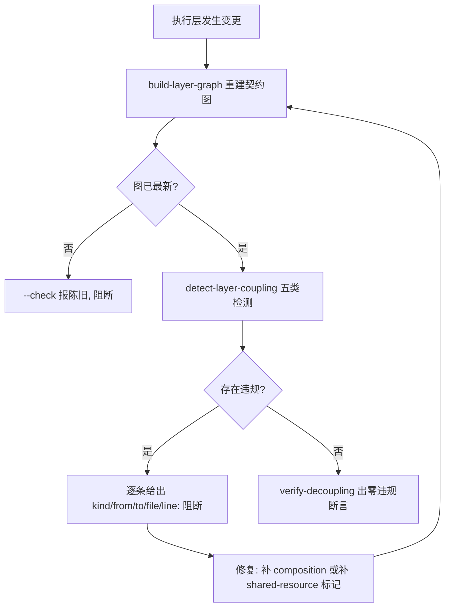

# Decoupling Guard (执行层解耦门禁)

## Overview

Decoupling Guard 是「层与层之间只通过契约说话」这条纪律的执行者。
它把建图、检测与断言串成一道写入门禁，让"偷偷 import 别人"这种耦合无法悄悄进仓库。

## When to Use

- 任何执行层技能新增、拆分、合并之后的交付前置；
- 与 `execution-tree-guard`（管层级归属）、`instance-pool-guard`（管并发准入）、`parallel-lock-guard`（管并行加锁）并列的结构门禁；
- 存量耦合分批治理时。

**触发禁区**：门禁不改技能契约内容，也不自动补 `composition`。

## Workflow



1. `[probe:exitcode]` 运行 `build-layer-graph`，退出码 0 方可继续；
2. `[probe:exitcode]` 运行 `build-layer-graph --check`，图陈旧即阻断（禁止拿旧图下结论）；
3. `[probe:exitcode]` 运行 `detect-layer-coupling`，非 0 即进入阻断分支；
4. `[probe:regex]` 断言阻断输出中每条违规均带 `kind` / `file` / `line`，杜绝「只说有耦合但不说在哪」；
5. `[probe:exitcode]` 运行 `verify-decoupling`，退出码 0 方可放行；豁免必须用 `--allow` 显式声明并在变更记录中留痕。

## Usage & Script

```bash
python3 skills/build-layer-graph/scripts/build_layer_graph.py
python3 skills/build-layer-graph/scripts/build_layer_graph.py --check
python3 skills/detect-layer-coupling/scripts/detect_coupling.py --json
python3 skills/verify-decoupling/scripts/verify_decoupling.py
```

## Success Contract

- Exit Code 0：契约图最新、五类违规为零、断言通过；
- Exit Code 1：图陈旧、存在未豁免违规、或断言失败；
- 阻断必须可定位：`kind` + `file` + `line` 三者齐备。

## Boundaries & Constraints

- **判据不放宽**：存量违规照报，不用"历史遗留"当豁免理由；
- 豁免只能按类别经 `verify-decoupling --allow` 显式声明，且必须同步登记到变更记录；
- 门禁不替代 `execution-tree-guard`：本门禁管依赖合法性，树门禁管层级归属与集群归属。
