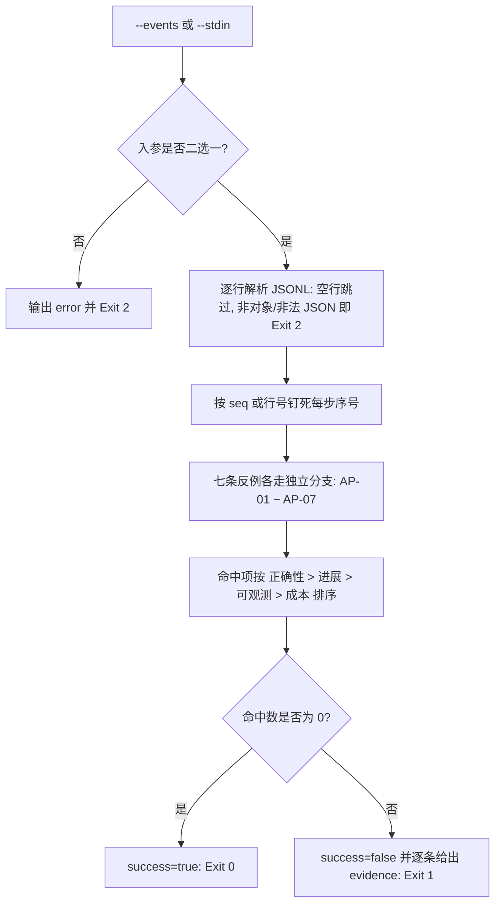

# Detect Forbidden State (反例命中检测)

## Overview

本技能是 L2 工序动作级工具，把 `anti-pattern-policy` 的七条物理判据落成一个可跑出证据的检测器：
输入事件流，输出**命中的反例编号 + 事件 seq 列表 + 人类可读证据 + 默认阈值**。

七条反例在脚本内**各有独立检测分支**（`detect_loop` / `detect_silence` / `detect_retry` / `detect_fake_done` / `detect_silent_degrade` / `detect_budget` / `detect_storm`），
因此每条都能被单独命中，且命中项永远带得走序号：这是「逐条可命中、互不误伤」的物理保障。

## When to Use

- 需要判定一段执行事件流是否已经触犯反例时；
- 需要为「零反例」主张采集可复算证据时；
- 需要在验收中逐条证明 AP-01 ~ AP-07 各自可被命中时。

**触发禁区**：本技能只检测与上报，**不中断任务、不改写事件流、不修复任何状态**；修复与放行裁决不属本技能。

## Input Contract (事件输入格式)

JSONL 文件（`--events`）或 stdin（`--stdin`），每行一个事件对象，字段全部可选：

```json
{"seq":1,"action":"read_file","state":"hash-abc","ts":1000,"silent":false,"ok":true,"claim_done":false,"probe_exit":0,"caught_error":false,"logged":true,"context_tokens":1200,"tier":"micro","text":"读取文件"}
```

确定性口径（与 `anti-pattern-policy` 逐字一致）：

| 口径 | 规则 |
| :--- | :--- |
| 时间 | `ts` 只从事件字段读取，**绝不取系统当前时间**，同输入恒得同结论 |
| 序号 | `seq` 缺失或非整数时，以 1 起算的行号代替，命中项永远带序号 |
| `probe_exit` | AP-04 中缺失视为「非 0」：没有探针证据就不得声明完成 |
| `logged` | AP-05 中缺失视为「未记录」：fail-safe，保守判违规 |
| 显式取值 | `silent` 只认显式 `true`，`ok=false` 只认显式 `false`，`tier` 只认显式 `"micro"` |

## Workflow



1. `[probe:file]` 校验 `--events` 指向的事件流文件存在且不是目录；缺参、二者同给或路径不存在立即退 2；
2. `[probe:regex]` 逐行解析 JSONL：空行跳过，任一行非法 JSON 或非 JSON 对象即输出 `error` 并退 2；
3. `[probe:regex]` 钉死每步序号：`seq` 为整数时取 `seq`，否则取 1 起算的行号，断言命中项的 `seq` 列表非空；
4. `[probe:length]` 执行 AP-01：统计连续 `(action, state)` 不变的最长运行段，长度 `>= --loop-threshold`（默认 5）即命中；
5. `[probe:length]` 执行 AP-03：统计同一 `action` + 显式 `ok=false` + `state` 未变的连续段，长度 `> --retry-threshold`（默认 3）即命中；
6. `[probe:length]` 执行 AP-02：连续 `silent=true` 步数 `> --silent-threshold`（默认 20），或相邻整数 `ts` 间隔 `> --silence-seconds`（默认 120）即命中；
7. `[probe:length]` 执行 AP-06：任一事件 `context_tokens > --token-budget`（默认 30000）即命中；
8. `[probe:regex]` 执行 AP-04：断言 `claim_done=true` 的事件其 `probe_exit` 恒为整数 0，否则命中；
9. `[probe:regex]` 执行 AP-05：断言 `caught_error=true` 的事件其 `logged` 恒为显式 `true`，否则命中；
10. `[probe:length]` 执行 AP-07：按 `tier="micro"` 的 `text` 原文分组计数，任一分组出现次数 `> --storm-threshold`（默认 3）即命中；
11. `[probe:exitcode]` 汇总 `hits` 与 `summary` 并输出 JSON：零命中退 0，有命中退 1，输入不可解析退 2。

## Usage & Script

```bash
# 文件模式：命中即给编号 + seq + 证据
python3 skills/detect-forbidden-state/scripts/detect_forbidden.py --events /tmp/events.jsonl --json

# stdin 模式
cat /tmp/events.jsonl | python3 skills/detect-forbidden-state/scripts/detect_forbidden.py --stdin --json

# 阈值覆盖：例如把死循环判据放宽到 8 次、预算收紧到 8000
python3 skills/detect-forbidden-state/scripts/detect_forbidden.py --events /tmp/events.jsonl --loop-threshold 8 --token-budget 8000 --json
```

阈值参数：`--loop-threshold 5`、`--silent-threshold 20`、`--silence-seconds 120`、`--retry-threshold 3`、`--token-budget 30000`、`--storm-threshold 3`，全部必须有非负整数，`--loop-threshold` 必须 `>= 1`。

## Success Contract

退出码表（`hits` 与 `summary` 为同步产物，见下）：

| 退出码 | 含义 |
| :--- | :--- |
| 0 | `success == true`，即 `hits` 为空数组（七条反例全部未命中） |
| 1 | 至少一条反例命中 |
| 2 | 输入缺失或不可解析 |

- Exit Code 0：`success == true`，即 `hits` 为空数组（七条反例全部未命中）；
- Exit Code 1：至少一条反例命中，`hits[].code` 落在 `AP-01` ~ `AP-07` 闭集内，且每条命中都带非空 `seq` 列表与 `evidence`；
- Exit Code 2：输入缺失或不可解析（既未给 `--events` 也未给 `--stdin`、二者同给、文件不可读、JSONL 行非法、事件非对象、阈值非法）；
- stdout 恒为合法 JSON，含 `success` / `checked_events` / `hits` / `summary` 四个字段；`--json` 为显式 JSON 模式开关（本脚本恒输出 JSON）。

## Boundaries & Constraints

- **只读检测**：绝不写入、修改或删除事件流文件，也不产生任何副作用；
- **无随机、无时间依赖**：禁止调用系统当前时间、随机数与并发调度，同一输入两次运行结论必须逐字节一致；
- **不修复、不裁决**：命中只上报，是否阻断由 `verify-no-forbidden-event` 与 `anti-pattern-guard` 决定；
- **不做加法豁免**：同一条流可同时命中多条反例（如 AP-01 与 AP-03 同段触发），全部上报，禁止只报最严重的一条；
- **不引入第二套阈值口径**：默认阈值只在 `DEFAULT_THRESHOLDS` 出现一次，仅允许 CLI 显式覆盖。
