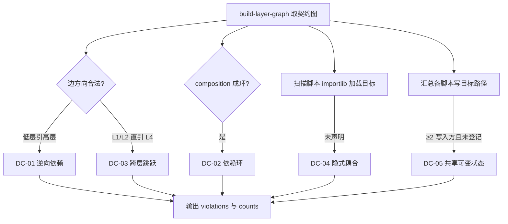

# Detect Layer Coupling (五类耦合检测)

## Overview

本技能是 L2 工序动作级检测器，把 `layer-decoupling-policy` 的五类判据落到真实文件上：
既读 Frontmatter 的契约边，也读脚本源码里的**事实边**——两者不一致的地方就是耦合。

## When to Use

- 新增或改动执行层技能之后；
- 怀疑某个脚本偷偷加载了别的技能却没说时；
- 两个技能都要写同一个产物、需要确认是否已登记共享资源时。

**触发禁区**：本技能只检测不修复；修复是补 `composition` 或补 `[shared-resource]` 标记。

## Workflow



1. `[probe:file]` 读 `<root>/docs/operations/skill-catalog.json` 与 `execution-layers.json`，缺失即退出 2；
2. `[probe:exitcode]` 调 `build-layer-graph` 建契约图，取得节点层级与 composition 边；
3. `[probe:regex]` 对每条边比对 `level(from)` 与 `level(to)`，命中 DC-01 / DC-03 并给出 SKILL.md 行号；
4. `[probe:regex]` 对 composition 有向图做环检测，命中 DC-02 并写出完整环路径；
5. `[probe:regex]` 扫描 `scripts/*.py` 中的 `skills/<V>/scripts/` 常量，凡含 importlib 加载且 `<V>` 未声明即判 DC-04；
6. `[probe:length]` 汇总写目标路径的写入方集合，`len(写入方) >= 2` 且存在未登记 `[shared-resource]` 的一方即判 DC-05。

## Usage & Script

```bash
python3 skills/detect-layer-coupling/scripts/detect_coupling.py --json
python3 skills/detect-layer-coupling/scripts/detect_coupling.py --skill build-layer-graph
python3 skills/detect-layer-coupling/scripts/detect_coupling.py --root /tmp/fakerepo   # 假仓库验证
```

## Success Contract

- Exit Code 0：五类违规计数全为 0；
- Exit Code 1：存在违规，`violations` 每条含 `kind` / `from` / `to` / `evidence` / `file` / `line`；
- Exit Code 2：catalog 或登记表缺失/不可读；
- 合规时 `counts` 为空对象，不得输出「零但字段缺失」的模糊结果。

## Boundaries & Constraints

- **判据不放宽**：改造前就存在的违规照报；豁免只能走 `verify-decoupling --allow` 显式留痕；
- 不修改任何文件；`--root` 仅用于把检测指向另一份仓库副本（测试用）。
