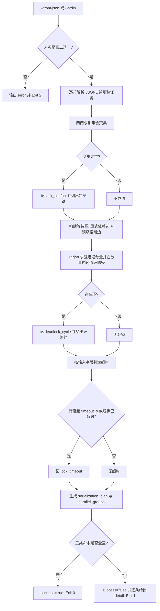

# Detect Lock Conflict (锁冲突·死锁环·超时检测器)

## Overview

本技能把 `parallel-lock-policy` 的三条口径落成一次可复算的检测：
**锁冲突**（交集非空）、**潜在死锁**（等待图成环）、**超时未释放**（跨度越界），
并额外产出两份调度结论——`serialization_plan`（必须串行的任务对）与 `parallel_groups`（可安全并行的分组建议）。

**它的存在意义是回答「这批任务凭什么可以并行」**：`parallel_groups` 非空且冲突为零，才构成可并行的物理证据；
先跑起来再补救不是并行，是事故。

等待边的两个来源（缺一不可，且都可解释）：

| 来源 | 判据 | 说明 |
| :--- | :--- | :--- |
| 显式依赖 | `X.depends_on` 含 `Y` ⇒ X 等 Y | 依赖关系本身就是等待关系 |
| 锁级推断 | X、Y 共享键、无显式依赖、且两侧都有取得时刻证据 ⇒ 后取得者等先取得者 | 先拿到的持有，另一方等待；无时间证据时**不推断**，保持保守 |

锁级推断的取得时刻逐键优先取 `lock_events`（`{"x":1000}`），缺失时回退任务级 `started_at`。
这正是识别交叉取锁（A 先拿 x 后拿 y、B 先拿 y 后拿 x）的必要输入。

## When to Use

- 并行派发之前，需要物理证明「这批任务两两无锁交集」时；
- 出现「互等」迹象（A 等 B 持有的键、B 等 A 持有的键），需要给出等待环路径时；
- 复核某任务「持锁是否超时未释放」时；
- 需要一份可直接执行的调度结论（哪些必须串行、哪些可以同组跑）时。

**触发禁区**：单任务串行执行、无 `locks` 声明的任务集不经过本技能；本技能只检测与建议，**不中断任务、不真的加锁、不改写任何文件**。

## Input Contract (并行任务输入格式)

JSONL，每行一个并行任务（`--from-json` 或 `--stdin`）：

```json
{"task":"pkg-006-t1","locks":["skills/a/SKILL.md","docs/operations/x.json"],"depends_on":["pkg-006-t0"],"timeout_s":300,"started_at":1000,"finished_at":1060}
```

| 字段 | 口径 |
| :--- | :--- |
| `task` | 必填非空字符串；缺失或非字符串即输入不可读（退 2） |
| `locks` | 数组；缺失按空集合处理，非数组即退 2；逐键归一化后去重排序再比对 |
| `depends_on` | 数组；构建等待图的显式边 |
| `timeout_s` | 整数秒；缺失或非非负整数时按**默认 300 秒**处理 |
| `started_at` / `finished_at` | 整数秒；**只从字段读，绝不取系统当前时间** |
| `lock_events` | 可选映射 `{"锁键": 取得时刻}`，用于锁级等待推断（逐键时刻优先于 `started_at`） |

超时口径：`finished_at - started_at > timeout_s` 即超时；只有 `started_at` 无 `finished_at` 时，
以**本批次逻辑终点**（全部任务时间字段的最大值）为参照点判定，不引入任何系统时间。

## Workflow



1. `[probe:file]` 校验 `--from-json` 指向的文件存在且不是目录，或 `--stdin` 可读；二者同给或皆缺即输出 `error` 并退 2；
2. `[probe:regex]` 逐行解析 JSONL：空行跳过，任一行非法 JSON 或非对象即退 2；`task` 非非空字符串即退 2；`locks` 非数组即退 2；
3. `[probe:regex]` 逐键归一化并去重排序，断言 `depends_on` 为数组且成员归一为非空字符串；
4. `[probe:length]` 两两求锁集合交集，`|交集| > 0` 即记 `lock_conflict`，`keys` 必为非空的冲突键列表；
5. `[probe:regex]` 构建等待图的显式边：`X.depends_on` 含 `Y` ⇒ 边 `X → Y`（同名任务以首条记录为准，保持确定性）；
6. `[probe:regex]` 构建等待图的锁级推断边：共享键 + 无显式依赖 + 取得时刻有序 ⇒ 边 `后取得者 → 先取得者`；无时间证据不推断；
7. `[probe:regex]` 断言等待图节点包含全部任务，随后用迭代式 Tarjan 求强连通分量，并在分量内沿邻接关系还原环路径；
8. `[probe:length]` 环路径头尾相接（`["A","B","A"]`）记 `deadlock_cycle`，环去重按最小节点旋转归一（同一环不重复上报）；
9. `[probe:length]` 按输入字段判超时：`span = finished_at - started_at > timeout_s` 记 `lock_timeout`；缺 `finished_at` 时以批次逻辑终点为参照；
10. `[probe:length]` 由冲突图着色生成 `parallel_groups`（组内两两无锁交集），由冲突对生成 `serialization_plan`（必须串行的任务对）；
11. `[probe:exitcode]` 汇总并以退出码定性：三类命中全空退 0，任一命中退 1，输入不可读退 2。

## Usage & Script

```bash
# 文件模式：三类检测 + 分组建议
python3 skills/detect-lock-conflict/scripts/detect_lock_conflict.py --from-json tasks.jsonl --json

# stdin 模式
cat tasks.jsonl | python3 skills/detect-lock-conflict/scripts/detect_lock_conflict.py --stdin --json

# 缺参（既不 --from-json 也不 --stdin），或二者同给 → Exit 2
python3 skills/detect-lock-conflict/scripts/detect_lock_conflict.py --json
```

## Output Contract (输出字段)

```json
{"success":true,"conflicts":[],"deadlock_cycles":[],"timeouts":[],
 "serialization_plan":[["pkg-006-t1","pkg-006-t2"]],
 "parallel_groups":[["pkg-006-t1","pkg-006-t3"],["pkg-006-t2"]]}
```

| 字段 | 含义 |
| :--- | :--- |
| `conflicts[]` | 锁冲突：`tasks`（冲突任务对）、`keys`（冲突键，非空）、`detail` |
| `deadlock_cycles[]` | 潜在死锁：`cycle`（头尾相接的环路径）、`tasks`（环上任务）、`detail` |
| `timeouts[]` | 超时未释放：`task`、`started_at`、`finished_at`、`timeout_s`、`span_s`、`detail` |
| `serialization_plan[]` | 必须串行的任务对 `[[taskA, taskB], ...]` |
| `parallel_groups[]` | 可安全并行的分组建议，**组内两两无锁交集** |

## Success Contract

| 退出码 | 含义 |
| :--- | :--- |
| 0 | 无冲突、无死锁、无超时（三类数组全为空），允许按 `parallel_groups` 派发 |
| 1 | `lock_conflict` / `deadlock_cycle` / `lock_timeout` 任一命中，禁止并行派发 |
| 2 | 输入不可读（缺参、二者同给、文件不存在/是目录/不可读、JSONL 行非法或非对象、`task` 缺失、`locks` 非数组） |

## Boundaries & Constraints

- **只检测不裁决**：本技能出证据与建议，放行裁决归 `verify-no-lock-violation`；
- **不真的加锁**：本技能不做任何互斥操作，也不中断、不重排正在运行的任务；
- **时间只从输入字段读**：缺 `finished_at` 时用批次逻辑终点作参照，**绝不取系统当前时间**，同输入恒得同结论；
- **无证据不推断**：缺 `started_at`/`lock_events` 时不做锁级等待推断，宁可漏报不制造假环；
- **阈值唯一**：`timeout_s` 缺省值 300 秒来自 `parallel-lock-policy`，禁止在本脚本内改动默认口径；
- **不改动任何文件**：本技能只读输入、只写 stdout。
