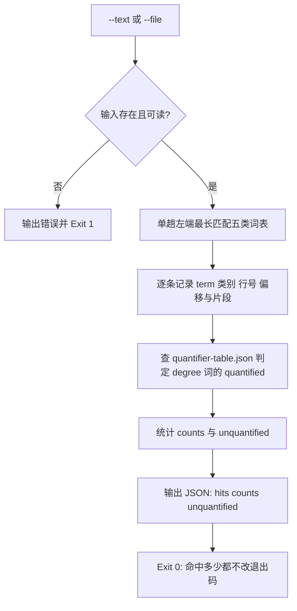

# Detect Vague Modifier (模糊词检测器)

## Overview

本技能是「修饰程度词必须量化」（`REQ-BUTLER-QUANTIFY-023`）流水线的**检测环节**，
同时是**全仓模糊词表的唯一真相源**：仓库里原有的两份 `VAGUE_TERMS` 副本
（`plan-fission` 与 `dsh-butler/fission_engine`）收敛后改为 importlib 加载本模块，
禁止再新增第三份词表。

对外暴露的模块级常量与函数（供其它脚本 importlib 复用）：

| 名称 | 类型 | 含义 |
| :--- | :--- | :--- |
| `DEGREE_WORDS` | 元组 | 程度类词表：严重、频繁、明显、显著、较多、较高、偏低、偏高、丰富、完善、稳定、高、大、快、多、好 |
| `AMBIGUITY_WORDS` | 字典 | 含糊类四分组：`hedge` / `range` / `reference` / `timing` |
| `AMBIGUITY_WORD_LIST` | 元组 | 含糊类并集（27 词，完整覆盖既有两份旧词表的并集） |
| `LEGACY_VAGUE_TERMS` | 元组 | 既有两份旧词表的并集清单，用于覆盖率对拍 |
| `classify_word(w)` | 函数 | 返回五类归属 `degree` / `hedge` / `range` / `reference` / `timing`，查不到返回 `None` |
| `scan(text, domain, table)` | 函数 | 返回 `{"hits": [...], "counts": {...}, "unquantified": n}` |

五类词（`word_class`）与对外二值类别（`category`）的映射：

| word_class | category | 词例 | 处置 |
| :--- | :--- | :--- | :--- |
| `degree` | `degree` | 高 / 大 / 快 / 多 / 好 / 严重 / 频繁 / 较多 / 偏高 | 必须量化（本需求） |
| `hedge` | `ambiguity` | 适当 / 尽量 / 尽可能 / 差不多 / 差不多就行 / 大概 / 酌情 / 友好 / 美观 / 根据情况 / 视情况 / 灵活处理 / 自行判断 | 含糊其辞，交 `REQ-BUTLER-CONCRETIZE-024` |
| `range` | `ambiguity` | 若干 / 一些 / 部分 / 多个 / 等等 | 范围含糊，给确切数量 |
| `reference` | `ambiguity` | 相关 / 相应 / 等 / 其它 / 之类 | 指代含糊，枚举实体 |
| `timing` | `ambiguity` | 尽快 / 必要时 / 适时 / 及时 | 时序含糊，给触发条件与时限 |

**匹配纪律**：全部词条按「长度降序 + 字典序」排入同一个正则，单趟左端最长匹配，因此
「差不多就行」先于「差不多」、「等等」先于「等」、「多个」先于「多」命中，同一位置不重复计数。

**`quantified` 的准确含义**（三段式判定，互不越界）：

| 判据 | 由谁回答 | 口径 |
| :--- | :--- | :--- |
| 该词在映射表里有没有场景量化值 | 本技能 `quantified` | 指定 `--domain` 时查 `(term, domain)`；未指定时任一场景命中即 `true` 并给出 `matched_domain` |
| 当前这处文本是否已经落了数值 | `verify-quantified-output` | 上下文窗口内必须有数值 + 单位 |
| 这一句能不能给出替换建议 | `quantify-modifier` | 场景未声明时不替用户挑场景，落 `unquantifiable` |

## When to Use

- 交付前需要知道正文里到底有哪些程度词与含糊词、落在第几行时；
- 需要判定某个程度词是否已有场景量化映射时；
- 需要复用全仓唯一模糊词表（禁止再复制一份常量）时；
- 上游 `concretize-*` 与 `verify-*` 技能需要词表与命中位置时。

**触发禁区**：本技能只做检测与位置定位，不做替换、不做断言、不阻断交付；纯代码块与命令原文中的字符命中同样会返回，是否豁免由调用方决定。

## Workflow



1. `[probe:file]` 断言 `--text` 与 `--file` 至少给出一个且文件存在可读，否则输出错误并 Exit 1；
2. `[probe:regex]` 用唯一词表正则单趟左端最长匹配，逐条取出 term 与其起始偏移，按长度降序保证不重复计数；
3. `[probe:length]` 以行起始偏移表把偏移换算为行号，并截取命中词左右各 12 字作为 snippet；
4. `[probe:file]` 加载 `docs/operations/quantifier-table.json`，按 `--domain` 查 `(term, domain)` 条目判定 `quantified`；
5. `[probe:length]` 汇总 `counts`（degree / ambiguity 与 hedge / range / reference / timing 细分）与 `unquantified`（未量化的程度词数）；
6. `[probe:exitcode]` 输出 JSON 后 Exit 0：命中数量不影响退出码，合格与否交给 `verify-quantified-output` 断言。

## Usage & Script

```bash
# 文本扫描（带场景：命中且有映射时 quantified=true）
python3 skills/detect-vague-modifier/scripts/detect_vague.py --text '接口响应要快' --domain 接口响应 --json

# 文件扫描（真实文档：命中多少都 Exit 0）
python3 skills/detect-vague-modifier/scripts/detect_vague.py --file skills/fold-repeated-events/SKILL.md --json

# 打印词表 JSON：逐词类别 + 五类分组 + 旧词表覆盖率
python3 skills/detect-vague-modifier/scripts/detect_vague.py --list-words

# 人类可读输出（不加 --json）
python3 skills/detect-vague-modifier/scripts/detect_vague.py --text '数据量大' --domain 单表数据量
```

复用示例（其它技能的唯一真相源入口）：

```python
import importlib.util
spec = importlib.util.spec_from_file_location(
    "detect_vague_modifier", "skills/detect-vague-modifier/scripts/detect_vague.py")
mod = importlib.util.module_from_spec(spec)
spec.loader.exec_module(mod)
mod.classify_word("大")            # -> "degree"
mod.classify_word("差不多")        # -> "hedge"
mod.scan("数据量大", domain="单表数据量")   # -> {"hits": [...], "counts": {...}, "unquantified": 0}
```

## Success Contract

JSON 载荷固定为三段式：

| 字段 | 类型 | 含义 |
| :--- | :--- | :--- |
| `success` | 布尔 | 扫描是否完成 |
| `hits` | 数组 | `[{"term","category","word_class","line","index","quantified","domain","matched_domain","snippet"}]` |
| `counts` | 对象 | `{"degree","ambiguity","hedge","range","reference","timing"}` |
| `unquantified` | 整数 | 未量化的**程度词**数量（含糊词不计入，它们由具像化管线承接） |

`index` 为命中词在全文中的字符偏移（从 0 开始），`line` 从 1 开始，`domain` 为调用方传入的场景（未传为 `null`）。

退出码：

| 码 | 含义 |
| :--- | :--- |
| 0 | 扫描完成（命中 0 处或多处均为 0），或 `--list-words` 打印词表 |
| 1 | 输入缺失（既无 `--text` 也无 `--file`），或 `--file` 指向的文件不存在/不可读 |

**退出码与命中数量无关**：检测层不判定合格，判定权在 `verify-quantified-output`。

## Boundaries & Constraints

- **唯一真相源**：全仓模糊词表只在本脚本维护，其它技能必须 importlib 复用，禁止复制常量；
- **覆盖率不下降**：`AMBIGUITY_WORDS` 必须完整包含既有两份旧词表的并集，`--list-words` 会给出 `legacy_coverage.missing` 供对拍；
- **只读不写**：不修改任何文件、不做替换、不阻断交付；
- **零子进程**：复用方以 importlib 进程内加载本模块，禁止起子进程绕过；
- **零第三方依赖**：纯 Python 3 标准库，无随机数与时间戳，同一输入产出同一结论。
