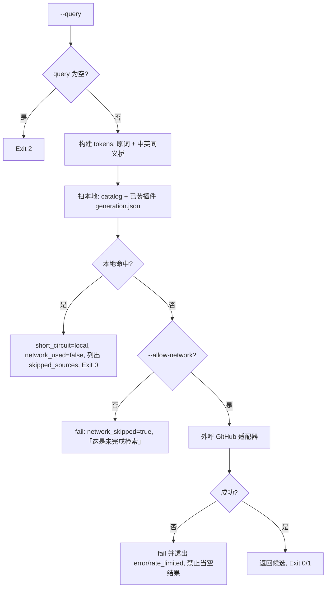

# Dispatch Skill Search (四源检索调度器)

## Overview

本技能是检索侧的**总闸**：它决定「先问谁、还要不要问别人」。
改造前，管线第一步没有物理探针；本技能把它变成一次可复算的调度。

## When to Use

- 需要找执行层，且不确定本地有没有时；
- 需要证明「这次检索没有浪费网络预算」时（本地命中即短路）。

**触发禁区**：不合并候选（交 `merge-search-candidates`）、不审计候选质量、不安装任何东西。

## Workflow



1. `[probe:regex]` 校验 `--query` 非空，空查询即退 2；
2. `[probe:regex]` 构建 tokens：**原始查询词必须保留**，再叠加中英同义桥（信息图 → `infographic`/`infographics`/`diagram`/`chart`/`visualization`）；
3. `[probe:file]` 扫本地技能池：读 `skill-catalog.json`，在 `id`/`description`/`category_title` 上做子串匹配；
4. `[probe:file]` 扫已装插件：读每个 `<generation>/generation.json` 的 `pluginName`，并读其 `package.json` 的 `description` 一并匹配；
5. `[probe:exitcode]` 本地命中即**短路**：`short_circuit=local`、`network_used=false`、`skipped_sources` 必非空（短路必须留痕）；
6. `[probe:exitcode]` 本地零命中且未给 `--allow-network` 时退 1，输出 `network_skipped=true` 与「这是未完成检索」；
7. `[probe:exitcode]` 允许外呼时以子进程调用 GitHub 适配器，**不并发**（未认证限流 10 次/分钟）；
8. `[probe:regex]` 外呼失败必须透出 `error`，禁止把失败折成「零候选成功」；
9. `[probe:length]` 断言短路时 `skipped_sources` 为三类外部源，证明真的一个都没问；
10. `[probe:exitcode]` 全流程退出码：本地命中 0 / 外呼成功 0 / 零候选 1 / 输入不可读 2。

## Usage & Script

```bash
# 本地优先（推荐默认）：命中即短路，零网络调用
python3 skills/dispatch-skill-search/scripts/dispatch_search.py --query "信息图" --json

# 本地未命中且确需外呼时才加 --allow-network
python3 skills/dispatch-skill-search/scripts/dispatch_search.py --query "<词>" --allow-network --limit 5
```

实测基线：

| 查询 | 短路 | 网络 | 命中 |
| --- | --- | --- | --- |
| 信息图 | `local` | 未使用 | `@tt-a1i/archify-dsh`、`@changfenhuang/dsh-genui` |
| 命名 | `local` | 未使用 | `audit-layer-naming`、`capability-naming-policy`、`layer-naming-guard` |
| zzz-nonexistent | 未短路 | 未允许 | 0（`success=false` +「这是未完成检索」） |

## Success Contract

| 退出码 | 含义 |
| --- | --- |
| 0 | 产出非空候选（本地短路或外呼成功） |
| 1 | 零候选（本地未命中且未允许外呼 / 外呼失败） |
| 2 | 输入不可读（缺 `--query`、catalog 不可解析） |

## Boundaries & Constraints

- **本地优先是硬规则**：命中即短路，且必须留痕 `skipped_sources`；
- **短路不是「省一步」**：它是限流预算与「不重造第二份真相」的双重约束；
- **未完成检索 ≠ 没找到**：零命中且未允许外呼必须显式失败；
- **外呼串行**：禁止并发打 GitHub（未认证 10 次/分钟）；
- **确定性**：本地扫描按名称排序，同输入恒得同顺序。
