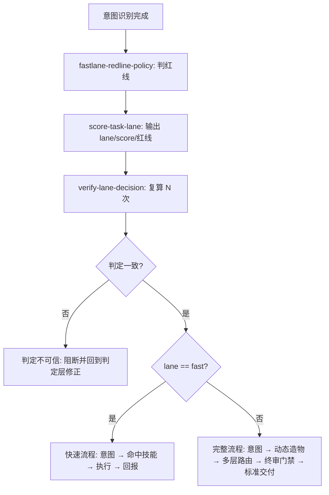

# Dual Lane Router (双流程分流总控)

## Overview

Dual Lane Router 让管家不再对所有任务一律付出全链路成本。
它在 `intent-detector` 之后、`atomic-fastpath-router` 之前介入，把任务分配到两条轨道上，并保证这个分配是可解释、可复算的。

## When to Use

- 每个任务进入执行前的必经关口；
- 需要向用户解释「为什么这件事要跑重型流程」时；
- 复审是否有人把高危任务误判进快车道时。

**触发禁区**：纯问候与确认类交互不分流；分流不改变任务内容，只决定执行链路长度。

## Workflow



1. `[probe:regex]` 用 `fastlane-redline-policy` 的四条红线与规模红线 R5 匹配任务；
2. `[probe:exitcode]` 调用 `score-task-lane` 取得 `lane` / `score` / `matched_redlines` / `reason`；
3. `[probe:exitcode]` 调用 `verify-lane-decision` 复算，退出码非 0 即判定不可信，必须修正判定层后重跑；
4. `[probe:exitcode]` 按 lane 分派：`fast` → 快速流程（≤4 步，直调，不动态造物、不派子智能体）；`full` → 完整流程（现有 5 步链路）；
5. `[probe:regex]` 断言交付说明中必含判定依据（lane + 命中红线或分值）。

## Usage & Script

```bash
# 判定（也可直接经 CLI 暴露的脚本调用）
python3 skills/score-task-lane/scripts/score_lane.py --task "读取并解释 docs/requirements/index.md"
python3 skills/verify-lane-decision/scripts/verify_lane.py --task "部署到生产环境" --repeat 10
```

## Success Contract

- Exit Code 0：判定完成、复算一致、任务已按 lane 分派；
- Exit Code 1：判定脚本不可用，或复算出现 lane 抖动（此时禁止继续执行任务）。

## Boundaries & Constraints

- **红线优先于分值**：允许快速流程的唯一前提是没有任何红线命中；
- 快车道不等于降低质量：快速流程仍须返回可核对的执行结果，只是省略动态造物与多层协商；
- 本技能不裁剪终审门禁：`full` 轨道始终包含 `qa-gatekeeper`。
