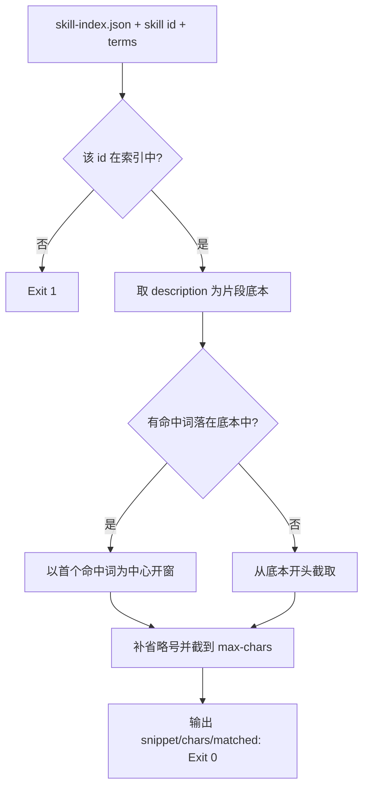

# Emit Search Snippet (检索片段生成)

## Overview

本技能是 L2 工序动作级工具，对应 Google 检索结果里的摘要行。
它是「只回灌片段」这条省 token 规则的具体执行者：每条结果给 120 字以内的命中窗口。

## When to Use

- 检索结果需要携带可读摘要时；
- 需要检查某条结果的片段是否会超长时；
- 作为库被 `google-style-skill-search-router` 导入时。

**触发禁区**：不负责排序与截断条数。

## Workflow



1. `[probe:file]` 断言 `skill-index.json` 可读且该技能 id 存在；
2. `[probe:regex]` 以 `description` 为片段底本，定位首个命中词位置；
3. `[probe:length]` 以命中词为中心开窗，两端补 `…`，并硬截断到 `--max-chars`（默认 120）；
4. `[probe:exitcode]` 输出 `snippet` / `chars` / `matched_terms` 并返回 0。

## Usage & Script

```bash
python3 skills/emit-search-snippet/scripts/emit_snippet.py --skill verify-file-exists --terms "文件,存在"
```

## Success Contract

- Exit Code 0：片段生成成功，`chars ≤ max_chars`；
- Exit Code 1：索引不可读，或技能 id 不存在；
- 确定性：同一输入重复执行，片段逐字符相同。

## Boundaries & Constraints

- 片段只能来自索引里的 `description` / `triggers` / `category_title`，不得臆造内容；
- 片段不得包含换行，保证单行可读。
