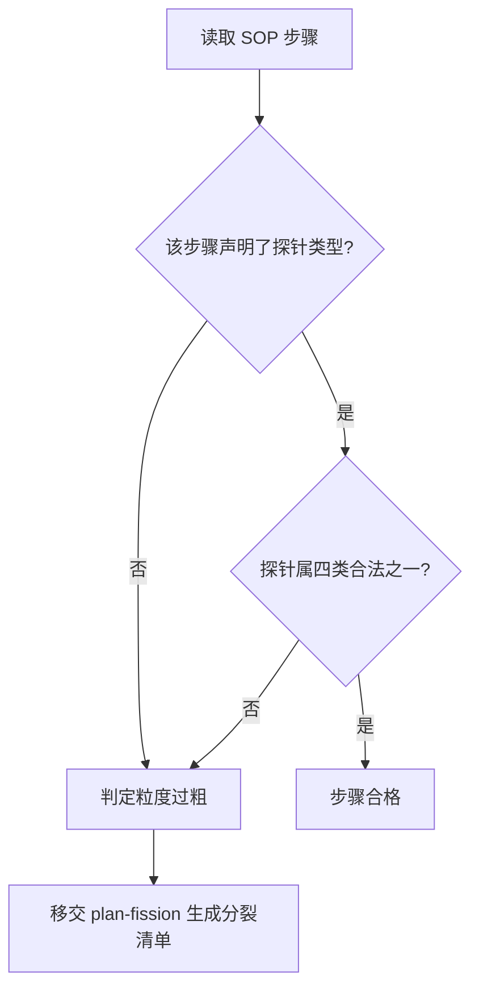

# Enforce Atomic Granularity (粒度物理化强制规约)

## Overview

本技能是 L1 原子级基础规约，是「粒度递归分裂门禁」的判定基元。
它把「这一步能不能被机器验证」这个问题，从主观感受变成一次字符串级检查：SOP 的每一步都必须显式声明它由哪一类物理探针承载。

## When to Use

- 编写、评审或修改任何 SOP、工作流、技能主体（`## Workflow`）时；
- 收到「优化管控机制」「把流程做得更确定」一类要求，需要判断现状粒度是否足够时；
- 管家在执行任何写入类任务前做粒度自查时。

**触发禁区**：纯聊天答复、纯知识问答、无执行步骤的只读解释 —— 这些没有 SOP 步骤，不适用本规约。

## Workflow

1. `[probe:regex]` 逐条读取 SOP 的有序步骤；
2. 检查步骤是否携带 `[probe:length]` / `[probe:regex]` / `[probe:exitcode]` / `[probe:file]` 四类标记之一；
3. `[probe:regex]` 未携带标记、或携带标记不在四类之内者，判定为粒度过粗；
4. `[probe:exitcode]` 输出「合格步骤 / 需分裂步骤」的判定结论，需分裂项移交 `plan-fission`。

## Strict Rules

四类合法物理探针（唯一合格判据）：

1. **length**：字符串与长度探针（截断、字数 ≤ N、首尾剥离）；
2. **regex**：正则排他探针（关键词黑名单命中、格式匹配）；
3. **exitcode**：进程退出码断言（0 通过 / 1 阻断）；
4. **file**：文件与字节物理探针（磁盘路径真实存在且大小非空）。

以下表述一律视为**未绑定探针**：适当、尽量、尽可能、根据情况、视情况、差不多、友好、美观。

## Boundaries & Constraints

- 本规约只负责**判定**粒度，不负责执行分裂；实际拆分动作由 `plan-fission` 承担，门禁由 `atomic-fission-guard` 承担；
- 不允许以「人工判断」「经验把握」作为步骤的承载方式；确需人工介入的步骤，必须改写成可核对的产物（检查清单文件、签字记录等）后再绑定 file 探针。
