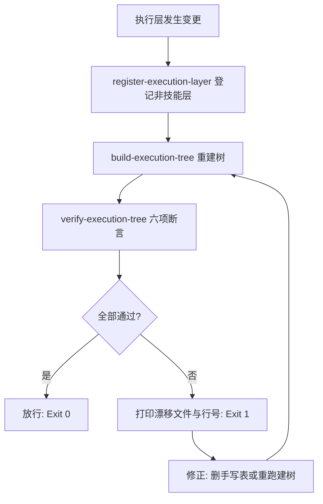

# Execution Tree Guard (执行层树门禁)

## Overview

Execution Tree Guard 是「地图必须跟着地形更新」这条纪律的执行者。
它把登记、建树与断言串成一道写入门禁，让树不可能悄悄落后于事实。

## When to Use

- 新增或修改任何执行层条目之后的交付前置；
- 与 `catalog-consistency-guard` 并列的口径门禁（一个管文档口径，一个管结构口径）；
- 定期体检时。

**触发禁区**：只读查询不经过本门禁；本门禁不改技能契约内容。

## Workflow



1. `[probe:exitcode]` 运行 `register-execution-layer --list`，退出码 0 方可继续；
2. `[probe:exitcode]` 运行 `build-execution-tree`，退出码必须为 0；
3. `[probe:exitcode]` 运行 `verify-execution-tree`，退出码 0 即放行；
4. `[probe:regex]` 断言阻断输出中每条漂移 issue 均带 `file` 与 `line`，杜绝「只说不对但不指位置」；
5. `[probe:regex]` 出现 C7（手写集群枚举）时，处置方式是**删除手写表并改由受管区块承载**，而不是逐行改对。

## Usage & Script

```bash
python3 skills/register-execution-layer/scripts/register_layer.py --list
python3 skills/build-execution-tree/scripts/build_tree.py
python3 skills/verify-execution-tree/scripts/verify_tree.py
```

## Success Contract

- Exit Code 0：登记表合法、树已重建且六项断言全过；
- Exit Code 1：任一步失败；失败必须可定位到文件与行号或对象 id。

## Boundaries & Constraints

- 门禁只改受管区块，不改技能契约与 catalog 内容；
- 不允许以「树只是展示」为由放宽 C3（孤儿原子）与 C7（手写枚举）。
