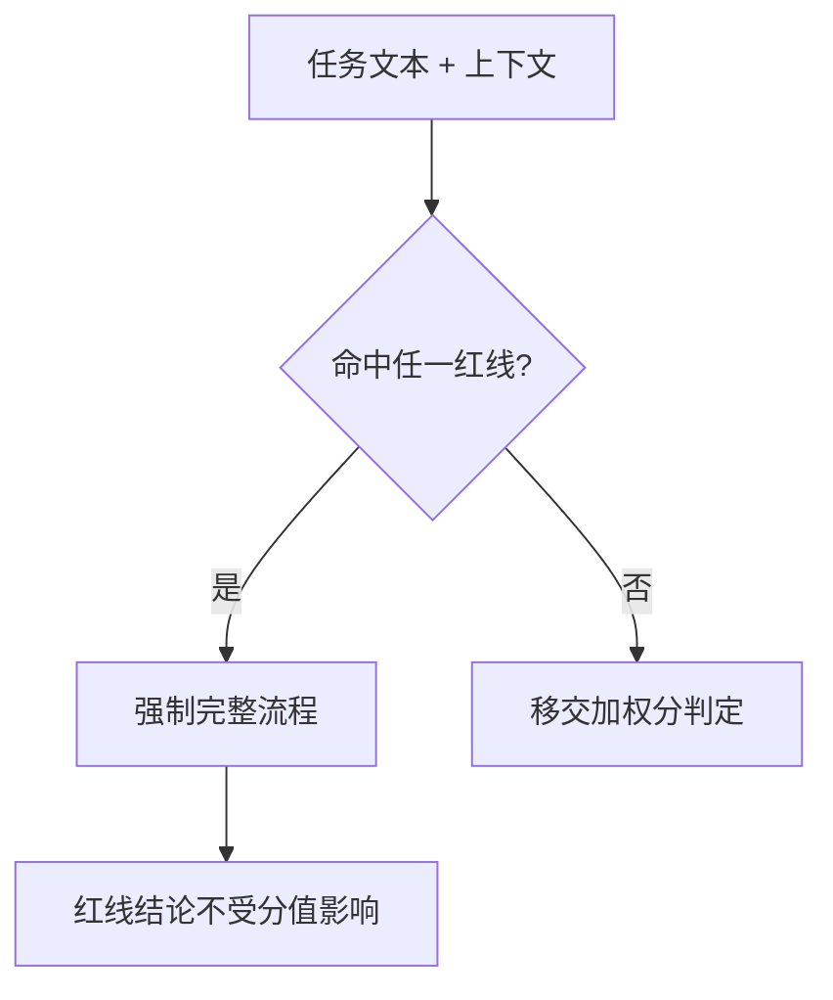

# Fastlane Redline Policy (快车道红线规约)

## Overview

本技能是 L1 原子级基础规约，是双流程分流的第一道也是最高优先级判据。
它回答一个问题：这件事做错了能不能轻松撤回？不能撤回的，一律不许走快车道。

## When to Use

- 任何任务进入流程分流判定时（由 `score-task-lane` 读取本规约）；
- 设计新流程、新命令、新自动化时，判断它是否属于高危动作；
- 复审「这条任务能不能走快速流程」时。

**触发禁区**：本规约只定义红线，不做具体打分；打分工由 `score-task-lane` 承担。

## Workflow

1. `[probe:regex]` 用红线正则匹配任务文本（删除/清空、发布/部署/推送、需求文档变更、安装外部依赖）；
2. `[probe:regex]` 用上下文参数匹配规模红线（`--files N`，N ≥ 2 视为批量改动）；
3. `[probe:regex]` 命中任一红线即输出 `lane = full`，并记录 `matched_redlines`；
4. `[probe:exitcode]` 未命中则移交 `score-task-lane` 继续加权打分。

## Strict Rules

四条红线（任一命中即强制完整流程）：

| 编号 | 红线 | 判定 | 为何不可快 |
| :--- | :--- | :--- | :--- |
| R1 | 删除或清空 | 文本含 删除/移除/清空/覆盖既有/`rm -rf` | 数据不可逆 |
| R2 | 发布 / 部署 / 推送 | 文本含 发布/部署/上线/推送/`push`/`commit`/`release`/`deploy` | 对外可见不可撤回 |
| R3 | 需求文档变更 | 文本含 修改需求/变更需求/基线/`REQ-` | 影响全局验收口径 |
| R4 | 安装外部依赖或技能 | 文本含 安装/引入外部/`npm install`/`pip install`/添加插件 | 供应链风险 |
| R5 | 批量改动 | 上下文 `--files N` 且 N ≥ 2 | 影响面不可目视核对 |

**红线优先级高于分值**：即使加权分为满分，命中红线仍强制完整流程。

## Boundaries & Constraints

- 普通单文件编辑**不是**红线：它由加权分判定，允许走快车道；
- 红线清单只增不减；删除任何一条红线都必须有明确的需求变更与用户确认。
