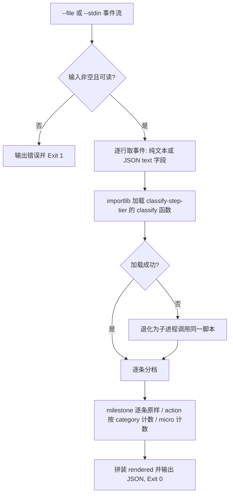

# Fold Repeated Events (过程事件折叠器)

## Overview

Fold Repeated Events 是过程输出里程碑化的**压缩执行层**：
它先用 `classify-step-tier` 给每条事件分档，再按里程碑逐条保留、动作按 `category` 聚合、微操作汇总为一行计数的规则折叠，
使 100 行刷屏过程输出收敛为「N 条里程碑 + 若干 ×N 折叠行」。
折叠只压缩形态，不静默丢信息：任何被折叠的条目都留下 `×N` 计数。

## When to Use

- 长任务的中间过程回报需要压缩成可读清单时；
- 子智能体上报大量同质动作（连续读文件、连续点击）需要汇总时；
- 交付前需要把过程日志折叠为里程碑视图时。

**触发禁区**：事件总数 ≤3 或纯只读问答不折叠；本技能不做质量判断，只做形态压缩。

## Workflow



1. `[probe:file]` 断言输入来源有效：`--file` 指向真实存在的可读文件，或 `--stdin` 有内容，否则 Exit 1；
2. `[probe:length]` 逐行解析事件，纯文本行与 `{"text": "..."}` 行都要支持，空行丢弃；
3. `[probe:exitcode]` 用 importlib 加载 `skills/classify-step-tier/scripts/classify_tier.py` 的 `classify` 函数（不起子进程），加载异常时退化子进程并保持同一判定口径；
4. `[probe:length]` milestone 原样进 `milestones` 与 `rendered`；action 按 `category` 聚合为 `· {category} ×{count}`；micro 汇总为一行 `· 微操作 ×{micro_total}`；
5. `[probe:regex]` 对 `rendered` 断言不含任何单条 micro 原文（微操作只以计数形态出现），违规即判定折叠失败；
6. `[probe:length]` 断言输出 JSON 恰含 `milestones` / `actions` / `micro_total` / `rendered` / `before_events` / `after_events` 六字段，且 `after_events` 等于 `rendered` 的行数。

## Usage & Script

```bash
# 造 12 条事件：3 条里程碑 + 5 条微操作 + 4 条工序动作
cat > /tmp/events.jsonl <<'EOF'
{"text": "已完成需求拆解"}
{"text": "读取文件 skill.md"}
{"text": "打开编辑器"}
{"text": "扫描全仓依赖拓扑并建立索引"}
{"text": "写入一行配置"}
{"text": "检索 catalog 中的 composition 字段"}
{"text": "生成骨架文件并登记索引"}
{"text": "到达验收阶段"}
{"text": "查看 diff 内容"}
{"text": "校验 UTF-8 编码合规"}
{"text": "重试一次网络请求"}
{"text": "已交付全部产物"}
EOF

# 文件模式（JSON 输出，含 before/after 计数）
python3 skills/fold-repeated-events/scripts/fold_events.py --file /tmp/events.jsonl --json

# 管道模式（只打印折叠后的过程输出）
cat /tmp/events.jsonl | python3 skills/fold-repeated-events/scripts/fold_events.py --stdin
```

stdout 契约（务必区分两种模式）：

```bash
# 默认：直接打印折叠后的 rendered 多行文本（永远非空，适合直接贴给用户）
python3 skills/fold-repeated-events/scripts/fold_events.py --file /tmp/events.jsonl

# --json：打印六字段 JSON，供 verify-progress-budget 等下游消费
python3 skills/fold-repeated-events/scripts/fold_events.py --file /tmp/events.jsonl --json
```

## Success Contract

- Exit Code 0：折叠完成，`rendered` 中不含任何单条 micro 原文，`after_events ≤ before_events`；
- Exit Code 1：输入为空、文件不存在或不可读；此时不得向用户输出任何折叠结果。

stdout 契约：默认（不带 `--json`）**必定打印非空的 `rendered` 多行文本**；带 `--json` 时打印六字段 JSON。
两条路径都不写文件、不静默——除非退出码为 1。

`rendered` 的三条拼装规则（顺序固定）：
1. milestone 逐条**原样**输出，顺序与输入一致；
2. action 按 `category` 首次出现顺序输出 `· {category} ×{count}`；
3. micro 非空时在末尾输出一行 `· 微操作 ×{micro_total}`。

## Boundaries & Constraints

- **里程碑只增不删**：折叠绝不合并、删减任何 milestone 原文；
- **微操作只折叠不丢弃**：必须保留 `×N` 计数，`micro_total` 与输入中 micro 事件条数逐条相等；
- **口径唯一**：分档必须复用 `classify-step-tier`，禁止在本脚本内另写一套判定词表；
- 不引入第三方依赖，不使用随机数与时间戳，同一输入必须产出同一 `rendered`。
