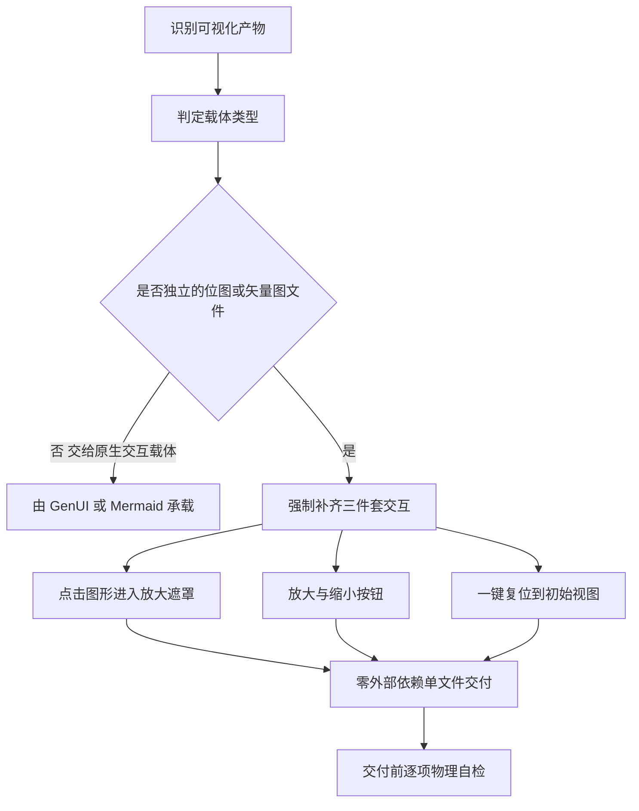

# Format Zoomable Visual (可缩放可视化输出规约)

## Overview

本技能是 L1 原子级基础规约。凡是交付给用户「看」的产物——位图、矢量图、图谱、拓扑图、结构图、截图——都必须自带缩放交互能力。

「看得见」不等于「看得清」，也不等于「存得下」。

**本规约在 REQ-VISUAL-ZOOMLEVELS-035 / REQ-VISUAL-DOWNLOAD-037 后扩展为四件套**：
点击放大、**多级缩放按钮**、复位、**下载**。其中缩放的档位表、吸附规则与下载三段降级，
唯一口径来源是 `zoom-level-policy`（L1），本规约只声明「必须做」，不重复定义「怎么做」。一张超出视口的静态图，用户只能靠操作系统级缩放或反复保存后放大，可视化的价值随之归零。本规约把「三件套交互」固定为可视化的最低交付标准，同时锁定零依赖的单文件形态：双击即开，不装环境、不联网、不加载 CDN。

本技能只立规约，不产出文件、不携带脚本；落地由下游 L2 技能 `build-image-viewer` 与 `verify-interactive-html` 承担。

## When to Use

- 需要把任何图片、图谱、拓扑图、结构图、示意图作为交付物给用户查看时；
- 需要评审或验收他人产出的可视化文件是否达到最低交互标准时；
- 需要为下游查看器生成器写明「什么才算合格可视化」的判据时。

**触发禁区**：纯文本、表格、纯 Mermaid 代码块、以及宿主已原生支持交互的 GenUI 图表一律不套用本规约——对这些载体强加查看器只会造成重复交互、体积膨胀与渲染冲突。

## Workflow

1. `[probe:file]` 确认待交付的可视化产物真实存在于磁盘且字节数大于 0；
2. `[probe:regex]` 在产物中排他匹配 `data-zoom-in`、`data-zoom-out`、`data-zoom-reset` 三个控制标识，任一缺失即判定不合规；
3. `[probe:regex]` 排他扫描 `src="http`、`href="http`、`url(http`、`<script src=`、`<link `，命中任一即判定违反零依赖原则；
3b. `[probe:length]` 断言档位可枚举：产物暴露 `data-zoom-levels` 且档数 ≥ 5，`data-zoom-default` 落在档位表内（口径见 `zoom-level-policy`）；
3c. `[probe:regex]` 断言吸附分支与下载三段降级齐备：`data-zoom-snap` 具两种状态、`data-download` 常显、`showSaveFilePicker` 与 Blob 降级路径同时存在；
4. `[probe:length]` 断言交付体积非零且为单个 HTML 文件，不得拆分为 HTML + CSS + JS 多文件；
5. `[probe:exitcode]` 以 `verify-interactive-html` 作为探针封装，退出码 0 才允许交付。

## Boundaries & Constraints

- 本技能只做规约判定，不生成文件、不提供脚本，任何实现细节不得下沉到此层；
- 严禁以「图很小」「用户自己会缩放」「只是临时看一眼」为由跳过三件套交互；
- 严禁引入外链 CSS、外链脚本、外链字体、CDN 或 `@import`；
- 三个属性名 `data-zoom-in` / `data-zoom-out` / `data-zoom-reset` 是被下游探针物理检测的稳定标识，任何实现都不得改名、缩写或换成 class；
- 遮罩内必须能关闭（至少支持 ESC），防止打开后无法返回原始视图。
