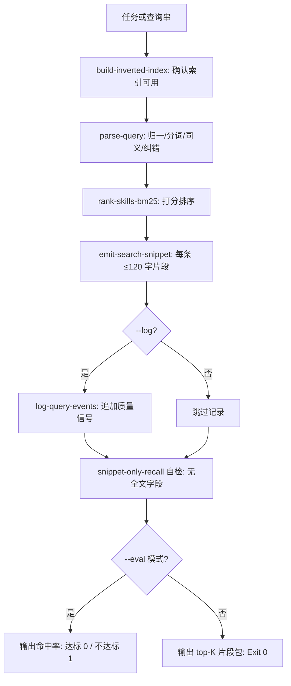

# Google Style Skill Search (Google 式技能检索总控)

## Overview

本技能把 Google 公开搜索机制的六个部件组装成一条可直接调用的检索链路，
是管家「找技能」的唯一推荐入口，也是 `skill-index-router` 检索路径的实现升级。

它把过去「读整份 catalog」的动作，压缩成一次 ≤1.5 KB 的片段回灌。

## When to Use

- 接到任务后需要确定「哪些技能可能相关」时（`on-demand-dispatcher` 的第一步）；
- 需要评测检索质量时（`--eval`）；
- 需要复盘「查了但没选中」的长尾时（配合 `log-query-events`）。

**触发禁区**：不负责加载技能正文（那是 `load-skill-contract`）；不做任务分流判定（那是 `dual-lane-router`）。

## Workflow



1. `[probe:file]` 断言 `skill-index.json` 存在且 `doc_count > 0`，否则提示先跑 `build-inverted-index`；
2. `[probe:regex]` 调用 `parse-query` 解析查询，记录 `corrections` 与 `dropped_stopwords`；
3. `[probe:exitcode]` 调用 `rank-skills-bm25` 取得排序结果，按 `--top-k` / `--offset` 截断；
4. `[probe:length]` 对每条结果调用 `emit-search-snippet` 生成 ≤120 字片段；
5. `[probe:regex]` 按 `snippet-only-recall` 自检输出中不存在 `content` / `body` / `text` 全文字段；
6. `[probe:exitcode]` `--log` 时追加质量信号；`--eval` 时输出命中率并据此返回 0/1，否则返回 0。

## Usage & Script

```bash
python3 skills/google-style-skill-search-router/scripts/search_skills.py --query "校验交付文件是否存在"
python3 skills/google-style-skill-search-router/scripts/search_skills.py --query "统计token消耗" --top-k 3
python3 skills/google-style-skill-search-router/scripts/search_skills.py --eval
```

## Success Contract

- Exit Code 0：检索完成，payload ≤ 1.5 KB，无全文字段；`--eval` 命中率 ≥ 90%；
- Exit Code 1：索引缺失/陈旧、参数非法，或 `--eval` 命中率不达标；
- 确定性：同一查询重复执行，`results` 顺序与 `snippet` 完全一致。

## Boundaries & Constraints

- **只回灌片段**：结果字段仅 `id` / `level` / `category_title` / `score` / `snippet` / `matched_terms`；
- 零命中时返回空列表并给出 `hint`，不报错、不降级为全量加载；
- 索引陈旧时先提示重建，不允许带着旧索引给出误导性排序。
