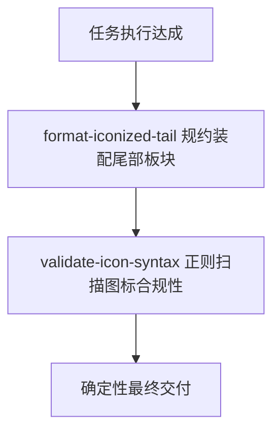

# Iconized Output Showcase (尾部特异化图标展示总控)

## Overview

本技能是 L3 复合流程级技能。整合尾部集中格式规约与正则物理校验，提供统一的特异化交付输出规范。

## Workflow

```mermaid
flowchart TD
    Finish[任务执行达成] --> Assemble[format-iconized-tail 规约装配尾部板块]
    Assemble --> Validate[validate-icon-syntax 正则扫描图标合规性]
    Validate --> Deliver[确定性最终交付]
```
