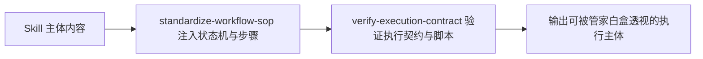

# Index Body Contract (索引主体运作契约)

## Overview

Index Body Contract 规范所有被索引 Skill 的内部运作白盒化。
确保管家在调用任意 Skill 时，不仅知道“什么时候调（头部）”，更能准确透视“具体怎么运作（主体）”。

## Workflow

## Boundaries

- 统一规约主体结构的标准呈现，不限制特定业务领域的自由算法。
